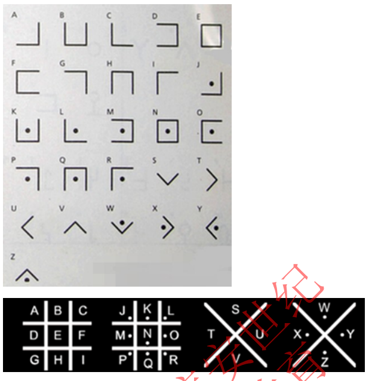
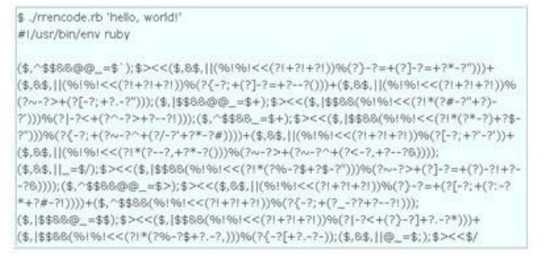

# 常见编码
## 1、ASCII编码
ASCII编码大致可以分作三部分组成：
第一部分是：ASCII非打印控制字符（参详ASCII码表中0-31）;
第二部分是：ASCII打印字符，也就是CTF中常用到的转换：

第三部分是：扩展ASCII打印字符(第一第三部分详见 ASCII码表 解释)。

**编码转换示例**
```
源文本： The quick brown fox jumps over the lazy dog
```
**ASCII编码对应十进制：**
```
84 104 101 32 113 117 105 99 107 32 98 114 111 119 110 32 102 111 120 32 106 117 109 112 115 32 111 118 101 114 32 116 104 101 32 108 97 122 121 32 100 111 103
```
对应可以转换成二进制，八进制，十六进制等。
## 2、Base64/32/16编码
base64、base32、base16可以分别编码转化8位字节为6位、5位、4位。16,32,64分别表示用多少个字符来编码，这里
我注重介绍base64。Base64常用于在通常处理文本数据的场合，表示、传输、存储一些二进制数据。包括MIME的
email，email via MIME,在XML中存储复杂数据。

**编码原理：**
Base64编码要求把3个8位字节转化为4个6位的字节，之后在6位的前面补两个0，形成8位一个字节的形式，6位2进制能表示的最大数是2的6次方是64，这也是为什么是64个字符(A-Z,a-z，0-9，+，/这64个编码字符，=号不属于编码字符，而是填充字符)的原因，这样就需要一张映射表，如下：

**举个例子(base64)：**
```
源文本：T h e
对应ascii码:84 104 101
8位binary：01010100 01101000 01100101
6位binary：010101 000110 100001 100101
高位补0：000010101 00000110 00100001 00100101
对应ascii码：21 6 33 37
查表：V G h l
```
利用Python base64模块，我们分别可以这样加密解密base64 32 16：、
```py
import base64

m = 'The quick brown fox jumps over the lazy dog'
c_b64 = base64.b64encode(m.encode())
c_b32 = base64.b32encode(m.encode())
c_b16 = base64.b16encode(m.encode())
print("base64加密：",c_b64)
print("base32加密：",c_b32)
print("base16加密：",c_b16)

base64decode = base64.b64decode(c_b64)
base32decode = base64.b32decode(c_b32)
base16decode = base64.b16decode(c_b16)
print("base64解密：",base64decode)
print("base32解密：",base32decode)
print("base16解密：",base16decode)
```
输出结果：
```
base64加密： b'VGhlIHF1aWNrIGJyb3duIGZveCBqdW1wcyBvdmVyIHRoZSBsYXp5IGRvZw=='
base32加密： b'KRUGKIDROVUWG2ZAMJZG653OEBTG66BANJ2W24DTEBXXMZLSEB2GQZJANRQXU6JAMRXWO==='
base16加密： b'54686520717569636B2062726F776E20666F78206A756D7073206F76657220746865206C617A7920646F67'
base64解密： b'The quick brown fox jumps over the lazy dog'
base32解密： b'The quick brown fox jumps over the lazy dog'
base16解密： b'The quick brown fox jumps over the lazy dog'
```
## 3、shellcode编码
shellcode是一段用于利用软件漏洞而执行的代码，shellcode为16进制之机械码，以其经常让攻击者获得shell而得名。shellcode常常使用机器语言编写。 在寄存器eip溢出后，加入一段可让CPU执行的shellcode机械码，让电脑可以执行攻击者的任意指令。

源文本：
```
The quick brown fox jumps over the lazy dog
```
编码后：
```
#!shell
\x54\x68\x65\x7f\x71\x75\x69\x63\x6b\x7f\x62\x72\x6f\x77\x6e\x7f\x66\x6f\x78\x7f\x6a\x75\x6d\x70\x73\x7
```
## 4、Quoted-printable 编码
源文本：
```
敏捷的棕色狐狸跳过了懒惰的狗
```
编码后：
```
=e6=95=8f=e6=8d=b7=e7=9a=84=e6=a3=95=e8=89=b2=e7=8b=90=e7=8b=b8=e8=b7=b3=e8=
=bf=87=e4=ba=86=e6=87=92=e6=83=b0=e7=9a=84=e7=8b=97
```
## 5、XXencode编码
XXencode将输入文本以每三个字节为单位进行编码。如果最后剩下的资料少于三个字节，不够的部份用零补齐。这三
个字节共有24个Bit，以6bit为单位分为4个组，每个组以十进制来表示所出现的数值只会落在0到63之间。以所对应值
的位置字符代替。它所选择的可打印字符是：
```
+-0123456789ABCDEFGHIJKLMNOPQRSTUVWXYZabcdefghijklmnopqrstuvwxyz
```
一共64个字符。跟base64打印字符相比，就是UUencode多一个“-” 字符，少一个”/” 字符。

源文本： 
```
The quick brown fox jumps over the lazy dog
```
编码后： 
```
fJ4VZ653pOKBf647mPrRi64NjS0-eRKpkQm-jRaJm65FcNG-gMLdt64FjNk++
```
## 6、UUencode编码
UUencode是一种二进制到文字的编码，最早在unix 邮件系统中使用，全称：Unix-to-Unix encoding，UUencode将输
入文本以每三个字节为单位进行编码，如果最后剩下的资料少于三个字节，不够的部份用零补齐。三个字节共有24个
Bit，以6-bit为单位分为4个组，每个组以十进制来表示所出现的字节的数值。这个数值只会落在0到63之间。然后将每
个数加上32，所产生的结果刚好落在ASCII字符集中可打印字符（32-空白…95-底线）的范围之中。
源文本： 
```
The quick brown fox jumps over the lazy dog
```
编码后： 
```
K5&AE('%U:6-K(&)R;W=N(&9O>"!J=6UP<R!O=F5R('1H92!L87IY(&1O9P``
```
## 7、URL编码
url编码又叫百分号编码，是统一资源定位(URL)编码方式。URL地址（常说网址）规定了常用地数字，字母可以直接使
用，另外一批作为特殊用户字符也可以直接用（/,:@等），剩下的其它所有字符必须通过%xx编码处理。 现在已经成
为一种规范了，基本所有程序语言都有这种编码，如js：有encodeURI、encodeURIComponent，PHP有 urlencode、
urldecode等。编码方法很简单，在该字节ascii码的的16进制字符前面加%. 如 空格字符，ascii码是32，对应16进制
是’20’，那么urlencode编码结果是:%20。
源文本：
```
The quick brown fox jumps over the lazy dog
```
编码后：
```
%54%68%65%20%71%75%69%63%6b%20%62%72%6f%77%6e%20%66%6f%78%20%6a%75%6d%70%73%20%6f%76%65%72%20%74%68%65%20%6c%61%7a%79%20%64%6f%67
```
## 8、Unicode编码
Unicode编码有以下四种编码方式：
**源文本：** The
**&#x [Hex]：** The
**&# [Decimal]：** The
**\U [Hex]：** \U0054\U0068\U0065
**\U+ [Hex]：** \U+0054\U+0068\U+0065

## 9、Escape/Unescape编码
Escape/Unescape加密解码/编码解码,又叫%u编码，采用UTF-16BE模式， Escape编码/加密,就是字符对应UTF-16 16
进制表示方式前面加%u。Unescape解码/解密，就是去掉”%u”后，将16进制字符还原后，由utf-16转码到自己目标字
符。如：字符“中”，UTF-16BE是：“6d93”，因此Escape是“%u6d93”。
**源文本：** The
**编码后：** %u0054%u0068%u0065

## 10、HTML实体编码

## 11、敲击码
敲击码(Tap code)是一种以非常简单的方式对文本信息进行编码的方法。因该编码对信息通过使用一系列的点击声音来编码而命名，敲击码是基于5×5方格波利比奥斯方阵来实现的，不同点是是用K字母被整合到C中。
敲击码表:
```
  1  2  3  4  5
1 A  B C/K D  E
2 F  G  H  I  J 
3 L  M  N  O  P
4 Q  R  S  T  U
5 V  W  X  Y  Z
```

## 12、莫尔斯电码
摩尔斯电码(Morse Code)是由美国人萨缪尔·摩尔斯在1836年发明的一种时通时断的且通过不同的排列顺序来表达不同
英文字母、数字和标点符号的信号代码，摩尔斯电码主要由以下5种它的代码组成：
1. 点（.）
2. 划（-）
3. 每个字符间短的停顿（通常用空格表示停顿）
4. 每个词之间中等的停顿（通常用 / 划分）
5. 以及句子之间长的停顿
摩尔斯电码字母和数字对应表：

源文本: 
```
THE QUICK BROWN FOX JUMPS OVER THE LAZY DOG
```
编码后：
```
- .... . --.- ..- .. -.-. -.- -... .-. --- .-- -. ..-. --- -..- .--- ..- -- .--. ... --- ...- . .-. - .... . .-.. .- --.. -.-- -.. --- --.
```
摩尔斯电码除了能对字母数字编码以外还对一些标点符号，非英语字符进行了编码，而且还有一些特定意义的组合称为
特殊符号，比如 ·-·-·-·-·- 表达的意思是调用信号，表示“我有消息发送”。

# 各种文本加密
文本加密可以将正常文本内容打乱为不可连读的文字或符号(汉字 数字 字母 音乐符号 国际音标 盲文 韩文 日文 傣文 彝
文 箭头符号 花朵符号 俄文)，换行等格式信息也会被清除，达到加密的作用。在进行文本加密时可以设定一个密码，
这样只有知道密码的人才能解密文本。密码可以是数字、字母和下划线，最多九位。


## 1、盲文加密
链接[盲文加解密](https://www.qqxiuzi.cn/bianma/wenbenjiami.php?s=mangwen)
**加密示例：**

源文本： 
```
敏捷的棕色狐狸跳过了懒惰的狗
```
加密后文本：
```
⡥⡿⡣⡇⡶⢴⡨⣥⢂⡂⡲⣠⡲⣈⢍⣃⢏⣷⡎⢶⡡⣢⡠⣀⡶⢴⡲⣧==
```

# 换位加密
## 1、栅栏密码
栅栏密码(Rail-fence Cipher)就是把要加密的明文分成N个一组，然后把每组的第1个字符组合，每组第2个字符组合…
每组的第N(最后一个分组可能不足N个)个字符组合，最后把他们全部连接起来就是密文，这里以2栏栅栏加密为例。
```
明文： The quick brown fox jumps over the lazy dog
去空格： Thequickbrownfoxjumpsoverthelazydog
分组： Th eq ui ck br ow nf ox ju mp so ve rt he la zy do g
第一组： Teucbonojmsvrhlzdg
第二组： hqikrwfxupoeteayo
密文： Teucbonojmsvrhlzdghqikrwfxupoeteayo
```
## 2、曲路密码
曲路密码(Curve Cipher)是一种换位密码，需要事先双方约定密钥(也就是曲路路径)。
明文： 
```
The quick brown fox jumps over the lazy dog
```
填入5行7列表(事先约定填充的行列数)

加密的回路线(事先约定填充的行列数)

密文： 
```
gesfc inpho dtmwu qoury zejre hbxva lookT
```
## 3、列移位密码
列移位密码(Columnar Transposition Cipher)是一种比较简单，易于实现的换位密码，通过一个简单的规则将明文打乱
混合成密文。下面我们以明文 
```
The quick brown fox jumps over the lazy dog
```
密钥 
```
how are u
```
为例：
填入5行7列表(事先约定填充的行列数，如果明文不能填充完表格可以约定使用某个字母进行填充)

密钥： 
```
how are u
```
按how are u在字母表中的出现的先后顺序进行编号，我们就有a为1,e为2，h为3，o为4，r为5，u为6，w为7，所以先
写出a列，其次e列，以此类推写出的结果便是密文：

密文：
```
qoury inpho Tkool hbxva uwmtd cfseg erjez
```
这里提供一个行列数相等的填充规则列移位密码加解密[链接](http://www.practicalcryptography.com/ciphers/classical-era/columnar-transposition/)
另外由列移位密码变化来的密码也有其他的，比如 Amsco密码 (Amsco Cipher)和 Cadenus密码 (Cadenus Cipher)。

# 替换加密
## 1、埃特巴什码
埃特巴什码(Atbash Cipher)是一种以字母倒序排列作为特殊密钥的替换加密，也就是下面的对应关系：
```
ABCDEFGHIJKLMNOPQRSTUVWXYZ
ZYXWVUTSRQPONMLKJIHGFEDCBA
```
明文： 
```
the quick brown fox jumps over the lazy dog
```
密文：
```
gsv jfrxp yildm ulc qfnkh levi gsv ozab wlt
```
## 2、凯撒密码
凯撒密码(Caesar Cipher或称恺撒加密、恺撒变换、变换加密、位移加密)是一种替换加密，明文中的所有字母都在字
母表上向后（或向前）按照一个固定数目进行偏移后被替换成密文。例，当偏移量是3的时候，所有的字母A将被替换
成D，B变成E，以此类推
```
明文： The quick brown fox jumps over the lazy dog
偏移量：1
密文： Uif rvjdl cspxo gpy kvnqt pwfs uif mbaz eph
```
用CaptfEncoder解比较好。

## 3、ROT5/13/18/47
ROT5/13/18/47是一种简单的码元位置顺序替换暗码。此类编码具有可逆性，可以自我解密，主要用于应对快速浏览，
或者是机器的读取。
ROT5 是 rotate by 5 places 的简写，意思是旋转5个位置，其它皆同。下面分别说说它们的编码方式：
ROT5：只对数字进行编码，用当前数字往前数的第5个数字替换当前数字，例如当前为0，编码后变成5，当前为1，编
码后变成6，以此类推顺序循环。
ROT13：只对字母进行编码，用当前字母往前数的第13个字母替换当前字母，例如当前为A，编码后变成N，当前为
B，编码后变成O，以此类推顺序循环。
ROT18：这是一个异类，本来没有，它是将ROT5和ROT13组合在一起，为了好称呼，将其命名为ROT18。
ROT47：对数字、字母、常用符号进行编码，按照它们的ASCII值进行位置替换，用当前字符ASCII值往前数的第47位
对应字符替换当前字符，例如当前为小写字母z，编码后变成大写字母K，当前为数字0，编码后变成符号_。用于
ROT47编码的字符其ASCII值范围是33－126，具体可参考ASCII编码，下面以rot13以例。
```
明文： the quick brown fox jumps over the lazy dog
密文： gur dhvpx oebja sbk whzcf bire gur ynml qbt
```
## 4、简单替换密码
简单换位密码(Simple Substitution Cipher)加密方式是以每个明文字母被与之唯一对应且不同的字母替换的方式实现
的，它不同于恺撒密码，因为密码字母表的字母不是简单的移位，而是完全是混乱的。 比如：
```
明文字母表 : abcdefghijklmnopqrstuvwxyz
明文字母表 : phqgiumeaylnofdxjkrcvstzwb
```
```
明文： the quick brown fox jumps over the lazy dog
密文： cei jvaql hkdtf udz yvoxr dsik cei npbw gdm
```
怎么破解
当密文数据足够多时这种密码我们可以通过字频分析方法破解或其他方法破解，比较好的在线词频分析网站http://quipqiup.com/index.php

密文：
```
pmpafxaikkitprdsikcplifhwceigixkirradfeirdgkipgigudkcekiigpwrpucikceiginasikwduearrxiiqepcceindgmieinpwdfprduppcedoikiqiasafmfddfipfgmdafmfdteiki
```
解密：
```
again pierre was overtaken by the depression he so dreaded for three days after the delivery of his speech at the lodge he lay on a sofa at home receiving no one and going nowhere
```
在线加解密[传送门](http://quipqiup.com/index.php)

## 5、希尔密码
希尔密码(Hill Cipher)是基于线性代数多重代换密码，由Lester S. Hill在1929年发明。每个字母转换成26进制数字：
A=0, B=1, C=2…Z=25一串字母当成n维向量，跟一个n×n的矩阵相乘，再将得出的结果MOD26。

**加密过程：**
```
明文： ACT
```

明文对应矩阵：
$$
 \left\{
 \begin{matrix}
   0  \\
   2  \\
   9 
  \end{matrix}
  \right\} 
$$
```
加密密钥： GYBNQKURP
```
加密矩阵：
$$
 \left\{
 \begin{matrix}
   6 & 24 & 1 \\
   13 & 16 & 10 \\
   20 & 17 & 15
  \end{matrix}
  \right\}
$$
计算过程：
$$
 \left\{
 \begin{matrix}
   6 & 24 & 1 \\
   13 & 16 & 10 \\
   20 & 17 & 15
  \end{matrix}
  \right\}
 \left\{
 \begin{matrix}
   0  \\
   2  \\
   9 
  \end{matrix}
  \right\}=
   \left\{
 \begin{matrix}
   67  \\
   222  \\
   319 
  \end{matrix}
  \right\} \equiv
   \left\{
 \begin{matrix}
   15  \\
   14  \\
   7 
  \end{matrix}
  \right\} \bmod(26)
$$
```
密文： FIN
```

**解密过程：**
密文： FIN
计算加密矩阵的逆矩阵：
$$
 \left\{
 \begin{matrix}
   6 & 24 & 1 \\
   13 & 16 & 10 \\
   20 & 17 & 15
  \end{matrix}
  \right\}^{-1}\equiv
   \left\{
 \begin{matrix}
   8 & 5 & 10 \\
   21 & 8 & 21 \\
   21 & 12 & 8
  \end{matrix}
  \right\}\bmod(26)
$$
解密计算得到：
$$
   \left\{
 \begin{matrix}
   8 & 5 & 10 \\
   21 & 8 & 21 \\
   21 & 12 & 8
  \end{matrix}
  \right\}
 \left\{
 \begin{matrix}
   15  \\
   14  \\
   7 
  \end{matrix}
  \right\}\equiv
 \left\{
 \begin{matrix}
   260  \\
   574  \\
   539 
  \end{matrix}
  \right\}\equiv
 \left\{
 \begin{matrix}
   0  \\
   2  \\
   19 
  \end{matrix}
  \right\} \bmod(26)  
$$
```
明文： ACT
```
至于证明和求逆可以参考线性代数知识。

**破解**
密码分析一门破解编码和密码的艺术。当我们尝试去攻破希尔密码你会发现频率分析实际上没有什么用处，特别在密钥
长度增多的情况下。对于较长的二元矩阵（2×2的希尔密码）频率分析可能可能会有帮助，但是对于较短的密文分析是
没有实际作用的。
这里推荐一篇关于用 已知明文样本攻击的方式破解希尔密码 的文章，基础的希尔密码用 已知明文攻击 的方式是可攻
破的，由于加密完全是线性的，所以攻击者在截取到部分明文/密文字符对可以轻松建立一个线性系统，轻松搞定希尔
密码，如果不能完全确定线性系统，那么只需要添加部分明文/密文对即可。已知明文攻击时最好的方式去破解写入密
码，如果明文一无所知，那就进行推测猜出部分明文。基于已知明文样本攻击的方式破解希尔密码的算法的实现工具破
解示例：
密文：
```
XUKEXWSLZJUAXUNKIGWFSOZRAWURORKXAOSLHROBXBTKCMUWDVPTFBLMKEFVWMUXTVTWUIDDJVZKBRMCWOIWYDXMLUFPVSHAGSVWUFWORCWUIDUJCNVTTBERTUNOJUZHVTWKORSVRZSVVFSQXOCMUWPYTRLGBMCYPOJCLRIYTVFCCMUWUFPOXCNMCIWMSKPXEDLYIQKDJWIWCJUMVRCJUMVRKXWURKPSEEIWZVXULEIOETOOFWKBIUXPXUGOWLFPWUSCH
```
解密链接[希尔解密](http://www.practicalcryptography.com/ciphers/hill-cipher/)
密码学工具箱tools也有hill解密

## 6、猪圈密码
猪圈密码(Pigpen Cipher或称九宫格密码、朱高密码、共济会密码或共济会员密码)，是一种以格子为基础的简单替代
式密码。
明文字母和对应密文：

```
明文： THE QUICK BROWN FOX JUMPS OVER THE LAZY DOG
```
密文：

在线加解密网站：[传送门](https://www.simonsingh.net/The_Black_Chamber/pigpen.html)
### 变种圣堂武士密码
圣堂武士密码(Templar Cipher)是共济会的“猪圈密码”的一个变种，一直被共济会圣殿骑士用。
明文字母和对应密文：

### 其他变种
明文字母和对应密文：

明文字母和对应密文：

明文字母和对应密文：

标准银河字母表如下：


## 7、波利比奥斯方阵密码
波利比奥斯方阵密码（Polybius Square Cipher或称波利比奥斯棋盘）是棋盘密码的一种，是利用波利比奥斯方阵进行
加密的密码方式，简单的来说就是把字母排列好，用坐标(行列)的形式表现出来。字母是密文，明文便是字母的坐标。

常见的排布方式：

**加密实例：**
```
明文： THE QUICK BROWN FOX JUMPS OVER THE LAZY DOG
密文： 442315 4145241325 1242345233 213453 2445323543 442315 31115554 143422
```
## 8、夏多密码(曲折加密)
夏多密码是作者麦克斯韦·格兰特在中篇小说《死亡之链》塑造夏多这一英雄人物中所自创的密码，如下图所示：

注意，在以上所示的字母表密钥的底部，列有四个附加符号1，2，3，4.他们可以放在密文中的任何地方。每个附加符
号指示，如何转动写有密文的纸张，再进行后续的加密或解密操作，直到出现另一个附加符号。可以把每个附加符号中
的那根线看作是指示针，它指示了纸张的上端朝上，朝右，朝下，朝左。比如说：如果出现符号3，那么纸张就应该转
动180度，使其上端朝下； 符号2表示纸张上端朝右，依次类推。
```
源文本： I AM IN DANGER SEND HELP(我有危险，速来增援)
```
密文：

## 9、普莱菲尔密码
普莱菲尔密码(Playfair Cipher)是第一种用于实际的双字替换密码，用双字加密取代了简单代换密码的单字加密，很明
显这样使得密文更难破译，因为使用简单替换密码的频率分析基本没有什么作用，虽然频率分析，通常仍然可以进行，
但是有25×25=625种可能而不是25种可能，可以分为三个步骤，即编制密码表、整理明文、编写译文，下面我们以明
文：
THE QUICK BROWN FOX JUMPS OVER THE LAZY DOG 和密钥 CULTURE 为例来讲解。普莱菲尔密码又称为单方密
码(Single Cipher)之后又出现它的升级版Double Playfair，也就是 二方密码 (Two-square Cipher),在之后又有四方密码
(Four-square Cipher)
### （1）编制密码表
1.整理密钥字母 C U L T U R E ，去掉后面重复的字母得到： C U L T R E
2.用上一步得到的字母自上而下来填补5乘5方表的纵列（也可横排），之后的空白按照相同的顺序用字母表中剩余的字
母依次填补完整，得到如下的方格:

这一步需要注意的要点：整理密钥字母时，如果出现”Z”，则需要去除，因为在英文里”Z”的使用频率最低，相应的如果
是德文，则需将”I”与”J”当作一个字母来看待，而法语则去掉”W”或”K”。
### （1）整理明文
我们要遵循的原则是“两个一组”，得到是若干个两两成对的字母段，用到的是明文 THE QUICK BROWN FOX JUMPS
OVER THE LAZY DOG 与字母” X “：
1.将明文两两一组按顺序排开，得到： TH EQ UI CK BR OW NF OX JU MP SO VE RT HE LA ZY DO G
2.对于末尾的单个字母要加上一个” X “使之成对： TH EQ UI CK BR OW NF OX JU MP SO VE RT HE LA ZY DO GX
这一步需要注意的要点：对于相连字母相同者，每个后面都需要加” X “，例如 TOMORROW ，需要写成： TO MO RX RX OW 。
### （3）编写密文
我们要得到的密文，当然，对于每个字母对，要严格遵循如下的原则：
1.如果两个字母在同一行则要用它右邻的字母替换，如果已在最右边，则用该行最左边的替换，如明文为” CE “，依据上表，应替换为” EG “；
2.如果两个字母在同一列则要用它下边的字母替换，如果已在最下边，则用该行最上边的替换，如明文为” OQ “，依据上表，应替换为” PS “；
3.如果两个字母在不同的行或列，则应在密码表中找两个字母使四个字母组成一个矩形，明文占据两个顶点，需用另外两个顶点的字母替换，如明文为” HX “，可以替换为” WI/J “或” I/JW “（下面的例子将按照横向替换原则即同行优先）。
按照上述原则，将明文 TH EQ UI CK BR OW NF OX JU MP SO VE RT HE LA ZY DO GX 加以转换得到 KU ND LH GT LF WU ES PW LH SI/J NP CG CR AG BU VZ QA I/JV （/表示或者，不过一般用I不用J，所以分析密文时你看25个字母都有而只差一个字母没有用到可以考虑一下这种加密方式）将得到的字母改为大写并五个一组列好，得到密文 KUNDL HGTLF WUESP WLHSI NPCGC RAGBU VZQAI V 。

加密解密[传送门](http://www.practicalcryptography.com/ciphers/classical-era/playfair/)
或者用密码学工具箱

## 10、维吉尼亚密码
维吉尼亚密码(Vigenère Cipher)是在单一恺撒密码的基础上扩展出多表代换密码，根据密钥(当密钥长度小于明文长度
时可以循环使用)来决定用哪一行的密表来进行替换，以此来对抗字频统计

密表：


```
明文： THE QUICK BROWN FOX JUMPS OVER THE LAZY DOG
```
密钥(循环使用，密钥越长相对破解难度越大)： CULTURE
加密过程：如果第一行为明文字母，第一列为密钥字母，那么明文字母’T’列和密钥字母’C’行的交点就是密文字母’V’，以此类推。
```
密文： VBP JOZGM VCHQE JQR UNGGW QPPK NYI NUKR XFK
```
### （1）已知密钥加解密
密码学工具箱和CaptfEncoder都能解

### （2）未知密钥破解

有个很吊的网站，能爆破，确实牛x。[传送门](https://www.guballa.de/vigenere-solver)
### （3）变种 格罗斯费尔德密码
有几种密码和维吉尼亚密码相似，格罗斯费尔德密码(Gronsfeld cipher)实际上和维吉尼亚密码相同，除了使用了数字来代替字母以外没有什么区别。数字可以选择一种数列，如斐波那契数列，或者一些其他的伪随机序列。格罗斯费尔德密码密码分析过程和维吉尼亚密码大同小异，不过，自动密钥密码不能使用 卡西斯基算法 (kasiski)来破译，因为自动密钥密码的密钥不重复循环使用，破译自动密钥密码最好的方法的就是从密文不断尝试和猜测其中明文或密钥的一部分。


在线加解密[传送门](https://rumkin.com/tools/cipher/gronsfeld/)
或者用密码学工具箱和CaptfEncoder都能解

## 11、自动密钥密码
自动密钥密码(Autokey Cipher)是多表替换密码，与维吉尼亚密码密切相关，但使用不同的方法生成密钥，通常来说要比维吉尼亚密码更安全。自动密钥密码主要有两种，关键词自动密钥密码和原文自动密钥密码.下面我们以关键词自动密钥为例：

```
明文： THE QUICK BROWN FOX JUMPS OVER THE LAZY DOG
关键词： CULTURE
自动生成密钥： CULTURE THE QUICK BROWN FOX JUMPS OVER THE
```
接下来的加密过程和维吉尼亚密码类似，从密表可得：
```
密文： VBP JOZGD IVEQV HYY AIICX CSNL FWW ZVDP WVK
```
### （1）已知密钥加解密
密码学工具箱和CaptfEncoder都能解

### （2）未知密钥破解
待查找中

## 12、博福特密码
博福特密码(Beaufort Cipher)，是一种类似于维吉尼亚密码的代换密码，由弗朗西斯·蒲福(Francis Beaufort)发明。它最知名的应用是Hagelin M-209密码机。博福特密码属于对等加密，即加密演算法与解密演算法相同。

```
明文： THE QUICK BROWN FOX JUMPS OVER THE LAZY DOG
密钥(循环使用，密钥越长相对破解难度越大)： CULTURE
```
加密过程：如果第一行为明文字母，第一列为密文字母，那么沿明文字母’T’列出现密钥字母’C’的行号就是密文字母’J’，以此类推。
```
密文： JNH DAJCS TUFYE ZOX CZICM OZHC BKA RUMV RDY
```
密码学工具箱和CaptfEncoder都能解

## 13、滚动密钥密码
滚动密钥密码(Running Key Cipher)和维吉尼亚密码有着相同的加密机制，区别是密钥的选取，维吉尼亚使用的密钥简短，而且重复循环使用，与之相反，滚动密钥密码使用很长的密钥，比如引用一本书作为密钥。这样做的目的是不重复循环使用密钥，使密文更难破译，尽管如此，滚动密钥密码还是可以被攻破，因为有关于密钥和明文的统计分析模式可供利用，如果滚动密钥密码使用统计上的随机密钥来源，那么理论上是不可破译的，因为任何可能都可以成为密钥，并且所有的可能性都是相等的。
```
明文： THE QUICK BROWN FOX JUMPS OVER THE LAZY DOG
```
密钥：选取C语言编程(1978版)第63页第1行”errors can occur in several places. A label has…”，去掉非字母部分作为
密钥(实际选取的密钥很长，长度至少不小于明文长度)。
加密过程：加密过程和维吉尼亚密码加密过程相同
```
密文: XYV ELAEK OFQYH WWK BYHTJ OGTC TJI DAK YESR
```

加解密[传送门](http://www.practicalcryptography.com/ciphers/classical-era/running-key/)

## 14、Porta密码
Porta密码(Porta Cipher)是一个由意大利那不勒斯的医生Giovanni Battista della Porta发明的多表代换密码，Porta密码具有加密解密过程的是相同的特点。

密表：
```
KEYS| A B C D E F G H I J K L M N O P Q R S T U V W X Y Z
----|----------------------------------------------------
A,B | N O P Q R S T U V W X Y Z A B C D E F G H I J K L M
C,D | O P Q R S T U V W X Y Z N M A B C D E F G H I J K L
E,F | P Q R S T U V W X Y Z N O L M A B C D E F G H I J K
G,H | Q R S T U V W X Y Z N O P K L M A B C D E F G H I J
I,J | R S T U V W X Y Z N O P Q J K L M A B C D E F G H I
K,L | S T U V W X Y Z N O P Q R I J K L M A B C D E F G H
M,N | T U V W X Y Z N O P Q R S H I J K L M A B C D E F G
O,P | U V W X Y Z N O P Q R S T G H I J K L M A B C D E F
Q,R | V W X Y Z N O P Q R S T U F G H I J K L M A B C D E
S,T | W X Y Z N O P Q R S T U V E F G H I J K L M A B C D
U,V | X Y Z N O P Q R S T U V W D E F G H I J K L M A B C
W,X | Y Z N O P Q R S T U V W X C D E F G H I J K L M A B
Y,Z | Z N O P Q R S T U V W X Y B C D E F G H I J K L M A
```
```
明文： THE QUICK BROWN FOX JUMPS OVER THE LAZY DOG
密钥(循环使用，密钥越长相对破解难度越大)： CULTURE
```
加密过程：明文字母’T’列与密钥字母’C’行交点就是密文字母’F’,以此类推。
```
密文： FRW HKQRY YMFMF UAA OLWHD ALWI JPT ZXHC NGV
```
密码学工具箱和CaptfEncoder都能解


## 15、同音替换密码
 同音替换密码(Homophonic Substitution Cipher)是单字母可以被其他几种密文字母同时替换的密码，通常要比标准替换密码破解更加困难，破解标准替换密码最简单的方法就是分析字母出现频率，通常在英语中字母’E’(或’T’)出现的频率是最高的，如果我们允许字母’E’可以同时被3种不同字符代替，那么就不能还是以普通字母的频率来分析破解，如果允许可代替字符越多，那么密文就会更难破译。
 
常见代换规则表：

```
明文: THE QUICK BROWN FOX JUMPS OVER THE LAZY DOG
密文(其中一种)： 6CZ KOVST XJ0MA EQY IOGL4 0W1J UC7 P9NB F0H
```

如果同音替换密码的同音词个数很多，那么破解它难度很大，通常的方法采取类似破解替换密码的”爬山算法”，除了找到一个明文字母映射几个字符之外，我们还需要确定映射了那些字符，可以尝试 2层嵌套”爬山算法” 来破解，外层确定映射的数量，内层确定映射字符。

这个破解。。。不会。。。直接劝退。

## 16、仿射密码
仿射密码(Affine Cipher)是一种单表代换密码，字母表中的每个字母相应的值使用一个简单的数学函数映射到对应的数
值，再把对应数值转换成字母。这个公式意味着每个字母加密都会返回一个相同的字母，意义着这种加密方式本质上是
一种标准替代密码。因此，它具有所有替代密码的弱点。每一个字母都是通过函数（ax + b）mod m加密，其中b是位移量，为了保证仿射密码的可逆性，a和m需要满足gcd(a , m)=1，一般m为设置为26。

常见的字母对应关系：

下面我们以E(x) = (5x + 8) mod 26函数为例子

解密：
因为我们知道
$$
E(x) = (ax+b) \bmod m
$$
$$
1 = aa^{-1}\bmod m
$$
即可得出解密结果
$$
D(x)=a^{-1}(x-b) \bmod m
$$
以E(x) = (5x + 8) mod 26加密，通过计算可得D(x)=21(x - 8) mod 26，这样便可以得到明文。

密码学工具箱和CaptfEncoder都能解

## 17、培根密码
培根密码(Baconian Cipher)是一种替换密码，每个明文字母被一个由5字符组成的序列替换，最初的加密方式就是
由’A’和’B’组成序列替换明文(所以你当然也可以用别的字母)，比如字母’D’替换成”aaabb”，以下是全部的对应关系(另一种对于关系是每个字母都有唯一对应序列，I和J与U/V各自都有不同对应序列)：
```
A = aaaaa I/J = abaaa R = baaaa
B = aaaab K = abaab S = baaab
C = aaaba L = ababa T = baaba
D = aaabb M = ababb U/V = baabb
E = aabaa N = abbaa W = babaa
F = aabab O = abbab X = babab
G = aabba P = abbba Y = babba
H = aabbb Q = abbbb Z = babbb
```
```
明文： T H E F O X
密文： baaba aabbb aabaa aabab abbab babab
```
密码学工具箱和CaptfEncoder都能解

## 18、ADFGX和ADFGVX密码
### （1）ADFGX密码
ADFGX密码(ADFGX Cipher)是结合了改良过的Polybius方格替代密码与单行换位密码的矩阵加密密码，使用了5个合
理的密文字母：A，D，F，G，X，这些字母之所以这样选择是因为当转译成摩尔斯电码(ADFGX密码是德国军队在一
战发明使用的密码)不易混淆，目的是尽可能减少转译过程的操作错误。

加密矩阵示例：
```
    A D F G   X
 ----------------
A | p h q g   m 
D | e a y n   o 
F | f d x k   r
G | c v s z   w 
X | b u t i/j l
```
就是：
```
phqgmeaynofdxkrcvszwbutil
```

明文： THE QUICK BROWN FOX

结果矩阵加密：
```
XF AD DA AF XD XG GA FG XA FX DX GX DG FA DX FF
```
列移位密钥： how are u

密文： 
```
DXADF AGXF XFFXD FXGGX DGFG AADA ADXXF
```

解密：
```py
#!python
>>>from pycipher import ADFGX
24/34
>>>a = ADFGX('phqgmeaynofdxkrcvszwbutil','HOWAREU')
>>>a.encipher('THE QUICK BROWN FOX')
'DXADFAGXFXFFXDFXGGXDGFGAADAADXXF'
>>>a.decipher('DXADFAGXFXFFXDFXGGXDGFGAADAADXXF')
'THEQUICKBROWNFOX'
```

或者密码学工具箱和CaptfEncoder都能解

### （2）ADFGVX密码
ADFGVX密码实际上就是ADFGX密码的扩充升级版，一样具有ADFGX密码相同的特点，加密过程也类似，不同的是密文字母增加了V，使得可以再使用10数字来替换明文。

```
    A D F G V X
 -------------
A | p h 0 q g 6
D | 4 m e a 1 y
F | l 2 n o f d
G | x k r 3 c v
V | s 5 z w 7 b
X | j 9 u t i 8
```
keysquare就是：
```
ph0qg64mea1yl2nofdxkr3cvs5zw7bj9uti8
```
加解密：
```
#!python
>>>from pycipher import ADFGVX
>>>a = ADFGVX('ph0qg64mea1yl2nofdxkr3cvs5zw7bj9uti8','HOWAREU')
>>>a.encipher('THE QUICK BROWN FOX')
'DXXFAFGFFXGGGFGXDVGDVGFAVFVAFVGG'
>>>a.decipher('DXXFAFGFFXGGGFGXDVGDVGFAVFVAFVGG')
'THEQUICKBROWNFOX'
```
或者密码学工具箱和CaptfEncoder都能解

## 19、双密码
双密码(Bifid Cipher)结合了波利比奥斯方阵换位密码，并采用分级实现扩散，这里的“双”是指用2个密钥进行加密。双密码是由法国Felix Delastelle发明，除此之外Felix Delastelle还发明了三分密码(Trifid Cipher)，四方密码(Four-SquareCipher)。还有一个 两方密码 (Two-Square)与四方密码类似， 共轭矩阵双密码 (Conjugated Matrix Bifid Cipher)也是双密码的变种。

示例密阵:
```
   1 2 3 4 5
1| p h q g m
2| e a y l n
3| o f d x k
4| r c v s z
5| w b u t i/j
```
keysquare就是：
```
phqgmeaylnofdxkrcvszwbuti
```
明文: THE QUICK BROWN FOX
经过密阵转换：
```
行: 512 15543 54352 333
列: 421 33525 21115 214
```
分组:
```
51215 54354 35233 3
42133 52521 11521 4
```
合并：
```
5121542133 5435452521 3523311521 34
```
在经过密阵转换后密文: 
```
WETED TKZNE KYOME X
```
加解密：
```
#!python
>>>from pycipher import
>>>Bifid('phqgmeaylnofdxkrcvszwbuti',5).encipher('THE QUICK BROWN FOX')
'WETEDTKZNEKYOMEX'
>>>Bifid('phqgmeaylnofdxkrcvszwbuti',5).decipher('WETEDTKZNEKYOMEX')
'THEQUICKBROWNFOX'
```
或者密码学工具箱和CaptfEncoder都能解

## 20、三分密码
三分密码(Trifid Cipher)结合换位和替换，三分密码与双密码非常相似，差别之处就是用除了3×3×3的密阵代替5×5密阵。
示例密阵:
```
密阵顺序 = EPSDUCVWYM.ZLKXNBTFGORIJHAQ 

  方阵 1    方阵 2    方阵 3 
  1 2 3     1 2 3     1 2 3 
1 E P S   1 M . Z   1 F G O 
2 D U C   2 L K X   2 R I J 
3 V W Y   3 N B T   3 H A Q
```
明文: THE QUICK BROWN FOX.
经过密阵转换：
```
T H E Q U I C K B R O W N F O X .
2 3 1 3 1 3 1 2 2 3 3 1 2 3 3 2 2
3 3 1 3 2 2 2 2 3 2 1 3 3 1 1 2 1
3 1 1 3 2 2 3 2 2 1 3 2 1 1 3 3 2
```
T(233)表示T在第一个方阵第三行第三列的位置

分组(分组密钥以5为例):
```
THEQU ICKBR OWNFO X.
23131 31223 31233 22
33132 22232 13311 21
31132 23221 32113 32
```
合并
```
23131 33132 31132 31223 22232 23221 31233 13311 32113 22 21 32
```
在经过密阵转换后密文:
```
231313313231132312232223223221312331331132113222132
N  O  O  N  W  G  B  X  X  L  G  H  H  W  S  K  W
```
密码学工具箱可解

## 21、四方密码
四方密码(Four-Square Cipher)是类似普莱菲尔密码双字母加密密码，这样使加密效果强于其他替换密码，因为频率分析变得更加困难了。

四方密码使用4个预先设置的5×5字母矩阵，每个矩阵包括25个字母，通常字母’j’被融入到’i’中(维基百科上说’q’被忽略，不过这不重要，因为’q’和’j’都是很少出现的字母)，通常左上和右下矩阵式是标准字母排序明文矩阵，右上和左下矩阵是打乱顺序的密钥矩阵。

示例矩阵：

明文： 
```
THE QUICK BROWN FOX JUMPS OVER THE LAZY DOG
```
整理明文(分组不够时用’X’填充)： 
```
TH EQ UI CK BR OW NF OX JU MP SO VE RT HE LA ZY DO GX
```
加密过程：
分别在明文矩阵中找到’TH’，分别找到他们在右上矩阵有左下矩阵的交点字母’ES’就是密文，以此类推。
密文：
```
ESZWQAFHGTDKWHRKUENYQOLMQTUNWMBPTGHQ
```
加解密：
```py
#!python
>>>from pycipher import Foursquare
>>>fs = Foursquare('zgptfoihmuwdrcnykeqaxvsbl','mfnbdcrhsaxyogvituewlqzkp')
>>>fs.encipher('THE QUICK BROWN FOX JUMPS OVER THE LAZY DOG')
'ESZWQAFHGTDKWHRKUENYQOLMQTUNWMBPTGHQ'
>>>fs.decipher('ESZWQAFHGTDKWHRKUENYQOLMQTUNWMBPTGHQ')
'THEQUICKBROWNFOXJUMPSOVERTHELAZYDOG'
```
或者密码学工具箱和CaptfEncoder都能解

## 22、棋盘密码
棋盘密码（Checkerboard Cipher)是使用一个波利比奥斯方阵和两个密钥作为密阵的替换密码，通常在波利比奥斯方阵中J字母往往被包含在I字母中。

示例密阵：
```
   Q U  I  C K
 --------------
B |K N I/J G H
R |P Q  R  S T
O |O Y  Z  U A
W |M X  W  V B
N |L F  E  D C
```
经过密阵替换:
```
明文:T  H  E  Q  U  I  C  K  B  R  O  W  N  F  O  X
密文:RK BK RU OC OC BI NK BQ WK RI OQ WI BU NU OQ WU
```

## 23、跨棋盘密码
跨棋盘密码(Straddle Checkerboard Cipher)是一种替换密码，当这种密码在结合其他加密方式，加密效果会更好。

棋盘示例(选择3和7作为变换):
```
   0 1 2 3 4 5 6 7 8 9
   f k m   c p d   y e
3: h b i g q r o s a z
7: l u t j n w v x
```
明文: 
```
T H E Q U I C K B R O W N F O X
```
经过加密棋盘替换得到密文: 
```
72 30 9 34 71 32 4 1 31 35 36 75 74 0 36 77
```
当然我们还可以继续用其他的加密方式在对跨棋盘密码加密出的结果再进行加密:
示例变换密钥:83729
```
  8372983729837298372983729837
 +7230934713241313536757403677
 -----------------------------
  5502817432078501808630122404
```
在经过棋盘转换后:
```
5502817432078501808630122404
ppfmyk n if  pfkyfyd hkmmcfc
```
CaptfEncoder能解

## 24、分组摩尔斯替换密码
分组摩尔斯替换密码(Fractionated Morse Cipher)首先把明文转换为莫尔斯电码，不过每个字母之间用 x 分开，每个单词用 xx 分开。然后使用密钥生成一个替换密表，这个密表包含所有 . - x 组合的情况(因为不会出现 xxx 的情况，
所以一共26种组合)。

密钥: MORSECODE

密表:
```
MORSECDABFGHIJKLNPQTUVWXYZ
.........---------XXXXXXXX
...---XXX...---XXX...---XX
.-X.-X.-X.-X.-X.-X.-X.-X.-
```
说明:密表下半部分是固定的，密表的安全性以及加密效果主要取决于使用的密钥。
明文：
```
THE QUICK BROWN FOX JUMPS OVER THE LAZY DOG
```
(类似)摩尔斯电码:
```
-x....x.xx--.-x..-x..x-.-.x-.-xx-...x.-.x---x.--x-.xx..-.x---x-..-xx.---x..- --x.-
-.x...xx---x...-x.x.-.xx-x....x.xx.-..x.-x--..x-.--xx-..x---x--.
```
说明:明文在转换为(类似)摩尔斯电码后进行每3个字符分组，再进行密表的查表。
密文(经过密表替换):
```
LMUWC OQVHG ZMTAK EVYSW NOYJQ NLIQB JQCDH XMDYF TWRGP FWNH
```
## 25、Bazeries密码
Bazeries密码(Bazeries Cipher)是换位密码和替换密码的组合，使用两个波利比奥斯方阵，一个明文字母方阵，使用一
个随机的数字(一般小于1000000)的生成一个密钥矩阵同时作为第一轮明文划分分组，比如2333这个数字翻译为英文便是TWO THOUSAND THREE HUNDRED THIRTY THREE,从第一个字母T开始选取不重复的字母，之后再从字母表中按序选取没有出现的字母组成密钥矩阵。

明文: 
```
THE QUICK BROWN FOX JUMPS OVER THE LAZY DOG
```

随机数字: 2333

明文矩阵:
```
A  F  L Q V
B  G  M R W
C  H  N S X
D I/J O T Y
E  K  P U Z
```
示例密钥矩阵:
```
T  W  O H U
S  A  N D R
E I/J Y B C
F  G  K L M
P  Q  V X Z
```
明文分组:
```
2   3   3   3   2  3   3   3   2  3   3   3
TH EQU ICK BRO WN FOX JUM PSO VE RTH ELA ZYD OG
```
分组明文反序:
```
HT UQE KCI ORB WN XOF MUJ OSP EV EHT ALE DYZ GO
```
使用密钥矩阵替换:
```
IL XHP QEG KDS YR CKW NXG KBV PU ILD TOP FMZ AK
```
(比如’H’在明文矩阵对应到密钥矩阵的位置就是’I’）

## 26、Digrafid密码
Digrafid密码(Digrafid Cipher)使用两个密钥生成分别生成类似波利比奥斯方阵的3x9方格的密表。，主要有3分组和4分组两类。

第一个方阵密钥: digrafid
第二个方阵密钥: cipher
密表：
```
1 2 3 4 5 6 7 8 9
D I G R A F D B C 1 2 3
E H J L M N O P Q 4 5 6
S T U V W X Y Z # 7 8 9
                  c f s 1
                  i g t 2
                  p j u 3
                  h k v 4
                  e l w 5
                  r m x 6
                  a n y 7
                  b o z 8
                  d q # 9
```

明文: THE QUICK BROWN FOX

密表转换(以4分组为例):
```
Th Eq Ui Ck Br Ow Nf Ox
2  1  3  9  8  7  6  7
7  5  7  2  1  6  5  6
4  9  2  4  6  5  1  6
```
说明:T在第一矩阵第2列，h在第二矩阵第4行，T所在的行与h所在的列相交的位置数字为7，所以Th表示为274。

转换密文:
```
213 975 724 924 876 716 566 516
Ip  #e  Dk  Ck  Zr  Dr  Mx  Ar
```

## 27、格朗普雷密码
格朗普雷密码(Grandpré Cipher)是替换密码的一种，一般使用8个8字母的单词横向填充8x8方阵，且第一列为一个单词，并且在方阵中26个字母都必须出现一次以上。

示例密阵

```
明文:T  H  E  Q  U  I  C  K  B  R  O  W  N  F  O 
密文:84 27 82 41 51 66 31 36 15 71 67 73 52 34 67
```
说明：明文中的字母在密阵位置可能不止一个，所以加密结果可能有多种，但是不影响解密。密阵还有6x6，7x7，9x9,10x10几种。显然密阵越大每个字母被替换的情况就可能越多，那么加密效果就更好。

## 28、比尔密码
比尔密码(Beale ciphers)有三份密码，当然这里说的是已被破解第二份，是一种类似书密码的替换密码。

以第二密码为例，每一个数字代表美国《独立宣言》的文本中的第几个词的首字母，如1代表第1个词的首字母“w”，2
代表第2个词首字母“i”。解密后的文字如下：
I have deposited in the county of Bedford…

## 29、键盘密码
一般用到的键盘密码就是手机键盘和电脑键盘两种，就类似以下这个题目：
```
r5yG lp9I BjM tFhB
T6uh y7iJ QsZ bhM 
```
键盘上“r5yg”围着“t”，以此类推得到：flag{tongyuan}

## 30、气泡密码
Bubble Babble Binary Data Encoding是由Antti Huima创建的一种编码方法，可以把二进制信息表示为由交替的元音和辅音组成的伪词（pseudo-words），主要用于密码指纹，其编码也具有内置的纠错和冗余。编码格式每5个字符中间以-来分隔，作者的原意就是想把难以记得的二进制数据表示为难忘的伪词

密文：
```
xibeh-kecog-vyvak-milil-mymef-bupah-zepih-habyk-lelud-coluk-lytol-kumih-mozux
```
气泡码，上破解链接[传送门](http://www.hiencode.com/bubble.html)
```
AVFN{h_xa0j_jU@g_!_guvaX}
```
或者密码学工具箱和CaptfEncoder都能解

## 31、Emoji密码
打开题目：
```
👝👫👣👥👖👘👦👣👴👞👛👠👬👲👖👢👖👠👜
```
应该是Emoji表情符号编码/解码[传送门](http://www.atoolbox.net/Tool.php?Id=937)

解出
```
ftln_aol}gdiu{_k_ie
```
## 32、天干地支
古代的天之地干文化，这是天之地干对照表：


例题：
```
得到得字符串用MRCTF{}包裹
一天Eki收到了一封来自Sndav的信，但是他有点迷希望您来解决一下
甲戌
甲寅
甲寅
癸卯
己酉 
甲寅
辛丑
```
查表得到：
我们先依据对照表讲它们分别转化为数字：
```
甲戌 11
甲寅 51
甲寅 51
癸卯 40
己酉 46
甲寅 51
辛丑 38
```
然后要加甲子，其中，甲子为60，因为古代以六十年为一个甲子。然后给他们分别加上60，得到 71，111，111，100，106，111，98
对应ascii表即可得到flag为 Goodjob


# 其他有趣的机械密码

## 1、恩尼格玛密码
恩尼格玛密码机（德语：Enigma，又译哑谜机，或“谜”式密码机）是一种用于加密与解密文件的密码机。确切地说，恩尼格玛是对二战时期纳粹德国使用的一系列相似的转子机械加解密机器的统称，它包括了许多不同的型号，为密码学对称加密算法的流加密。

这有一个不错的恩尼格玛机在线模拟器[传送门](https://cryptii.com/pipes/enigma-machine)


Plaintext：未加密或已解密的明文。

Ciphertext：加密后的密文。


中间区域则为恩尼格码机的设置区域：

Model：恩尼格码机的型号。

REFLECTOR：反射器型号。

ROTOR 1：转子1型号。

ROTOR 2：转子2型号。

ROTOR 3：转子3型号。

POSITION：对应转子的起始位置（A-Z对应1-26）。

RING：对应转子的字母环位置（A-Z对应1-26）。

PLUGBOARD：接线板

FORIGEN CHARS：是否包含外文字符（Include为包含，Ignore为忽略）


加密流程：

在左边Plaintext键入明文，中间设置好想要使用的恩尼格码机的参数，右边自动生成密文。


解密流程：

在右边Ciphertext键入密文，中间设置好加密时所使用的恩尼格码机的参数，左边自动生成解密后的明文。


另外，这个恩尼格码机模拟器并不能解决破解恩尼格码机的问题，如果不知道加密时的机器设置，是无法解密的。

# 代码混淆加密
## 1、asp混淆加密
上个破解链接[传送门](http://www.zhaoyuanma.com/aspfix.html)，后面再研究。
## 2、php混淆加密
上个破解链接[传送门](http://www.zhaoyuanma.com/phpjmvip.html)，后面再研究
## 3、css/js混淆加密

上个破解链接[传送门](https://tool.css-js.com/)，后面慢慢研究吧。
## 4、VB.Encode混淆加密
上个破解链接[传送门](http://www.zhaoyuanma.com/aspfix.html)，后面再研究
## 5、ppencode
ppencode-Perl把Perl代码转换成只有英文字母的字符串。


就找到了个加密的[传送门](http://www.hiencode.com/ppencode.html)

## 6、rrencode
rrencode可以把ruby代码全部转换成符号。


## 7、jjencode/aaencode
jjencode将JS代码转换成只有符号的字符串，类似于rrencode，介绍的 PPT ，aaencode可以将JS代码转换成常用的网络表情，也就是我们说的颜文字js加密。

aaencode加解密链接[传送门](http://www.hiencode.com/aaencode.html)
jjencode/aaencode的解密直接在浏览器的控制台里输入密文即可执行解密：


## 8、JSfuck
JSFuck 可以让你只用 6 个字符 [ ]( ) ! + 来编写 JavaScript 程序。

加解密链接[传送门](https://jsfuck.com/)
直接在浏览器的控制台里输入密文即可执行解密

## 9、jother
jother是一种运用于javascript语言中利用少量字符构造精简的匿名函数方法对于字符串进行的编码方式。其中8个少量字符包括： ! + ( ) [ ] { } 。只用这些字符就能完成对任意字符串的编码。

jother直接在浏览器(IE可以)的控制台里输入密文即可执行解密：

## 10、brainfuck和Ook！
Brainfuck是一种极小化的计算机语言，按照”Turing complete（完整图灵机）”思想设计的语言，它的主要设计思路是：
用最小的概念实现一种“简单”的语言，BrainF**k 语言只有八种符号，所有的操作都由这八种符号( > < + - . , [ ])的组合来完成。


明文：hello!

brainfuck加密：
```
+++++ +++++ [->++ +++++ +++<] >++++ .---. +++++ ++..+ ++.<+ +++++ +++++
[->++ +++++ ++++< ]>+++ ++++. <++++ +++[- >---- ---<] >--.< +++++ ++[->
----- --<]> ----- ----- .<
```
Ook!加密：
```
Ook. Ook. Ook. Ook. Ook. Ook. Ook. Ook. Ook. Ook. Ook. Ook. Ook. Ook. Ook.
Ook. Ook. Ook. Ook. Ook. Ook! Ook? Ook! Ook! Ook. Ook? Ook. Ook. Ook. Ook.
Ook. Ook. Ook. Ook. Ook. Ook. Ook. Ook. Ook. Ook. Ook. Ook. Ook. Ook. Ook.
Ook. Ook? Ook. Ook? Ook! Ook. Ook? Ook. Ook. Ook. Ook. Ook. Ook. Ook. Ook.
Ook! Ook. Ook! Ook! Ook! Ook! Ook! Ook! Ook! Ook. Ook. Ook. Ook. Ook. Ook.
Ook. Ook. Ook. Ook. Ook. Ook. Ook. Ook. Ook. Ook! Ook. Ook! Ook. Ook. Ook.
Ook. Ook. Ook. Ook. Ook! Ook. Ook? Ook. Ook. Ook. Ook. Ook. Ook. Ook. Ook.
Ook. Ook. Ook. Ook. Ook. Ook. Ook. Ook. Ook. Ook! Ook? Ook! Ook! Ook. Ook?
Ook! Ook! Ook! Ook! Ook! Ook! Ook! Ook! Ook! Ook! Ook! Ook! Ook! Ook! Ook!
Ook! Ook? Ook. Ook? Ook! Ook. Ook? Ook! Ook! Ook! Ook! Ook! Ook! Ook! Ook!
Ook! Ook! Ook! Ook! Ook! Ook! Ook! Ook! Ook! Ook! Ook! Ook! Ook! Ook! Ook!
Ook! Ook! Ook! Ook! Ook! Ook! Ook. Ook? Ook. 
```

还有一种是短OoK！编码，由.!?组成


加解密链接[传送门](https://www.splitbrain.org/services/ook)

