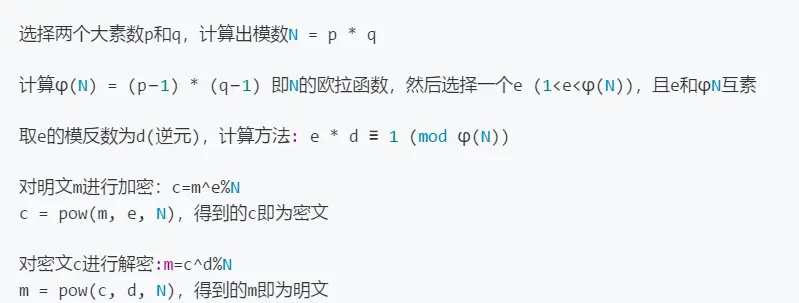

# 一、RSA简介及原理
## 1、rsa算法简介
RSA是公钥密码体制，是一种使用不同的加密密钥与解密密钥


选择两个大素数p和q，计算出模数N=p*q 
计算$\varphi(N) = (p-1) \times (q-1)$


## 2、RSA算法原理
### 1）欧拉函数φ(n)
欧拉函数φ(n)的定义是小于n的自然数中与n互质的数的个数

例如:5的欧拉函数为4，因为小于5 的自然数中与5互质的数为1，2，3，4.

任何一个素数p的欧拉函数就是$p-1$，即$φ(p) =p-1$

又因为模数$N = p * q$ ，$p$和$q$均为素数
所以$φ(N) = φ(p) * φ(q) = （p-1）*（q-1）$

其实有4中情况：
#### 第一种情况：
如果n=1，则 φ(1) = 1 。因为1与任何数（包括自身）都构成互质关系。
#### 第二种情况：
如果n是质数，则 φ(n)=n-1 。因为质数与小于它的每一个数，都构成互质关系。比如5与1、2、3、4都构成互质关系。

#### 第三种情况：
如果n是质数的某一个次方，即 $n = p^k$ ($p$为质数，$k$为大于等于1的整数)，则：
$$φ(n) = p^k-p^{(k-1)}$$ 

比如 φ(8) = φ(2^3) =2^3 - 2^2 = 8 -4 = 4。

这是因为只有当一个数不包含质数p，才可能与n互质。而包含质数p的数一共有p^(k-1)个，即$1×p、2×p、3×p、...、$$p^{(k-1)}×p$，把它们去除，剩下的就是与n互质的数。
#### 第四种情况：
如果n可以分解成两个互质的整数之积:
$$
n = p×q
$$
则：
$$
φ(n) = φ(p) = φ(p)×φ(q) = (p-1)×(q-1)
$$
即积的欧拉函数等于各个因子的欧拉函数之积。比如:φ(56)=φ(8×7)=φ(8)×φ(7)=4×6=24。

### 2）欧拉定理
若n,a为正整数，且n,a互质 gcd(n,a)=1，则:
$$a^{φ(n)}≡1 \bmod n$$

这个$a^{φ(n)}≡1\bmod n$ ==》 $a^{φ(n)}≡1 + kn$ ，$k$为任意整数。

也就是说，a的φ(n)次方被n除的余数为1。或者说，a的φ(n)次方减去1，可以被n整除。比如，3和7互质，而7的欧拉函数φ(7)等于6，所以3的6次方（729）减去1，可以被7整除（728/7=104）。


### 3）费马小定理 

费马小定理是欧拉定理的特例。若p是素数，a与p互质，则：
$a^p ≡ a\bmod p$      =>   $a^p = a + kp$   ，其中$k$为任意整数。
$a^{(p-1)} ≡ 1\bmod p$  => $a ^{(p-1)} = 1 + kp$，其中$k$为任意整数。$

### 4）模运算
模运算与基本四则运算有些相似，但是除法除外。其规则如下： 
```
(a + b) % p = (a % p + b % p) % p
(a - b) % p = (a % p - b % p) % p
(a * b) % p = (a % p * b % p) % p
a ^ b % p = ((a % p) ^ b) % p
结合律
((a + b) % p + c) = (a + (b + c) % p) % p
((a * b) % p * c) = (a * (b * c) % p) % p
交换律
(a + b) % p = (b + a) % p
(a * b) % p = (b * a) % p
分配律
(a + b) % p = (a % p + b % p) % p
((a + b) % p * c) % p = ((a * c) % p + (b * c) % p
重要定理
若 a ≡ b (mod p)，则对于任意的 c，都有(a + c) ≡ (b + c) (mod p)
若 a ≡ b (mod p)，则对于任意的 c，都有(a * c) ≡ (b * c) (mod p)
若 a ≡ b (mod p)，c ≡ d (mod p)，则
(a + c) ≡ (b + d) (mod p)
(a - c) ≡ (b - d) (mod p)
(a * c) ≡ (b * d) (mod p)
(a / c) ≡ (b / d) (mod p) 
```

### 5）推导过程
```
式1：c=m^e%N
式2：m=c^d%N 
```
将式1带入式2 得 m = (m ^ e % N ) ^ d % N

需要证明：m 是否与 ( m ^ e % N ) ^ d % N 相等？

```
(m^e%N)^d%N

=> (m^e)^d%N #模运算 a ^ b % p = ((a % p) ^ b) % p

=> m^(e*d)%N #幂的乘方，底数不变，指数相乘
```
将$e * d ≡ 1 (mod φ(N))$ 即 $e * d = K * φ(N) + 1$，$K$为任意正整数，代入得：

```
=> (m^(K*φ(N)+1))%N

=> (m^(K*φ(N))*m^1)%N # 同底数相乘，指数相加

=> (m^(K*φ(N))*m)%N  # (a^b)^c = a^(b*c)

=> ((m^φ(N)^K%N*m)%N # 幂的乘方，底数不变，指数相乘

=> ((m^φ(N)^K%N*m%N)%N # (a * b) % p = (a % p * b % p) % p

=> ((m^φ(N)%N)^K%N*m%N)%N # a ^ b % p = ((a % p) ^ b) % p

=> (1^K%N*m%N)%N # 根据欧拉定理：a^φ(n)≡1 mod n 即 a^φ(n) mod n = 1

=> (m%N)%N # 1^K%N=1
    
=> (m%N)%N

=> (m%N)^1%N

=> (m^1)%N   # a ^ b % p = ((a % p) ^ b) % p

=> m%N

m  #因为 m < N    
```
## 3、扩展欧几里得定理

## 4、中国剩余定理