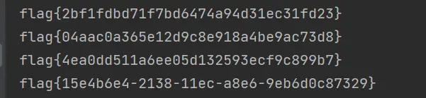
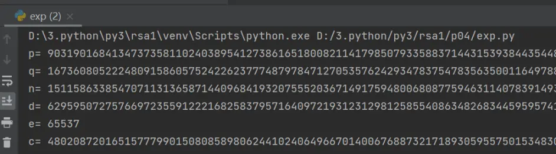
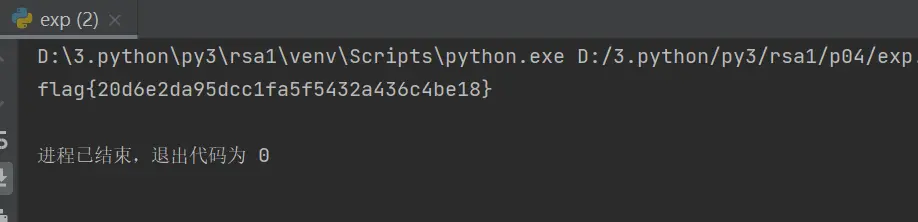
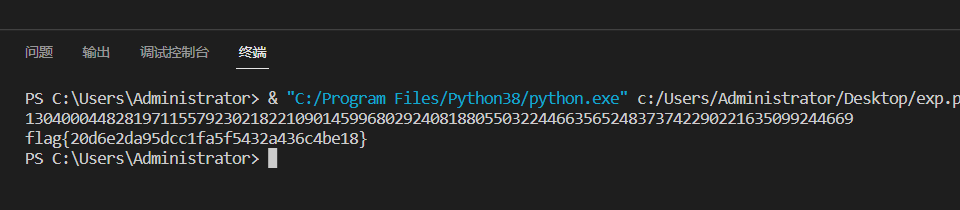
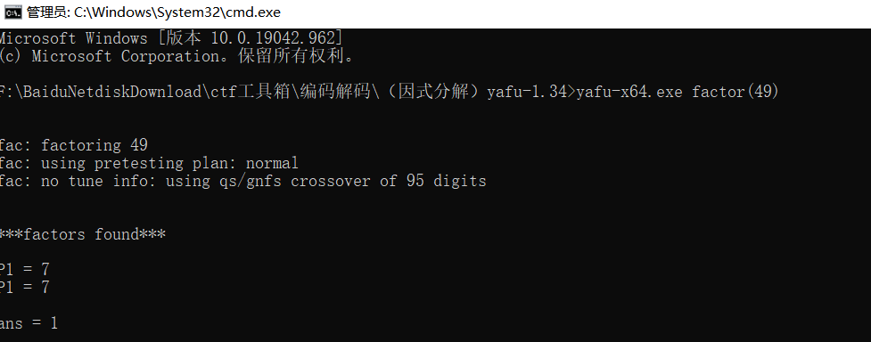
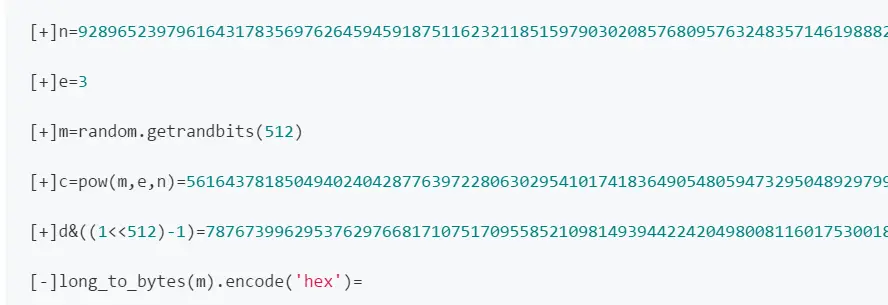

# 1、RSA基础题目及脚本
## 1）随机生成flag的脚本
```python
import random
import hashlib
import string

#字符串列表
a=string.printable
#随机生成flag
for i in range(10):
    flag = ""
    for i in range(10):
        flag += a[random.randint(0, 99)]
    flag = hashlib.md5(flag.encode()).hexdigest()
    print("flag{" + flag + "}")


from uuid import uuid1
flag="flag{"+str(uuid1())+"}"
print(flag)
```


## 2）出题脚本
```py
import libnum

#生成随机素数
p=libnum.generate_prime(1024)
q=libnum.generate_prime(1024)
e=65537
m="flag{20d6e2da95dcc1fa5f5432a436c4be18}"
#字符串转数字
m=libnum.s2n(m)
n=p*q
phi_n=(p-1)*(q-1)
#求逆元
d=libnum.invmod(e,phi_n)
c=pow(m,e,n)


print("p=",p)
print("q=",q)
print ("n=",n)
print("d=",d)
print ("e=",e)
print ("c=",c)
```


## 3）已知n,d,e,c求m
```py
import libnum

n= 14685532699024100754723222996385121368294636639693750794149020559314539676501066491415844320990799035552463714403031072164829458702780715523923962246149328887690893262271480633736651143634392056066729487305166335857950659680699210683976952113003674104898343893168719508462975991580551696824510044412974267585312807460664570245139015568859112921920860421973308538800641652781742897528769692264955229878206911313791989518088100099218315995549914435278654377368771668058107642713121127495780090852489015591581414806590111818355121157794129813430710822697558144598815860067978324469091074823400715400666808772858128261149
d= 10655677501818714057545408290692306276248758047017058020876274084213258239416744966450976471246402284779991562186357882946337721435118045765127426899173581894141706933500094886492805160951008521020815528782559085235105783294876017603112074153984218299742602608478449101819428678878037976091306073545785820932796422483686522431260926680891531210950251782422010888047909274618007401655588566411972291526501884077240225819170340160706732901152519829956055255218835518533347875405883278225018714890042991619568316304958478955576005445279807142753050999269866987221510643119355301877102904394259290548609330522059178100989
e= 65537
c= 7937297427288435728721973474925856865675225171317301007619581716746999628275946964127516634203401830643076435690247635478297903236185011960902817030042080567027165802992734580344202744697251074454156026031417427325660809453340428989949816426637434868049018580855865080715251672252410696685286047485204432648545886024276695749435709592994477514818763551176789963387889424072650811645828675090859926233585219662579177051353763021116106877502871331756544361402971459889233069752657661921397258845893293005099736406362733668960163109452223071514272504206470939914043855546880424121530822318600645513435826636440478681928

m=pow(c, d, n)
print(libnum.n2s(m).decode())
```


## 4）已知p,q,e,c求m
```py
import libnum

p= 178974110759313878895493455207516672882434662571655460770401953730906926302476821805659378622536968418528094957044346203494793341636459433763427491907849563922785749794854266865548657682445692416895365631610849027415100889893466490767087266542637440212533807985124840688092762928583845838066174446047886496977
q= 93610871651220602641323046206103959524660743045950590135111801621145944725719667412027010040112514078098465817329474817485502356054795293086881519931215167856745860801666777619204160653243683622930567962804914581845602027547589056026105213437044768786486688576038889017989891165091320977401144724582916902269
e= 65537
c= 10505609204533893330224001468185225454647695615253006709365840521320011117703729471412769493857753605106376689659952882885215696765275778768339621441610719177208351696489476567331875339672513868473669863672226315682278831184868041476134806131989809014422520472566202048041013413698358733781909446846787304422628166599338803127610040714545537436536348608012176828441837378861024372912755344397449657260043057239911064546424582314518819235470388313710641962070846850292694572345451390561142917224092435026246696084949470913298543523893386679712766629009873176804118782436042080621119334193337953451160118095182279971122

n=p*q
phi_n=(p-1)*(q-1)

#求逆元
d=libnum.invmod(e,phi_n)

m=pow(c,d,n)
print(m)
#数字转字节，转字符串
print(libnum.n2s(int(m)).decode())
```


# 2、基于N分解的RSA题目
对N进行分解（只要知道p和q,就能解出任何rsa）

N在一般情况下不可分解的，如果p和q太接近，或相差过大，或pq很小等情况

## 1）在线查询分解网站
http://www.factordb.com/index.php

这里大部分是n的分解记录

## 2）使用yafu工具分解
下载地址：https://sourceforge.net/projects/yafu/
```
#以分解49为例
yafu-x64.exe factor(49)

#导入文件进行分解，主要注意文本结尾要换行！！！不然要报错
yafu-x64.exe "factor(@)" -batchfile 1.txt
```


## 3）使用费马分解
用于p和q很接近的情况
```py
def isqrt(n):
  x = n
  y = (x + n // x) // 2
  while y < x:
    x = y
    y = (x + n // x) // 2
  return x

def fermat(n, verbose=True):
    a = isqrt(n) # int(ceil(n**0.5))
    b2 = a*a - n
    b = isqrt(n) # int(b2**0.5)
    count = 0
    while b*b != b2:
        # if verbose:
        #     print('Trying: a=%s b2=%s b=%s' % (a, b2, b))
        a = a + 1
        b2 = a*a - n
        b = isqrt(b2) # int(b2**0.5)
        count += 1
    p=a+b
    q=a-b
    assert n == p * q
    # print('a=',a)
    # print('b=',b)
    # print('p=',p)
    # print('q=',q)
    # print('pq=',p*q)
    return p, q
print(fermat(n))
```
## 4）分解出来后，用脚本解密即可
```py
import gmpy2
import libnum

p=
q=
e=
c=

n=p*q
phi_n=(p-1)*(q-1)

#求逆元
#d=libnum.invmod(e,phi_n)
d=gmpy2.invert(e,phi_n)

m=pow(c,d,n)
print(m)
print(libnum.n2s(int(m)).decode())
```
## 5）出题脚本
p,q接近，很快就能分解
```py
import libnum
import gmpy2

p=libnum.generate_prime(1024)
#下一个素数
q=gmpy2.next_prime(p)
print(p)
print(q)
print(gmpy2.is_prime(q))
e=65537
m="flag{20d6e2da95dcc1fa5f5432a436c4be18}"
m=libnum.s2n(m)
n=p*q
phi_n=(p-1)*(q-1)
d=libnum.invmod(e,phi_n)
c=pow(m,e,n)

print("n=",n)
print ("e=",e)
print ("c=",c)
```
## 6）解题脚本
```py
import  gmpy2
import libnum

def isqrt(n):
  x = n
  y = (x + n // x) // 2
  while y < x:
    x = y
    y = (x + n // x) // 2
  return x

def fermat(n, verbose=True):
    a = isqrt(n) # int(ceil(n**0.5))
    b2 = a*a - n
    b = isqrt(n) # int(b2**0.5)
    count = 0
    while b*b != b2:
        # if verbose:
        #     print('Trying: a=%s b2=%s b=%s' % (a, b2, b))
        a = a + 1
        b2 = a*a - n
        b = isqrt(b2) # int(b2**0.5)
        count += 1
    p=a+b
    q=a-b
    assert n == p * q
    # print('a=',a)
    # print('b=',b)
    print('p=',p)
    print('q=',q)
    # print('pq=',p*q)
    return p, q
n= 11236396438945464079176717143196471087880430124798640194523124584883161483744355761881720924798661332027501424643154414538029585287580122761405974427818841257794157497994556608202723391478027760181705924317533420305444809223444128034654367210331137068958693840582892819495487826045956577156074156668942232139402108462349340352898572481115406698318121299787982873916502591396884489682255184448165523604671743400422220149772905676655777228607948091675612455989601008858361759327370403306760674195506394280387024357322586732298060169962426894360775981877169895632927906390632063530920611197753716095903307467004289983267
e= 65537
c= 4260482466101011731957430920901406417434306478040387371588613512063428441001754753741853444857207349755032658064826592770143368278573527632514794087007140974732031358793249329430363014561312271335226315065519570861993052432656879088776144909638480994662696119431870831156129142403063675855781198930583825083362703887688501680905266707624440432914989795886392952354713859444836529227033324455920455610359249535012999943891644938239837207994673190694512955995798836266797112432609992164908679997257920566918693544746179908166741635316261624634351348613130319346356388546672516037747806222134853885202448682842353199133
pq=fermat(n)
p=pq[0]
q=pq[1]
phi_n=(p-1)*(q-1)
#求逆元
#d=libnum.invmod(e,phi_n)
d=gmpy2.invert(e,phi_n)
m=pow(c,d,n)
print(m)
print(libnum.n2s(int(m)).decode())
```
# 3、RSA密钥生成与读取
## 1）公钥生成
```py
from Crypto.PublicKey import RSA #pycryptodome模块

p= 787228223375328491232514653709
q= 814212346998672554509751911073
n= 640970939378021470187479083920100737340912672709639557619757
d= 590103645243332826117029128695341159496883001869370080307201
e= 65537


rsa_components = (n, e)
keypair = RSA.construct(rsa_components)
with open('pubckey.pem', 'wb') as f :
    f.write(keypair.exportKey())
```
## 2）私钥生成
```py
from Crypto.PublicKey import RSA

p= 787228223375328491232514653709
q= 814212346998672554509751911073
n= 640970939378021470187479083920100737340912672709639557619757
d= 590103645243332826117029128695341159496883001869370080307201
e= 65537


rsa_components = (n,e,d,p,q)
keypair = RSA.construct(rsa_components)
with open('private1.pem', 'wb') as f :
    f.write(keypair.exportKey())
```
## 3）公钥读取
公钥读取的是n和e
```py
from Crypto.PublicKey import RSA
with open("pubckey.pem","rb") as f:
    key = RSA.import_key(f.read())
    print('n = %d' % key.n)
    print('e = %d' % key.e)
```
## 4）私钥读取
私钥读取的是n，e，d，p，q
```py
from Crypto.PublicKey import RSA
with open("private1.pem","rb") as f:
    key = RSA.import_key(f.read())
    print('n = %d' % key.n)
    print('e = %d' % key.e)
    print('d = %d' % key.d)
    print('p = %d' % key.p)
    print('q = %d' % key.q)
```
## 5）出题脚本 -基于N分解的题目
```py
import libnum
import gmpy2
from Crypto.PublicKey import RSA

p=libnum.generate_prime(1024)
#下一个素数
q=int(gmpy2.next_prime(p))
e=65537
m="flag{a272722c1db834353ea3ce1d9c71feca}"
m=libnum.s2n(m)
n=p*q
c=pow(m,e,n)
flag_c=libnum.n2s(c)
rsa_components = (n, e)
keypair = RSA.construct(rsa_components)
with open('pubckey1.pem', 'wb') as f :
    f.write(keypair.exportKey())
with open("flag.txt","wb") as f:
    f.write(flag_c)
```

## 6）解题脚本
```py
import libnum
import gmpy2
from Crypto.PublicKey import RSA


def isqrt(n):
  x = n
  y = (x + n // x) // 2
  while y < x:
    x = y
    y = (x + n // x) // 2
  return x

def fermat(n, verbose=True):
    a = isqrt(n) # int(ceil(n**0.5))
    b2 = a*a - n
    b = isqrt(n) # int(b2**0.5)
    count = 0
    while b*b != b2:
        # if verbose:
        #     print('Trying: a=%s b2=%s b=%s' % (a, b2, b))
        a = a + 1
        b2 = a*a - n
        b = isqrt(b2) # int(b2**0.5)
        count += 1
    p=a+b
    q=a-b
    assert n == p * q
    # print('a=',a)
    # print('b=',b)
    # print('p=',p)
    # print('q=',q)
    # print('pq=',p*q)
    return p, q


with open("pubckey1.pem","rb") as f:
    key = RSA.import_key(f.read())
    n=key.n
    e=key.e

with open("flag.txt","rb") as f:
    c=f.read()
    c=libnum.s2n(c)

#费马分解,
n1=fermat(n)
p=n1[0]
q=n1[1]
phi_n=(p-1)*(q-1)
#求逆元
d=libnum.invmod(e,phi_n)
m=pow(c,d,n)
print(m)
print(libnum.n2s(int(m)).decode())
```
## 7）进阶——自动生成密钥及加解密
```py
from Crypto.Cipher import PKCS1_v1_5
from Crypto import Random
from Crypto.PublicKey import RSA
from Crypto.Cipher import PKCS1_OAEP


random_generator = Random.new().read
rsa = RSA.generate(2048, random_generator)
# 生成私钥
private_key = rsa.exportKey()
# print(private_key.decode('utf-8'))
with open('rsa_private_key.pem', 'wb')as f:
    f.write(private_key)
# 生成公钥
public_key = rsa.publickey().exportKey()
# print(public_key.decode('utf-8'))
with open('rsa_public_key.pem', 'wb')as f:
    f.write(public_key)


#测试用密钥加密
public_key = RSA.importKey(public_key)
msg='flag'
pk = PKCS1_v1_5.new(public_key)
encrypt_text = pk.encrypt(msg.encode())
print(encrypt_text)

#测试密钥解密
private_key = RSA.importKey(private_key)
pk = PKCS1_v1_5.new(private_key)#PKCS1_v1_5是一种RSA的加密填充方式
msg = pk.decrypt(encrypt_text,0)
print(msg)


#两种标准
rsa_components = (n, e, int(d), p, q)
arsa = RSA.construct(rsa_components)
rsakey = RSA.importKey(arsa.exportKey())
rsakey = PKCS1_OAEP.new(rsakey) #PKCS1_OAEP是一种RSA的加密填充方式
decrypted = rsakey.decrypt(c)
print(decrypted)
```
# 4、共模攻击脚本
共模攻击，也称同模攻击。
同模攻击利用的大前提就是，RSA体系在生成密钥的过程中使用了相同的模数n。
在CTF题目中，就是同一明文，同一n，不同e，进行加密。
m，n相同；e，c不同，且e1和e2互质。
## 1）出题脚本
```py
import libnum
import gmpy2
#生成素数
p=libnum.generate_prime(1024)
q=libnum.generate_prime(1024)
e1=2333
e2=23333
m="flag{6ed4c74e022cb18c8039e96de93aa9ce}"
m=libnum.s2n(m)
n=p*q
c1=pow(m,e1,n)
c2=pow(m,e2,n)
print("n1=",n)
print("e1=",e1)
print("c1=",c1)
print("n2=",n)
print("e2=",e2)
print("c2=",c2)
```
## 2）解密脚本
```py
import gmpy2
import libnum

n= 25333966058003377512707481338795714713737652659944601834182685873529702913988641983855700459996104700470621411559153944988952210084014634675583566338568882440708528997808798650962116756969822211586531522430245040013570571043385238601846104615050089457836721437790715225367971106085839523500735480715155424498941150468093083816830215632716244390679417218873179734276657411907216486790815037105108306055794473002315541787461904728375164737225486501009857299717749346279371251245318729951905832578739696926931502225899707226264570557623527701806829827566904224572897378639191756878049342203546309520458672464170859577433
e1= 2333
c1= 11355981897781478907853356911752561659125575027336719997290835661089901154031171698660586203170528368228850895159361637188990782030255983633790580700032092629587631108597144196551438410868034739981960656110887650747325311613900008001234835897835613759692146419080113176963747835592656185435741504176116672174539018089139547795447109458469225330809064539216773123671814859510069089532677704482026169178543062578686794346026774853085101278125763460212801929360456888869350105294595904940799522522144740464043605342348269086324747729288399275079874271519208155039364092577755518532799345651172433227745483422620900776136
e2= 23333
c2= 1326499538902841116411674554069945581390130048432351353260154261863309471312810811160302458644816390944833633923435634961251092531893503039914793217247984595331920909367627316087404934402312358642315675486438968585084964845763881078835787872160374025547400141298650794551970291119975344578667689961134814676553190178139842507675899262024572370313939107080072875068218336255452161407859907308656094331557912187788276334833723893856310434523337557011032081467262457427167978528280339494077785813461280853735266463152709443731638714219391773144349752633555310299318290576258086971373777118482642702020599928071855133041

#共模攻击
#共模攻击函数
def rsa_gong_N_def(e1,e2,c1,c2,n):
    e1, e2, c1, c2, n=int(e1),int(e2),int(c1),int(c2),int(n)
    s = gmpy2.gcdext(e1, e2)
    s1 = s[1]
    s2 = s[2]
    if s1 < 0:
        s1 = - s1
        c1 = gmpy2.invert(c1, n)
    elif s2 < 0:
        s2 = - s2
        c2 = gmpy2.invert(c2, n)
    m = (pow(c1,s1,n) * pow(c2 ,s2 ,n)) % n
    return int(m)
m = rsa_gong_N_def(e1,e2,c1,c2,n)
print(m)
print(libnum.n2s(int(m)))
```
## 3）共模攻击原理
这道题目给出两组密文，但加密模数n是相同的，加密指数e不同，且$GCD(e1,e2)=1$，是典型的共模攻击。推导一下共模攻击的公式。

$已知e1,e2，且GCD(e1,e2)=1， 由扩展欧几里得算法，存在一组整数s1,s2，使得：$
两个及以上的公钥(n,e)来加密同一条信息m
```
c1 = pow(m, e1, n)
c2 = pow(m, e2, n)
```
e1，e2互质，则有
```
gcd(e1,e2)=1
```
根据扩展欧几里德算法 对于不完全为 0 的整数 a，b，gcd（a，b）表示 a，b 的最大公约数。那么一定存在整数 x，y 使得 gcd（a，b）=ax+by
```
e1*s1+e2*s2 = 1
```
s1、s2皆为整数，但是一正一负，假设s1为正数,s2为负数 
因为：
```
c1 = m^e1%n
c2 = m^e2%n
```
可得：
```
(c1^s1*c2^s2)%n = ((m^e1%n)^s1(m^e2%n)^s2)%n
```
根据模运算性质： 幂运算是一种关于幂的数学运算。同底数幂相乘，底数不变，指数相加。同底数幂相除，底数不变，指数相减。幂的乘方，底数不变，指数相乘。
```
(a * b) % p = (a % p * b % p) % p
a ^ b % p = ((a % p) ^ b) % p
```
简化公式为：
```
(c1^s1*c2^s2)%n = ((m^e1%n)^s1*(m^e2%n)^s2)%n

=> (c1^s1*c2^s2)%n = ((m^e1%n)^s1%n*(m^e2%n)^s2%n)%n #(a * b) % p = (a % p * b % p) % p

=> (c1^s1*c2^s2)%n = ((m^e1)^s1%n*(m^e2)^s2%n)%n #((a % p) ^ b) % p =a ^ b % p

=> (c1^s1*c2^s2)%n = ((m^e1)^s1*(m^e2)^s2)%n # (a % p * b % p) % p=(a * b) % p

=>(c1^s1*c2^s2)%n = ((m^(e1*s1)*(m^(e2*s2))%n #。幂的乘方，底数不变，指数相乘。

(c1^s1*c2^s2)%n = (m^(e1*s1+e2*s2))%n  # 同底数幂相乘，底数不变，指数相加。
```
因为 $e1*s1+e2*s2 = 1$ 得：
```
(c1^s1*c2^s2)%n = (m^1)%n

(c1^s1*c2^s2）%n=m
```
上述就是rsa共模攻击的过程

因此，同一m，同一n,不同e，进行加密。在不需要知道d的情况下，可以进行解密。

# 5、wiener(维纳)攻击脚本
维纳攻击：e指数很大（理论上$d<N^{0.25}$此攻击起作用）

## 1）出题脚本
```py
import libnum
import random
import gmpy2
#生成随机素数
p=libnum.generate_prime(512)
q=libnum.generate_prime(512)
m="flag{20d6e2da95dcc1fa5f5432a436c4be18}"
#字符串转数字
m=libnum.s2n(m)
n=p*q
phi_n=(p-1)*(q-1)
#计算d
while True:
    nbits=1024
    d = random.getrandbits(nbits // 4)
    if (libnum.gcd(d, phi_n) == 1 and 36 * pow(d, 4) < n):
        break
#计算e
e = libnum.invmod(d,phi_n)
c=pow(m,e,n)
print ("n=",n)
print ("e=",e)
print ("c=",c)
```
## 2）解密脚本
```py
import gmpy2
import libnum

def continuedFra(x, y):
    """计算连分数
    :param x: 分子
    :param y: 分母
    :return: 连分数列表
    """
    cf = []
    while y:
        cf.append(x // y)
        x, y = y, x % y
    return cf
def gradualFra(cf):
    """计算传入列表最后的渐进分数
    :param cf: 连分数列表
    :return: 该列表最后的渐近分数
    """
    numerator = 0
    denominator = 1
    for x in cf[::-1]:
        # 这里的渐进分数分子分母要分开
        numerator, denominator = denominator, x * denominator + numerator
    return numerator, denominator
def solve_pq(a, b, c):
    """使用韦达定理解出pq，x^2−(p+q)∗x+pq=0
    :param a:x^2的系数
    :param b:x的系数
    :param c:pq
    :return:p，q
    """
    par = gmpy2.isqrt(b * b - 4 * a * c)
    return (-b + par) // (2 * a), (-b - par) // (2 * a)
def getGradualFra(cf):
    """计算列表所有的渐近分数
    :param cf: 连分数列表
    :return: 该列表所有的渐近分数
    """
    gf = []
    for i in range(1, len(cf) + 1):
        gf.append(gradualFra(cf[:i]))
    return gf


def wienerAttack(e, n):
    """
    :param e:
    :param n:
    :return: 私钥d
    """
    cf = continuedFra(e, n)
    gf = getGradualFra(cf)
    for d, k in gf:
        if k == 0: continue
        if (e * d - 1) % k != 0:
            continue
        phi = (e * d - 1) // k
        p, q = solve_pq(1, n - phi + 1, n)
        if p * q == n:
            return d


n= 68781015120012754009149819243839432182753699533745468739333557116438115901358573880902197723852823949505376140916570536753019491036629572363854637530919546688901226752085109196549145599781909847664046508960094447692268230516763088293911965638780888720788954194778424857089535187609738198309161969913567107861
e= 54093680529782962282616750547542407544796590039913570980901028264103594185617926725669901283009540557359666956131385125727959502505561517117179644650419753631214251337533961664493198676862110639584202010794500844074619335752668896589407110076134931918634061631574656816488381501901503924226166074238518619869
c= 30443384983816710270001651296607959522389400057103143909277631290995899073895621701281106228069835965181342091582584186637031613250922961166298411359757600825556083868477673357860585539016515776933117915504873987178857740106223631465737111746470236003857656528610755145017342412306680097140732745012583119076

d=wienerAttack(e, n)
m=pow(c, d, n)
print(libnum.n2s(m).decode())
```
# 6、低加密指数攻击
加密指数指的是e，e一般选取65535，当e很小，可直接破解。

这类攻击在CTF题中，一般是 e=3

$如果e=3，且m^e<n，c开3次根式，得到m。$
$如果e=3，且m^e>n，那么设k，有：c=m^e+kn$
$爆破k，如果c-kn能开3次根式，就能得到m。$

## 1）出题脚本
```py
import libnum
import gmpy2

#生成随机素数
p=libnum.generate_prime(1024)
q=libnum.generate_prime(1024)
e=3
m="flag{20d6e2da95dcc1fa5f5432a436c4be18}"
#字符串转数字
m=libnum.s2n(m)
n=p*q
phi_n=(p-1)*(q-1)
#求逆元
d=gmpy2.invert(e,phi_n)
c=pow(m,e,n)

print ("n=",n)
print ("e=",e)
print ("c=",c)
```  
## 2）解密脚本
```py
import gmpy2
import libnum

def de(c, e, n):
    k = 0
    while True:
        mm = c + n*k
        result, flag = gmpy2.iroot(mm, e)
        if True == flag:
            return result
        k += 1
n= 14067473525623615859223663589118945198091192669401088734569589535726733244095067264729942915265175903139441309376381225701454902095234966599914234681888481774607095853830772571665038109641511499155604914228117882196188074964226780922239011682486198651997912713999544628177959592818928976240251790858062449396082494272361535640237914373270152455829541596341184902017633404494979208958080467979235974182507427501682492000572071306960595992848840147393057648929439822116261337091431441205378542080755128597543738922210525692259529009107645032171097155449558362749512243918901171631681472217935131865121871798425854707759
e= 3
c= 2217344750798294937344050117513831761010547351781457575945714176628679412650463329423466955026804439931765627111856888102133234836914006818023839994342283023142702993182665344445325734299047409223354338948863171846780674244925724334091153701697864918695050507247415283070309

m=de(c,e,n)
print(m)
print(libnum.n2s(int(m)).decode())
```
# 7、低加密指数广播攻击
如果选取的加密指数较低，并且使用了相同的加密指数给一个接受者的群发送相同的信息，那么可以进行广播攻击得到明文。
在CTF中，n，c不同，明文m，e相同，其e比较小。使用中国剩余定理求解。
## 1）出题脚本
```py
import libnum
#生成随机素数
def rsa_def(e,m):
    p=libnum.generate_prime(1024)
    q=libnum.generate_prime(1024)
    #字符串转数字
    m=libnum.s2n(m)
    n=p*q
    c=pow(m,e,n)
    n_lt.append(n)
    c_lt.append(c)

n_lt=[]
c_lt=[]
e=23
m='flag{2cb2eb4b2c7fdf4e94e10344be856446}'
for i in range(7):
    rsa_def(e,m)

print("e=",e)
print("n=",n_lt)
print("c=",c_lt)
```
## 2） 解密脚本1
```py
import libnum
from gmpy2 import invert, gcd, iroot

def op(x):
    res = 1
    for i in x:
        res *= i
    return res

def CRT(m, a):
    assert (len(m) == len(a))
    M = op(m)
    sum = 0
    for m, a in zip(m, a):
        Mi = M // m
        ti = invert(Mi, m)
        sum += a * ti * Mi
    return sum % M
def GCRT(m, a):
    assert (len(m) == len(a))
    curm, cura = m[0], a[0]
    for m, a in zip(m[1:], a[1:]):
        d = gcd(curm, m)
        c = a - cura
        assert (c % d == 0)
        K = c // d * invert(curm // d, m // d)
        cura += curm * K
        curm = curm * m // d
    return cura % curm

e= 23
n= [13700568188515160652483333122748856122721197793561758976293940196437611129096187147049018844770801852491509905633421086860525538786202094426963328030251710764571262136174896745533638173611350459716214924297588461960177050085385463667053134112771796358074472935345700519739991250404101653259068109069693105921388873407341327391535695855870048544246046807524271999074571290297887397122751189238913097314211648891658786959026354758174645247220351373112768023740548658853638361571194694899655444114676642455442372865402013423716810043521278757792135057542028337381224680456644807085272591758332208055210218120184762933993, 12455303951778295101801876746865726762837380068225611327265475119171234220566439286424157465915935073825839673377690927685328334906307316474567186387631653801487281448621083840044622749158794717243547992072439308091388396577613505544620596436291129920864908674330398567591089739953054198863265589615640925745448938637009162522951734388734884333210018733280942210441939903191498896601489219385238879930891399742641138070096026008226581854996694584005317481033177457738077410685570860098544905752983525186623046625831970650060102227916725290755005373441583687173317035035580381484364030548806838563780182184117638395501, 11312913453345524997229175092303757066349809787030135927591246090443816441487008566337534259925791562593802909853876625626317525202428762422138834267165059103366474521447755350822619474026723784588743249816343322663039545930277057837056152601616900790058365628051926865192020616084647924562898079954569875871488048485269581903324695594743584490301132714735102846843035514174635115834382345956826120332925240425711055383445735314612014526078453624636064136731525847521062469732411461240879728208804879621960486763810048962817360272134393185930002946977732438576414921250013379633385546522773969341316069572502067565747, 19273688926871530751707885170718573691217157450567879434223457628340410073625895093788197974441685806302563195850728310991029886375715086122432340760177266985524985445504300034480827487797904941865418089597333968798898696588493471468263648636085443020434703464184815215924633364352735339920297191301112596913193981943417483120540953061378442416926357165828400001655707467493126093621482473840789855669296212432210460828627914111587469312179918093681028472281824867507358588256781382024745011058883359327063772375423890907634909474243733397473408057822868275644578237140525612613960087777442779675214209932962161127943, 25824403380218842654152117237181863815407686057920357548100132783016208234216157331481187013858706620084532009147859360032194662194329147430352381352060599665383607132414222783152103706812942495504805443853663820643284400132519740763181995336671760074736189118849190911417412125673622718186682930944463719251663826122062414169185281402187745799450127860616811214434583738617470847946117017912241156196170781549212311773302997289690360334428053433645188479934679156573770259457673448241437007751122166255146634172359683608410225806629185780976706769275891277564054509652711969428966369382807140328871035548244913540169, 27237916069051621208940446912652352983034283876768722877796629630339066194659652050347720419800886409125794947519574028544026594230991606608793723513349031053967598250588096756917851047427400805606694825815650771281434785207392911507124225263256982256339868047939184615897450178154018301408865653899046967323372600912627209194957697714349971037547547785817038582309482843956504640495722872808769284795831606211370129997371039857944461416328980185572754574947986464294124047090215456723501364524474569642506285260702179251484768225200095243277847312804129809104143492271538375785121251371642879445405237226218130294767, 13761550682262178277138207445908812895938004012620351458812077456012342912081457948142730381037941264721223863482179216010551793547021574285408780459622610402725800322968427850107196669966179328339837806343597136218927944640487794959105652921590477743490006234776475206318254765423468761009179359533340573903819987444132938579714590504929528901380380034611797641640102025769022580055379262631658712636898183456153010636153333354330556615811465638688432337372481631547224635135648075131524783033767896216049834072882777559679890752875405582498757130694817571975439400501682753249614034942783158191876673449277964305873]
c= [10262571808823462518706222972617543597862568988621892788603169566061143066015712397590162941689759961146172690260488971865965270847230222579998032904557938430984766267711048364907947168116473908091952262274847901197798670702630932509348193160049011343984674456154980133706472252009228877741952811774717803218313244040775956381945077497379634101671865923305021804060521682939202170177994307021066512676052755208342422597702905467231418454913781792876325613132181844091995047630699929420681514255787561417787538399764114936771546416271603555435195286433694761222982635917086486380929164535357220194188751490847126159740, 1873760069623225193188031460164577168629510321843511590851589581010158323091884037245625334264450576423497513703748949943402486554235195486945608003604913492410550727032646952732075387833483434157962823847945961417788077590746865603009614636801926695485643494439910816287002493987681839263137321312158281577409606512588038571503481880205375876372759847610515728629030784895468324627007475548811579324164095761843942789779697129082973879068202809855392853491223029896314818656151121278599338954208895547796950391203204627158727359612310869523861493123901912234283765154942764948742461112728821107134608346552771856775, 2985895977894993412250356564280621188757701877004747248029655606908178453788442472530624315824217412687521627124641549636268771426175593603860596969406918746968428475480360839574070154578348252212233965555420185919910549233104881737429986120779245582625147836249604511991694099504498456423355415033891952572068957140136031237587821914297743550751703500164233251775829591163214908665505948671743637428615178406048668071123208829673815143306105215918457316827849469724561259085924020618664008688924504157202910867055508798021785392339533763892777711399815389010578953671416118696256122691527492893238690603105740871718, 880226958648330570665826652923585021064905285913220564535802601268914731939998238851663053132946194395728683681709691206818341165883097568804208974913295560837751365921375933221025439628586836402981502674560586284377581275819082460923772292780487491196858992362166740159608419089452540222602172839570711702715638458570267373629408280794214751990345330692342439212475521544906222647038911039746667297765160642325197077286500302972512842670715220866427191331087678451078964988930072707946282911276517877581001397844626280393814317485128907214187598723285030652543787338988559227984102314239323999288888886062656553567, 2009815427590067013904234705045801411676517862085803426907991060580056876965631979890272588810800230952582542504850877216565503823555945840629024122371840947339558621619080946766065959900677138148030357494710396126783369878070540451138925897438184723977799391715647904517833046633527545658064968373331747651285453005992951298693244135497529999014011663505125408546171884008627711191184419674138689402575260876247393334319284308455639799976027283117878360299913911527890869762030625362974305707352360014964055595635315501016094747111266795155708691399809263809612237731990725856751947329733607523318847566974421507377, 5694700766209667533320463555578774304413921444532095100497641465531621818677278187178007777107102216001903166590706266461389108866563137126658591265596096815630888192401258893389043674230339983362206002697721033273220169349689433933228398864735569502059227668658884754437859192804614688078126017106973898338983058467903273433629800893427045854677794419302456422469488313296020469202479512874455184512957276727018667852597050339727765639174070344434646695283305954814336208535975320481890216924783115781802398152316171967550392347431746885369490458690822632544727994467024208594657404613355215378203965583472028051158, 10292024155412613173825075050556970628998306804602106049394871162726180325842644363271001627039660982320232377250177866906798633433125147372046294230795160430975886694419367570376173140902999001496377201160021928316891425794054040646925354276987039659647583093660753953920769021487949471906220620446860851971969844544591399518592683848757784465531598787547279741438244737906014906621222662915117890417807671575763023265920422409800110274912550502682376498609611973173660997965660328963204286476887664127188442751055758474381180365051193094521479396706496869721757475497142256079170254820437945136475911435012491537989]

m = CRT(n, c)
m1 = iroot(m, e)  # 开e次方
print(m1)
print(libnum.n2s(int(m1[0])))
```
## 3） 解密脚本2
```py
import binascii,gmpy2
from functools import reduce

import libnum


def CRT(mi, ai):
    assert(reduce(gmpy2.gcd,mi)==1)
    assert (isinstance(mi, list) and isinstance(ai, list))
    M = reduce(lambda x, y: x * y, mi)
    ai_ti_Mi = [a * (M // m) * gmpy2.invert(M // m, m) for (m, a) in zip(mi, ai)]
    return reduce(lambda x, y: x + y, ai_ti_Mi) % M

e= 23
n= [13700568188515160652483333122748856122721197793561758976293940196437611129096187147049018844770801852491509905633421086860525538786202094426963328030251710764571262136174896745533638173611350459716214924297588461960177050085385463667053134112771796358074472935345700519739991250404101653259068109069693105921388873407341327391535695855870048544246046807524271999074571290297887397122751189238913097314211648891658786959026354758174645247220351373112768023740548658853638361571194694899655444114676642455442372865402013423716810043521278757792135057542028337381224680456644807085272591758332208055210218120184762933993, 12455303951778295101801876746865726762837380068225611327265475119171234220566439286424157465915935073825839673377690927685328334906307316474567186387631653801487281448621083840044622749158794717243547992072439308091388396577613505544620596436291129920864908674330398567591089739953054198863265589615640925745448938637009162522951734388734884333210018733280942210441939903191498896601489219385238879930891399742641138070096026008226581854996694584005317481033177457738077410685570860098544905752983525186623046625831970650060102227916725290755005373441583687173317035035580381484364030548806838563780182184117638395501, 11312913453345524997229175092303757066349809787030135927591246090443816441487008566337534259925791562593802909853876625626317525202428762422138834267165059103366474521447755350822619474026723784588743249816343322663039545930277057837056152601616900790058365628051926865192020616084647924562898079954569875871488048485269581903324695594743584490301132714735102846843035514174635115834382345956826120332925240425711055383445735314612014526078453624636064136731525847521062469732411461240879728208804879621960486763810048962817360272134393185930002946977732438576414921250013379633385546522773969341316069572502067565747, 19273688926871530751707885170718573691217157450567879434223457628340410073625895093788197974441685806302563195850728310991029886375715086122432340760177266985524985445504300034480827487797904941865418089597333968798898696588493471468263648636085443020434703464184815215924633364352735339920297191301112596913193981943417483120540953061378442416926357165828400001655707467493126093621482473840789855669296212432210460828627914111587469312179918093681028472281824867507358588256781382024745011058883359327063772375423890907634909474243733397473408057822868275644578237140525612613960087777442779675214209932962161127943, 25824403380218842654152117237181863815407686057920357548100132783016208234216157331481187013858706620084532009147859360032194662194329147430352381352060599665383607132414222783152103706812942495504805443853663820643284400132519740763181995336671760074736189118849190911417412125673622718186682930944463719251663826122062414169185281402187745799450127860616811214434583738617470847946117017912241156196170781549212311773302997289690360334428053433645188479934679156573770259457673448241437007751122166255146634172359683608410225806629185780976706769275891277564054509652711969428966369382807140328871035548244913540169, 27237916069051621208940446912652352983034283876768722877796629630339066194659652050347720419800886409125794947519574028544026594230991606608793723513349031053967598250588096756917851047427400805606694825815650771281434785207392911507124225263256982256339868047939184615897450178154018301408865653899046967323372600912627209194957697714349971037547547785817038582309482843956504640495722872808769284795831606211370129997371039857944461416328980185572754574947986464294124047090215456723501364524474569642506285260702179251484768225200095243277847312804129809104143492271538375785121251371642879445405237226218130294767, 13761550682262178277138207445908812895938004012620351458812077456012342912081457948142730381037941264721223863482179216010551793547021574285408780459622610402725800322968427850107196669966179328339837806343597136218927944640487794959105652921590477743490006234776475206318254765423468761009179359533340573903819987444132938579714590504929528901380380034611797641640102025769022580055379262631658712636898183456153010636153333354330556615811465638688432337372481631547224635135648075131524783033767896216049834072882777559679890752875405582498757130694817571975439400501682753249614034942783158191876673449277964305873]
c= [10262571808823462518706222972617543597862568988621892788603169566061143066015712397590162941689759961146172690260488971865965270847230222579998032904557938430984766267711048364907947168116473908091952262274847901197798670702630932509348193160049011343984674456154980133706472252009228877741952811774717803218313244040775956381945077497379634101671865923305021804060521682939202170177994307021066512676052755208342422597702905467231418454913781792876325613132181844091995047630699929420681514255787561417787538399764114936771546416271603555435195286433694761222982635917086486380929164535357220194188751490847126159740, 1873760069623225193188031460164577168629510321843511590851589581010158323091884037245625334264450576423497513703748949943402486554235195486945608003604913492410550727032646952732075387833483434157962823847945961417788077590746865603009614636801926695485643494439910816287002493987681839263137321312158281577409606512588038571503481880205375876372759847610515728629030784895468324627007475548811579324164095761843942789779697129082973879068202809855392853491223029896314818656151121278599338954208895547796950391203204627158727359612310869523861493123901912234283765154942764948742461112728821107134608346552771856775, 2985895977894993412250356564280621188757701877004747248029655606908178453788442472530624315824217412687521627124641549636268771426175593603860596969406918746968428475480360839574070154578348252212233965555420185919910549233104881737429986120779245582625147836249604511991694099504498456423355415033891952572068957140136031237587821914297743550751703500164233251775829591163214908665505948671743637428615178406048668071123208829673815143306105215918457316827849469724561259085924020618664008688924504157202910867055508798021785392339533763892777711399815389010578953671416118696256122691527492893238690603105740871718, 880226958648330570665826652923585021064905285913220564535802601268914731939998238851663053132946194395728683681709691206818341165883097568804208974913295560837751365921375933221025439628586836402981502674560586284377581275819082460923772292780487491196858992362166740159608419089452540222602172839570711702715638458570267373629408280794214751990345330692342439212475521544906222647038911039746667297765160642325197077286500302972512842670715220866427191331087678451078964988930072707946282911276517877581001397844626280393814317485128907214187598723285030652543787338988559227984102314239323999288888886062656553567, 2009815427590067013904234705045801411676517862085803426907991060580056876965631979890272588810800230952582542504850877216565503823555945840629024122371840947339558621619080946766065959900677138148030357494710396126783369878070540451138925897438184723977799391715647904517833046633527545658064968373331747651285453005992951298693244135497529999014011663505125408546171884008627711191184419674138689402575260876247393334319284308455639799976027283117878360299913911527890869762030625362974305707352360014964055595635315501016094747111266795155708691399809263809612237731990725856751947329733607523318847566974421507377, 5694700766209667533320463555578774304413921444532095100497641465531621818677278187178007777107102216001903166590706266461389108866563137126658591265596096815630888192401258893389043674230339983362206002697721033273220169349689433933228398864735569502059227668658884754437859192804614688078126017106973898338983058467903273433629800893427045854677794419302456422469488313296020469202479512874455184512957276727018667852597050339727765639174070344434646695283305954814336208535975320481890216924783115781802398152316171967550392347431746885369490458690822632544727994467024208594657404613355215378203965583472028051158, 10292024155412613173825075050556970628998306804602106049394871162726180325842644363271001627039660982320232377250177866906798633433125147372046294230795160430975886694419367570376173140902999001496377201160021928316891425794054040646925354276987039659647583093660753953920769021487949471906220620446860851971969844544591399518592683848757784465531598787547279741438244737906014906621222662915117890417807671575763023265920422409800110274912550502682376498609611973173660997965660328963204286476887664127188442751055758474381180365051193094521479396706496869721757475497142256079170254820437945136475911435012491537989]

m=gmpy2.iroot(CRT(n, c), e)[0]
print(m)
print(libnum.n2s(int(m)))
```
n和c比较多，e比较小就是广播攻击，
n和c比较多，e比较大就是模不互素。

# 8、N不互素（共享素数）
已知条件：n1、n2、c1、c2、e
两个n里使用有相同的素数p或q，在CTF中，同样一个e（一般为65537）和m，有两个或多个n和c时，那么n之间可能时共享素数。
通过求两个n的最大公约数，得到p，n//p得到q，
## 1）出题脚本
```py
import libnum

#生成随机素数
p1=libnum.generate_prime(1024)
p2=libnum.generate_prime(1024)
q=libnum.generate_prime(1024)
e=65537
m="flag{c9d48baa792e91ce65d175bb586f8c24}"
#字符串转数字
m=libnum.s2n(m)
print(q)
n1=p1*q
n2=p2*q
#求逆元
c1=pow(m,e,n1)
c2=pow(m,e,n2)

print ("e=",e)
print("n1=",n1)
print("n2=",n2)
print ("c1=",c1)
print ("c2=",c2)
```
## 2）解题脚本
```py
import libnum
import gmpy2


e= 65537
n1= 18851781425565649500243914718895527060598553785142033499277947796047289729069551538151421839511239897691881228121437622923274745439286192958624933347473814433650645821240330239352230328910532686189064529002598986350545013596873280380093139589440286483854335646063005690269032198568724965964443111093291700142910652223408636268615176273268372177721667944316123253596652992256076572634227395015036348109972259736684061785035583511127926569341967394058493301139935304361924639075754092181040235419401702148068770694697982444290753353433701503833775179671108406498799549700127209151389161427718168658930877516526900193773
n2= 24141384186719901100738328229558939321137195844627407412035205930880546126459260897433418685279927024995699136588216700770429628894224051287181657357533218989737870319139269421990248988961435374202640406264110282763206906390508271179764960952342404379846442988489435158217691170804372863828966379599925114485971708200189788312061335938149982724447336254731731196164294152411281627551943972751739099703406466680639123738668207648503911709799873188331259979032169198913999856215096219340617703116234922400948884716827963616800355410477122406692338452507358998811789750057925245184372948089354754021196407808558611706347
c1= 11233930138929485738604185458820792679941706517184575056860307907280050814616639358486313129298273947905894904145194035804995663173314907762677924041275132974029028894644172713486633713023630611556983846927634063704894533048653309657581762974450289360550659261899944333557732087882069544235529266455787027619668939220511057340231613645208599303911724024926701608537602920797245075262273603379467945283128416767718651714209330369788240996832207630345743245279821753430782200336283582459635492184924556145031704499178500242816865275291936063430100028447772122941596704727728675661250380470986371668037469383671505328135
c2= 5585224206647236865248808202221713289466135149339680308821203835812670001259895780508640505222648200259525489427033258746992319005320440650548405653844536422632581252608192223771882550003217335273112474383014796651892287737753603533030776710121680439078567046997872719450037145665867123925472406058893384600128119493338790196284996386511009366274826447064392594100457497289556291407982935292829015102796178711091471748295065093460144885719356062242014650190112796869173536886083200906303200902844575328314123662659807283984619970501020349836850699532193026247740142876327310689901499496665093919484517214474842110431


#求最大公约数
q=gmpy2.gcd(n1,n2)
p1=n1//q

phi_n=(q-1)*(p1-1)
#求逆元d
d1=libnum.invmod(e,phi_n)
m=pow(c1,d1,n1)
print(m)
#数字转字节，转字符串
print(libnum.n2s(int(m)).decode())
```
# 9、dp泄露
## 1）原理解析
已知公钥n、e以及dp
其中，$dp= d\bmod(p-1)$

已知：
```
c = m^e mod n
m = c^d mod n
ϕ(n)=(p−1)*(q−1)
d∗e ≡ 1 mod ϕ(n)
dp = d mod (p−1)
```
最后一个式子两边同时乘以e，得到：
```
dp*e≡d*e mod (p−1)
```
因此可以得到：
```
式1：d∗e=k∗(p−1)+dp∗e
式2：d∗e≡1 mod ϕ(n)
```
式1带入式2：
```
=> k∗(p−1)+dp∗e ≡1 mod ϕ(n)

=> k∗(p−1)+dp∗e ≡1 mod (p−1)∗(q−1)

=> k1∗(p−1)+dp∗e = k2*(p−1)∗(q−1)+1

=> dp*e =  k2*(p−1)∗(q−1)+1-k1∗(p−1)

=> dp*e = (p-1)*[k2*(q-1)-k1]+1
```
因$dp<p−1$（$dp$是$d//（p-1）$的余数，$dp<p−1$）

所以$e > k2∗(q−1)−k1$

假设$x=k2∗(q−1)−k1$

$x$的范围为$(0,e)$

$x∗(p−1)+1=dp∗e$

求出$p-1$方法，遍历$(0,e)$的范围，求出$p$，其中肯定有一个$p$可以被$n$整除，那么求出$p$和$q$。
## 2）出题脚本
```py
import random
import base64
import hashlib
import string
import libnum

def put_flag():
    # 字符串列表
    a = string.printable
    flag = ""
    for i in range(10):
        flag += a[random.randint(0, 99)]
    flag = r"flag{%s}"%(hashlib.md5(flag.encode()).hexdigest())
    print(flag)
    return flag

#生成素数
p=libnum.generate_prime(1024)
q=libnum.generate_prime(1024)
e=65537
n=p*q
phi_n=(p-1)*(q-1)
d=libnum.invmod(e,phi_n)
dp=d%(p-1)
m=put_flag()
m=libnum.s2n(m)
n=p*q
c=pow(m,e,n)

print("n=",n)
print("e=",e)
print("dp=",dp)
print("c=",c)
```
## 3）解密脚本
```py
import libnum
import gmpy2

n= 15490329974794812647207350945845678224681604428642220566423366180973839697096441619340018253695472604335938643849069014103520861300713053955205392905536446156153192076633656788424185734898016745641378430506574498111680248029123341493733599302123100131134215957579162168779228208387783035893621162016993340603475960735061572761512755519616410410615413820180757126318567325096339342686253738778178380191340135516056457473854126752188188261914055391966730674861017432904735293451031131827880629989269835970170038295168392442835892108945315382078025510997711116410638765048886317360842562784200384045644008789130370444983
e= 65537
dp= 92421914522602787051376990773545034723755500322946639408033747477366773088952064561196722681757327451210117825346237003629597066505402384880737033044776720946764227004188812078355462119361676746112866393394866072449432108301690846327127554699521545673830710939287951837844749172755258073462248214264511338895
c= 11917967705200196530423914441613144297148147672566202863977167024519218321836386637302409557947445841293888462405994683655441879000427977086221906497225533946193332303182079068462781262341197088906792898634398410298474823088739257515556595214077227746604247505450334512424047100626106474291190033258919062850451435841454816600402372026810570127115167968899329724894556092798669018218440148846597174016217159034241427361756697433952800424383010684502324285145303400856470193420837017178412747680690628590204528459258189973779463979907863227915782407651254796209362605706066438960631045833533860845111845422613428738602

for i in range(1,65535):
    p=(dp*e-1)//i+1
    if n%p==0:
        q=n//p
        break
print(p)
print(q)
phi_n= (p-1)*(q-1)
d=gmpy2.invert(e,phi_n)
m=pow(c,d,n)
print(m)
flag=libnum.n2s(int(m)).decode()
print(flag)
```

# 10、dp、dq泄露
攻击条件：已知dp，dq，p，q，c
## 1）原理解析
这种题一般知道$p、q、dp、dq和c$
其中$dp= d\bmod(p-1)$，$dq= d\bmod(q-1)$


已知：
```
c = m^e mod n
m = c^d mod n
ϕ(n) = (p-1)*(q-1)
d*e = 1 mod ϕ(n)
dp = d mod (p-1)
dq = d mod (q-1)
```
正常来说，解密用到是这个公式：$m ≡ c^d \bmod n$。但是由于$n = pq$
先将求m mm的同余式写成等式：
$$
m = c^d +kn=c^d+kpq
$$
其中k为假设的商。分别对p，q取余，kpq那一项就被消去了，就得到：
$$
\begin{cases}
\begin{align}
m1 &\equiv c^d\bmod p \tag{1} \\
m2 &\equiv c^d\bmod q \tag{2}
\end{align}
\end{cases}
$$
由于：
$$
\begin{cases}
dp = d\bmod (p-1)\\ 
dq = d\bmod (q-1) 
\end{cases}
$$
结合欧拉定理，上面的同余式组可以化为：
$$
\begin{cases}
\begin{align}
m1 &\equiv c^{dp}\bmod p \tag{3} \\
m2 &\equiv c^{dp}\bmod q \tag{4}
\end{align}
\end{cases}
$$
由式（1）可得：
$$
m1 + kp = c^d \tag{5}
$$
将（5）代入（2），可得：
$$
kp \equiv (m2-m1)\bmod q
$$
又因为$gcd ( p , q ) = 1$ ，即$p,q$互素，所以可以在刚刚得到式子两边同时乘上$p$的逆元，得到 :
$$
k \equiv p^{'}(m2-m1)\bmod q
$$
其中$p^{'}$是$p$关于$q$的逆元。
将这个k的表达式，代入（5），得到：
$$
c^d = m1+[p^{'}(m2-m1)\bmod q]*p
$$
其中的$m1$和$m2$可以通过上面的式(3)(4)计算得到。最后就可以得到$c^{d}$的值从而解出明文$m$。

## 2）出题脚本
```py
import random
import base64
import hashlib
import string
import libnum

def put_flag():
    # 字符串列表
    a = string.printable
    flag = ""
    for i in range(10):
        flag += a[random.randint(0, 99)]
    flag = r"flag{%s}"%(hashlib.md5(flag.encode()).hexdigest())
    print(flag)
    return flag
#生成素数
p=libnum.generate_prime(1024)
q=libnum.generate_prime(1024)
e=65537
n=p*q
phi_n=(p-1)*(q-1)
d=libnum.invmod(e,phi_n)
dp=d%(p-1)
dq=d%(q-1)
m=put_flag()
m=libnum.s2n(m)
n=p*q
c=pow(m,e,n)

print("p=",p)
print("q=",q)
print("dq=",dq)
print("dp=",dp)
print("c=",c)
```
## 3）解题脚本
```py
import gmpy2
import libnum

def decrypt(dp,dq,p,q,c):
    InvQ = gmpy2.invert(q, p)
    mp = pow(c, dp, p)
    mq = pow(c, dq, q)
    m = (((mp-mq)*InvQ) % p)*q+mq
    print(libnum.n2s(int(m)).decode())

p= 160332148422085773419118366054725936852233416334843123745197905865814122767542980683547268180832158164485150298039693727719040683372172258525148659296087240380682418673910965969383538696724039000114078510939033236731476700182949760779821042982194738324421029616780752077145649691266297077244661585947836997447
q= 148424511925430832355285085986622242653116164650119278601839811809456838348201308360579207172541711367335049779204390510911294031319604192881139002646252381246691575112024047502962776542023275076827456857946499013733968522162634588753330857821421229306405469212854327011240808908334404955299250060931240865821
dq= 46499718919891753512042256824043332562579628188599554881257534157373206051013462063558177543473555667701042801266834703603013397791386747764400964376350060145521940586234916815399419075649204020285050341140996959732454059493770135591854817473937175643058380668604376797759987312600851466228301604453060674993
dp= 142333710655003285129381975633061553108365353347897720974344479656881847851071160049571693284111493690735707224010091720382284617217647771503015838348510851051285580945849520119912938971503190396671148935203517916795662212439446680229030750273953490024181996476865040448118374338738013091140796970725623029913
c= 19717919131356145411002342007533511479254120775597684622452661875292805564648015749422307039514664862428413419529876049533096947970606477676695854787457286807502628964582922773374784879459806551819337741730331777937597915727889640104583136339578788518904647309084873362461758500783634423921343109980901514994298280728150961559886893338458119937441920391275957965781890308011172861718172757876950159723089326843019779174406022143147201642738466470809603008292152193968160973116769118512212438656127645018486302418482079051867180606083540035964208124143457540388206274742292869004756069240519187723267661857029470809099


decrypt(dp,dq,p,q,c)
```

# 11、n是p的r次方

## 1）原理解析
**CTF中，遇到这样的题目：**
$$
n=p^r，p为素数，没有q。因为p=q。
$$
可以参照欧拉函数的第三种情况。
**那么计算n的欧拉函数$\phi (n)$就是：**
$$
\phi (n) = p^r - p^{r-1}
$$
**推导过程为：**
欧拉函数$\phi (n)$的定义是小区n的自然数中与$n$互质的数的个数。
$p^r$质因数就只有p，那么不与它互质的数都含有$p$，
和它不互质的数的个数：$p^r/p = p^{r-1}$
剩下的就是互质的数，其个数就是：$p^r - p^{r-1}$
则有：$\phi (n) = p^r - p^{r-1}$
## 2）出题脚本
```py
import libnum

#生成随机素数
p=libnum.generate_prime(256)
e=65537
m="flag{de8c3ea714f7f780185924d473997bcb}"
#字符串转数字
m=libnum.s2n(m)
n=p**4
phi_n=p**4-p**3
#求逆元
d=libnum.invmod(e,phi_n)
c=pow(m,e,n)

print ("n=",n)
print ("e=",e)
print ("c=",c)
```
## 3）解密脚本
先分解n，用工具或者factor都行
```py
import libnum
import gmpy2
n= 23219089633250510580388184338893261190159425274266091829251069678345101374315005119889075848991325948461687799542168350589180122396501651434531030343667226410506241902501479054317717625217008857112114881864252928341340770771920275461651508679148124345837511394681152499950625703121385320234450147885925563601
e= 65537
c= 4777659110099869449331032200405354033599223023041765916601886190091487314989244505694085724093454432510462782520998688417537643026221506529296297782026160739262075190691284018675189858368054339063575534858807322887095235742287437139426799368719305846674897884286541494038433345483824310623372192122891409065 #分解n #yafu-x64.exe factor() 
p=69416273731307471601239913553838998413594935515871627319658832112504691596643
phi_n=p**4-p**3 #求逆元 
d=libnum.invmod(e,phi_n)
m=pow(c,d,n)
print(m) #数字转字节，转字符串
print(libnum.n2s(int(m)).decode())
```
# 12、N分解三个素数
对n分解，得到了三个素数怕p、q、r
## 1）出题脚本
```py
import libnum
import gmpy2
#生成随机素数
p=libnum.generate_prime(32)
q=libnum.generate_prime(32)
r=libnum.generate_prime(512)
e=65537
m="flag{20d6e2da95dcc1fa5f5432a436c4be18}"
#字符串转数字
m=libnum.s2n(m)
n=p*q*r
phi_n=(p-1)*(q-1)*(r-1)
#求逆元
d=libnum.invmod(e,phi_n)
c=pow(m,e,n)
print ("n=",n)
print ("e=",e)
print ("c=",c)
```
## 2）解题脚本
先分解n，然后上脚本
```py
import libnum
import gmpy2

n= 145019079329431335397614962361328380657791588724922798973663969211116220115770245475920263239995612730754707053842643157419631306217775476295468921323722072358718740419891343
e= 65537
c= 140685916068372840188594810951725120856549500572531415145851334100894172238220723655155392437389265779142744297662199397338128573434156637005620163707528325151303620546345193

#分解n
#yafu-x64.exe  factor()
p=3744386671
q =3635915567
r =10651987877533772188440205268385723681224651777384121120926977791191426755882566107618206306815183484369276527316840499421776849406225472400639701281788399

phi_n=(p-1)*(q-1)*(r-1)
d=gmpy2.invert(e,phi_n)
m=pow(c,d,n)
print(m)
print(libnum.n2s(int(m)))
```
# 13、e和phi(n)不互素
$e$和$\phi(n)$不互素,
题目已知条件：    p、q、e、c
## 1）出题脚本
```py
import gmpy2
import libnum
import random
import uuid
flag="flag{"+str(uuid.uuid4())+"}"
m=libnum.s2n(flag)

while 1:
    e = random.randint(100,1000)
    p=libnum.generate_prime(1024)
    q=libnum.generate_prime(1024)
    phi_n=(p-1)*(q-1)
    t=gmpy2.gcd(e,phi_n)
    if  gmpy2.invert(e // t, phi_n) and t !=1:
        break
n=p*q
c=pow(m,e,n)
print("p=",p)
print("q=",q)
print("e=",e)
print("c=",c)
```
## 2）解题脚本
```py
import gmpy2
from Crypto.Util.number import *

# 当e约去公约数后与phi互素
def decrypt(p, q, e, c):
    n = p * q
    phi = (p - 1) * (q - 1)
    t = gmpy2.gcd(e, phi)
    d = gmpy2.invert(e // t, phi)
    m = pow(c, d, n)
    print(m)
    msg = gmpy2.iroot(m, t)
    print(msg)
    if msg[1]:
        print(long_to_bytes(msg[0]))

p= 127577058764408216374028752283743628765651360507566484643526093715329608267323381565274095814069864692746147152580906850350743742856555229701448239882612922698102985146366639955081466129923966803267071097174222576416224094182123529282235807472362341680183683025490897702891081336913842652559163341223338641607
q= 156492273708587234539506501480609692085997989594717058472605523051244522493701609615085173280972894139427194976925940854142835807192417391269823151398439665817176522629246535810290194301862945052149450578938260979300632842291287807430486629994530805358742405299538986591596966945727494262182814875780600646003
e= 750
c= 7029383721249299532521086933490698266831518266762255492452526410777276825803657150303837084263410309063739203644435184397762022380085273363900423091223180151147964276354189658062571415744140073426572149093499560918765793389358300893454490774387180728097370701432534877005948330689495694820361726719418371072834639369078180094444137972424909816959445043108154884587947573054460257114169961823509538355580857411319157089278918107229480661280354242839678709689654304688727345294473487201644985815128413154870914132135222144633969959773621933444285994038028721862094040876152694240238708737727034258171506516394913692187

decrypt(p, q, e, c)
```

# 14、n和c不互素（2021绿城杯）
## 1）题目
已知n、e、c
```py
from Crypto.Util.number import *
import gmpy2
from flag import flag
assert flag[:5]==b'flag{'

m = bytes_to_long(flag)
p = getPrime(1024)
q = getPrime(1024)
n = p * q
print('n =',n)
e = 0x10001
M = 2021 * m * 1001 * p
c = pow(M,e,n)
print('c =',c)

#n = 17365231154926348364478276872558492775911760603002394353723603461898405740234715001820111548600914907617003806652492391686710256274156677887101997175692277729648456087534987616743724646598234466094779540729413583826355145277980479040157075453694250572316638348121571218759769533738721506811175866990851972838466307594226293836934116659685215775643285465895317755892754473332034234495795936183610569571016400535362762699517686781602302045048532131426035260878979892169441059467623523060569285570577199236309888155833013721997933960457784653262076135561769838704166810384309655788983073376941843467117256002645962737847
#c = 6944967108815437735428941286784119403138319713455732155925055928646536962597672941805831312130689338014913452081296400272862710447207265099750401657828165836013122848656839100854719965188680097375491193249127725599660383746827031803066026497989298856420216250206035068180963797454792151191071433645946245914916732637007117085199442894495667455544517483404006536607121480678688000420422281380539368519807162175099763891988648117937777951069899975260190018995834904541447562718307433906592021226666885638877020304005614450763081337082838608414756162253825697420493509914578546951634127502393647068722995363753321912676
```
## 2）分析
根据题目
$$
c = M^e \bmod n
$$
```
c = (m*p)^e mod n
c = (m*p)^e + kn
c = (m*p)^e + k*p*q
两边同时 mod p,可得:
c mod p = 0
因此 p是c的因子
又由于 n = p*q
所以构成n与c不互素
那么，n和c的最大公约数即为p
即，gmpy2.gcd(n,c) = p
求出p之后可直接解出q
此时已知p、q、n、e、c，接下来就是常规的RSA解密了。
```
## 3）解题脚本
```py
import gmpy2
import libnum

n = 17365231154926348364478276872558492775911760603002394353723603461898405740234715001820111548600914907617003806652492391686710256274156677887101997175692277729648456087534987616743724646598234466094779540729413583826355145277980479040157075453694250572316638348121571218759769533738721506811175866990851972838466307594226293836934116659685215775643285465895317755892754473332034234495795936183610569571016400535362762699517686781602302045048532131426035260878979892169441059467623523060569285570577199236309888155833013721997933960457784653262076135561769838704166810384309655788983073376941843467117256002645962737847
c = 6944967108815437735428941286784119403138319713455732155925055928646536962597672941805831312130689338014913452081296400272862710447207265099750401657828165836013122848656839100854719965188680097375491193249127725599660383746827031803066026497989298856420216250206035068180963797454792151191071433645946245914916732637007117085199442894495667455544517483404006536607121480678688000420422281380539368519807162175099763891988648117937777951069899975260190018995834904541447562718307433906592021226666885638877020304005614450763081337082838608414756162253825697420493509914578546951634127502393647068722995363753321912676
e = 0x10001
p = gmpy2.gcd(n, c)
q = n // p
assert n == p * q
phi_n=(p-1)*(q-1)
d=gmpy2.invert(e,phi_n)
M=pow(c,d,n)
#M= 2021 * 1001 * p*m
m=M//(2021 * 1001 * p)
print(libnum.n2s(int(m)))
```
# 15、rabin解密脚本
$RSA中选取的公钥 e满足 1 < e < \varphi(n) ，且gcd(e,\varphi(n))=1。Rabin密码体制则取e=2。$

## 1）题目
密文flag
```
ZNpjDckEhgOPDHBmMhKYQ+tMzVV/EMe4W+oLoWKWqvQ
```
公钥pubkey.pem
```
-----BEGIN PUBLIC KEY-----
MDowDQYJKoZIhvcNAQEBBQADKQAwJgIhAMJjauXD2OQ/+5erCQKPGqxsC/bNPXDr
yigb/+l/vjDdAgEC
-----END PUBLIC KEY-----
```
## 2）解题脚本
读取公钥pubkey.pem文件，得到n和c，把rabin 加密的四种结果，全部列出。
```py
from gmpy2 import *
import libnum
import hashlib
p=275127860351348928173285174381581152299
q=319576316814478949870590164193048041239
n=87924348264132406875276140514499937145050893665602592992418171647042491658461
e=2
c=45617141162985597041928941111553655146539175146765096976546144304138540198644
inv_p = invert(p, q)
inv_q = invert(q, p)
mp = pow(c, (p + 1) // 4, p)
mq = pow(c, (q + 1) // 4, q)
a = (inv_p * p * mq + inv_q * q * mp) % n
b = n - int(a)
c = (inv_p * p * mq - inv_q * q * mp) % n
d = n - int(c)
#因为rabin 加密有四种结果，全部列出。
aa=[a,b,c,d]
for i in aa:
    print(i)
    print(libnum.n2s(int(i)))
```
## 3）解题脚本（完整版）
```py
from Crypto.PublicKey import RSA
import libnum
import gmpy2
#导入公钥
with open("pubkey.pem","rb") as f:
    key = RSA.import_key(f.read())
    n =key.n
    e =key.e
#导入密文
with open("flag","rb") as f:
    c=libnum.s2n(f.read())

print(n)
print(e)
#n 在线分解
p=275127860351348928173285174381581152299
q=319576316814478949870590164193048041239
inv_p = gmpy2.invert(p, q)
inv_q = gmpy2.invert(q, p)
mp = pow(c, (p + 1) // 4, p)
mq = pow(c, (q + 1) // 4, q)
a = (inv_p * p * mq + inv_q * q * mp) % n
b = n - int(a)
c = (inv_p * p * mq - inv_q * q * mp) % n
d = n - int(c)
#因为rabin 加密有四种结果，全部列出。
aa=[a,b,c,d]
for i in aa:
    # print(i)
    print(libnum.n2s(int(i)))
```
也可以使用风二西的工具解 一键梭哈

# 16、sage脚本_m高位攻击
需要使用的sage，点击SageMath 9.3 Notebook，

## 1）出题脚本
```py
import libnum
import uuid
#m文高位攻击出题脚本
flag="flag{"+str(uuid.uuid4())+"}"
m=libnum.s2n(flag)
p=libnum.generate_prime(1024)
q=libnum.generate_prime(1024)
n=p*q
e=3
c=pow(m,e,n)
m1=((m>>60)<<60) #隐藏了明文的后60位
print("n=",n)
print("e=",e)
print("c=",c)
print("((m>>60)<<60)=",m1)
```
## 2）解题脚本
脚本扔到sage
```py
import libnum
def phase2(high_m, n, c):
    R.<x> = PolynomialRing(Zmod(n), implementation='NTL')
    m = high_m + x
    M = m((m^3 - c).small_roots()[0])
    print(libnum.n2s(int(M)))

n= 16375911057984467860173028499662793813198989070891462046702689271326139635781678292779095962528585009670015786235494254339716198163498114440710970519760731615457538963588012609421435357625310123852269659556877780556282784378911243624799312161395869291700339099744622787092292212808041739935363726641015733082591519285930439717736591210957039387077203590963514630879038078615201950805057733038622070074246926048776699133348654093003217709061073510046710565744672093957004519016895478465918909294337641778357708633353664132944153092793959582685432330892190960961439661225639169934805918097911051922729785720701933534021
e= 3
c= 175676150266403934024028881165956357569100114594293998449367661494592439256350774016927790942005197030835672661768700955232102741828268826317608643103085037913845664530507219457425306700667637263739558920826441431873842792152100711788904901597274447160613809337879563457097769364821425046114008763402341
high_m= 56006392793404656900162277604003911130977996870658599363889243117614813715239971694356275604343488512

phase2(high_m, n, c)
```
# 17、sage脚本_p高位攻击

## 1）题目
```py
from Crypto.Util.number import getPrime, bytes_to_long
FLAG = b"flag{}"
 
def enc(m):
    return pow(m, e, N)
 
if __name__ == "__main__":    
    l = 256
    p = getPrime(1024)
    N = p * getPrime(1024)
    e = 65537
    a = (p >> l) << l
    print("N:", N)
    print("Known part of p:", hex(a))
    print("Length of the unknown part:", l)
    print("enc:", enc(bytes_to_long(FLAG)))
 
 
N: 13139369168613206469808493070119137888363636548621629780897948879328793540933675072448361493321304924953815474270401406259487525517560528123707016104942485164559271692275987380567766009184969340122208041180122234792566147648471202470677782205185423853314467362074540818483729953544353584322270414479260852672948012862257167187569701381652931473637503302338392147780573148724508117699531886205586281824118899931516823621049590863613262210219765105389989391065557707559113268724368695051264276619633555407916385088611885715568165460641318205321508100969473959719364829756492542217470309748646183210141490634293731384313
Known part of p: 0xce2f93251a3a97404a11c1fe88cf15c7aaf26ffd508ff006933bff2e9ea0c6197a98f1188f03b74b16d564e958a84c877fc0e21faf00f0ae42f26bde226ebf7c9732f17d860b81d139799832d510b91001967fc33ff2d9fbd4c4767fa2438e480000000000000000000000000000000000000000000000000000000000000000
Length of the unknown part: 256
enc: 10994040238462701583659972453101990790105813765012990749608185072718600854440721383239626137413394180017327728436373282101414910961527694291269438429124480262436140242346606299693570528165786128342639697068827177018329599990851910019879374047005450085901527704075107943071874274180276690059744636245418370546246757239666384320024728428669095536636012185174919921512858446990367609436305909104080544807406108497002947094974486271586520410674562299953931051491793506395053049529401503138822284281986730639405804678960905130223082038659899687410133538282139577181626031301078543719687909557541703207389570582210505090095
```
## 1）解题脚本1
从题目可以得知p隐写了256位。
根据题目，注意下面解题脚本种的2^256，256需要修改相应的位数 a = (p >> 256) << 256
```py
def phase3(high_p, n):# 脚本1 注意脚本种的2^256，256需要修改相应的位数 a = (p >> 256) << 256
    R.<x> = PolynomialRing(Zmod(n), implementation='NTL')
    p = high_p + x
    x0 = p.small_roots(X = 2^256, beta = 0.1)[0]

    P = int(p(x0))
    Q = n // P
#     print(P)
#     print(Q)
    assert n == P*Q
    return P,Q

n= 13139369168613206469808493070119137888363636548621629780897948879328793540933675072448361493321304924953815474270401406259487525517560528123707016104942485164559271692275987380567766009184969340122208041180122234792566147648471202470677782205185423853314467362074540818483729953544353584322270414479260852672948012862257167187569701381652931473637503302338392147780573148724508117699531886205586281824118899931516823621049590863613262210219765105389989391065557707559113268724368695051264276619633555407916385088611885715568165460641318205321508100969473959719364829756492542217470309748646183210141490634293731384313
p4= 0xce2f93251a3a97404a11c1fe88cf15c7aaf26ffd508ff006933bff2e9ea0c6197a98f1188f03b74b16d564e958a84c877fc0e21faf00f0ae42f26bde226ebf7c9732f17d860b81d139799832d510b91001967fc33ff2d9fbd4c4767fa2438e480000000000000000000000000000000000000000000000000000000000000000
e= 65537
c= 10994040238462701583659972453101990790105813765012990749608185072718600854440721383239626137413394180017327728436373282101414910961527694291269438429124480262436140242346606299693570528165786128342639697068827177018329599990851910019879374047005450085901527704075107943071874274180276690059744636245418370546246757239666384320024728428669095536636012185174919921512858446990367609436305909104080544807406108497002947094974486271586520410674562299953931051491793506395053049529401503138822284281986730639405804678960905130223082038659899687410133538282139577181626031301078543719687909557541703207389570582210505090095

phase3(p4, n)

p = phase3(p4, n)[0]
q = phase3(p4, n)[1]
phi_n=(p-1)*(q-1)

#求逆元
d=libnum.invmod(e,phi_n)

m=pow(c,d,n)
print(m)
#数字转字节，转字符串
print(libnum.n2s(int(m)).decode())
```
## 3）解题脚本2
```py
import libnum

n= 13139369168613206469808493070119137888363636548621629780897948879328793540933675072448361493321304924953815474270401406259487525517560528123707016104942485164559271692275987380567766009184969340122208041180122234792566147648471202470677782205185423853314467362074540818483729953544353584322270414479260852672948012862257167187569701381652931473637503302338392147780573148724508117699531886205586281824118899931516823621049590863613262210219765105389989391065557707559113268724368695051264276619633555407916385088611885715568165460641318205321508100969473959719364829756492542217470309748646183210141490634293731384313
p4= 0xce2f93251a3a97404a11c1fe88cf15c7aaf26ffd508ff006933bff2e9ea0c6197a98f1188f03b74b16d564e958a84c877fc0e21faf00f0ae42f26bde226ebf7c9732f17d860b81d139799832d510b91001967fc33ff2d9fbd4c4767fa2438e480000000000000000000000000000000000000000000000000000000000000000
e= 65537
c= 10994040238462701583659972453101990790105813765012990749608185072718600854440721383239626137413394180017327728436373282101414910961527694291269438429124480262436140242346606299693570528165786128342639697068827177018329599990851910019879374047005450085901527704075107943071874274180276690059744636245418370546246757239666384320024728428669095536636012185174919921512858446990367609436305909104080544807406108497002947094974486271586520410674562299953931051491793506395053049529401503138822284281986730639405804678960905130223082038659899687410133538282139577181626031301078543719687909557541703207389570582210505090095
pbits = 1024 # P的位数，从题目得知是1024位，大于1024也能解出来
kbits = pbits - p4.nbits()
print(p4.nbits())
p4 = p4 << kbits
PR.<x> = PolynomialRing(Zmod(n))
f = x + p4
roots = f.small_roots(X=2^kbits, beta=0.4)
if roots:
    p = p4+int(roots[0])
    print ("n: ", n)
    print ("p: ", p)
    print ("q: ", n/p)

phi_n = (p-1)*(n//p-1)    
d=libnum.invmod(int(e),phi_n)    
m=pow(int(c), d, n)
print(m)
print(int(c))
print(libnum.n2s(int(m)).decode())
```
# 18、sage脚本_d 低位攻击
## 1）题目
已知：n、e、c、d的低位

d&((1<<512)-1)的意思就是取d的低512位。

已知d的低位，也就是已知$d$在模$2^{512}$意义下的值，又有$e=3$,我们考虑等式
$$
\begin{align}
e*d &\equiv 1 (\bmod(p-1)(q-1)) \\
3d &= 1+k·(p-1)(q-1)    where k<3
\end{align}
$$
两边对$2^{512}$取模，有
$$
3·dLow \equiv 1+k·(m-p-q+1)(mod2^{512})
$$
以$n/p$代替$q$，使上面的方程成为单变量的：
$$
3·dLow·p \equiv p+k·(np-p^2-n+p）)(mod2^{512})
$$
这个方程是模意义下的一元二次方程，是可解的。解出来之后得到了$p$的低位，通过与phase3类似的方式可以得到$p,q$。

## 2）解题脚本
```py
import libnum

def getFullP(low_p, n):
    R.<x> = PolynomialRing(Zmod(n), implementation='NTL')
    p = x*2^512 + low_p
    root = (p-n).monic().small_roots(X = 2^128, beta = 0.4)
    if root:
        return p(root[0])
    return None   

def phase4(low_d, n, c):
    maybe_p = []
    for k in range(1, 4):
        p = var('p')
        p0 = solve_mod([3*p*low_d  == p + k*(n*p - p^2 - n + p)], 2^512)
        maybe_p += [int(x[0]) for x in p0]
    print(maybe_p)

    for x in maybe_p:
        P = getFullP(x, n)
        if P: break

    P = int(P)
    Q = n // P

    assert P*Q == n
    d = inverse_mod(3, (P-1)*(Q-1))
    print(int(power_mod(c, d, n)))
    print(hex(power_mod(c, d, n))[2:])
    print(libnum.n2s(int(power_mod(c, d, n))))

n = 92896523979616431783569762645945918751162321185159790302085768095763248357146198882641160678623069857011832929179987623492267852304178894461486295864091871341339490870689110279720283415976342208476126414933914026436666789270209690168581379143120688241413470569887426810705898518783625903350928784794371176183
c = 56164378185049402404287763972280630295410174183649054805947329504892979921131852321281317326306506444145699012788547718091371389698969718830761120076359634262880912417797038049510647237337251037070369278596191506725812511682495575589039521646062521091457438869068866365907962691742604895495670783101319608530
low_d = 787673996295376297668171075170955852109814939442242049800811601753001897317556022653997651874897208487913321031340711138331360350633965420642045383644955

phase4(low_d, n, c)
```
# 19、sage脚本_广播攻击
## 1）出题脚本
```py
import libnum
import gmpy2
import random
import uuid

flag="flag{"+str(uuid.uuid4())+"}"
m=libnum.s2n(flag)

p = libnum.generate_prime(1024)
q = libnum.generate_prime(1024)
n1=p*q
p = libnum.generate_prime(1024)
q = libnum.generate_prime(1024)
n2=p*q
p = libnum.generate_prime(1024)
q = libnum.generate_prime(1024)
n3=p*q
while 1:
    e=random.randint(10,20)
    print(e)
    if gmpy2.is_prime(e):
        break
c1=pow(m,e,n1)
c2=pow(m,e,n2)
c3=pow(m,e,n3)

print("n1=",n1)
print("n2=",n2)
print("n3=",n3)

print("c1=",c1)
print("c2=",c2)
print("c3=",c3)
```
## 2）解题脚本
```py
import libnum 
e=13 
n1= 16655230929893303490818415854457831426545038662809855283873228642358207995734291242944120042612699642460820594813654718158395826755230956722936107927889550129166619245152453353908373751380196656611349200623414836128383308653618062999595622747482867683840133843768870236300348203389275090871132570173650238774275209757683812077533989960172822335488251744796657926473009279723460304257252876756936524918018903158795894385111046938638194925881670388700872760201130485273663156422785999102754192840209476417602399017445296045070405343876349687582470436774316410697773759057621576657298096301937899052773787116133124199739 
n2= 17197151926745749646602149115445210421300330711044282276861045275221683290586877554048509794473112203880585601275129330843554946888863132721219683639579200702355880529569042889789589005950061966309684759066705732225014741164779016525568884409690021988879475589545329149547046975086877521757237117008484775731784935960191717287332176327498377273179740487245459081737196777751408106728622513560888261855065717079007065635401835089216224111969668029246916986663313301660909538148574652809266532053889578734157117390082522831069594417637550812101652367765364077901612478983024721669687150628356918237152414368862535409859 
n3= 18719461901666732419189610536735130974364055134601694187780706398369536769336080321122034942831217438281120989017698755904233940669427542442488330152862658754609065361849067002424120904308655036927580582916373684567047102601602588472175947665724244201887952599804681827419266055359412641159981152796138695901074514583606207162167385730873921563442166111892785482387108299191119048884993267729877797586421940344366636285656854837470348603688925980178978612114344024951042846249621559376348599687263736342957456838732355009637030035658212442442824658869094581324944034490700706979663405137522294780606800571433058912041 
c1= 3530761236149189046680124371485374220252032991305088864647979778627799354583229731576585900490173357726425570018182390597284149666834264690795437972634538596441103368165128688664787322126097802985602065455316693754513332761284857157982201975554297034291092099307950246864758375115838291339394148547902128382917596947095456178572561422004708150053706114994560773293625641699691472764190426577272488084620105693964419578988589192873196530900413833531923536786853211065167782657153004342018675666293830194703777994380600060782651326623229047839109994778831432598543154184891096335217588164509636922274833553782288823349 
c2= 7557835478962501903223351987016911891266554255050134264644805724502475848487138948948076311894495847429608136390014902405718084026208891531815323418707377349405409096779206918831458396991602033494429461919844309109113047361743133772636443322195238900874786548606687215969337920658068807801603115402783849082788527952834594443136756890747461628705174983562847145588532659589787532039981477468881131005056101092222499397893730056830156407331988257383965698358904379729558105489119604343081747549319382873235286788453435066434264212954607441597606413293491628299838317713381567250093086011058119721189087729804152444980 
c3= 8471234074077377509408346140986116360421840978074779990698043926601850838824365885362094731657766299393262223086536737448516669969503891677808275285733096884405583100485903641986516527279324847718603091709062689898441711907846902050004165404073776422495381050861998133576074526490209080137421773440295749900582039873013319584167081936219517593826232230971430937112005615502869367413205660317010303160932970748420125111225082886082306332340892549579826854620461821084886193470846195356695313518639669516456574134135244251956477677377976434266541164893562226872334598362396368708087248848222008201970781942468960022694 
def phase5(n1, c1, n2, c2, n3, c3): 
    r = CRT([c1, c2, c3], [n1, n2, n3]) 
    m = int(r)^(1/13) 
    print(m)         
    print(libnum.n2s(int(m)))
phase5(n1, c1, n2, c2, n3, c3)
```

# 20、sage脚本_Franklin-Reiter attack
## 1）出题脚本
```py
from secret import flag
from Crypto.Util.number import *

m1 = bytes_to_long(flag)
N = getPrime(512)*getPrime(512)
e = 17

c1 = pow(m1, e, N)

a = getRandomNBitInteger(512)
b = getRandomNBitInteger(512)
m2 = a*m1 + b
c2 = pow(m2, e, N)

print(N, a, b, c1, c2, sep="\n")

# 51296885372346449295388453471330409021784141081351581975478435681552082076338697136130122011636685327781785488670769096434920591920054441921039812310126089859349902066456998315283909435249794317277620588552441456327265553018986591779396701680997794937951231970194353001576159809798153970829987274504038146741
# 13256631249970000274738888132534852767685499642889351632072622194777502848070957827974250425805779856662241409663031192870528911932663995606616763982320967
# 12614470377409090738391280373352373943201882741276992121990944593827605866548572392808272414120477304486154096358852845785437999246453926812759725932442170
# 18617698095122597355752178584860764221736156139844401400942959000560180868595058572264330257490645079792321778926462300410653970722619332098601515399526245808718518153518824404167374361098424325296872587362792839831578589407441739040578339310283844080111189381106274103089079702496168766831316853664552253142
# 14091361528414093900688440242152327115109256507133728799758289918462970724109343410464537203689727409590796472177295835710571700501895484300979622506298961999001641059179449655629481072402234965831697915939034769804437452528921599125823412464950939837343822566667533463393026895985173157447434429906021792720 作者：风二西 https://www.bilibili.com/read/cv13480202/?from=readlist 出处：bilibili
```
## 2）解题脚本
```py
n=51296885372346449295388453471330409021784141081351581975478435681552082076338697136130122011636685327781785488670769096434920591920054441921039812310126089859349902066456998315283909435249794317277620588552441456327265553018986591779396701680997794937951231970194353001576159809798153970829987274504038146741
a=13256631249970000274738888132534852767685499642889351632072622194777502848070957827974250425805779856662241409663031192870528911932663995606616763982320967
b=12614470377409090738391280373352373943201882741276992121990944593827605866548572392808272414120477304486154096358852845785437999246453926812759725932442170
c1=18617698095122597355752178584860764221736156139844401400942959000560180868595058572264330257490645079792321778926462300410653970722619332098601515399526245808718518153518824404167374361098424325296872587362792839831578589407441739040578339310283844080111189381106274103089079702496168766831316853664552253142
c2=14091361528414093900688440242152327115109256507133728799758289918462970724109343410464537203689727409590796472177295835710571700501895484300979622506298961999001641059179449655629481072402234965831697915939034769804437452528921599125823412464950939837343822566667533463393026895985173157447434429906021792720
e=17

import libnum
def franklinReiter(n,e,c1,c2,a,b):
    R.<X> = Zmod(n)[]
    f1 = X^e - c1
    f2 = (X*a+ b)^e - c2
    # coefficient 0 = -m, which is what we wanted!
    return Integer(n-(compositeModulusGCD(f1,f2)).coefficients()[0])

  # GCD is not implemented for rings over composite modulus in Sage
  # so we do our own implementation. Its the exact same as standard GCD, but with
  # the polynomials monic representation
def compositeModulusGCD(a, b):
    if(b == 0):
        return a.monic()
    else:
        return compositeModulusGCD(b, a % b)

m=franklinReiter(n,e,c1,c2,a,b)
print(m)
print(type(m))
print(libnum.n2s(int(m)))
```
# 21、sage脚本_Boneh Durfee 攻击
跟维纳攻击类似
```py
import time

"""
Setting debug to true will display more informations
about the lattice, the bounds, the vectors...
"""
debug = True

"""
Setting strict to true will stop the algorithm (and
return (-1, -1)) if we don't have a correct
upperbound on the determinant. Note that this
doesn't necesseraly mean that no solutions
will be found since the theoretical upperbound is
usualy far away from actual results. That is why
you should probably use `strict = False`
"""
strict = False

"""
This is experimental, but has provided remarkable results
so far. It tries to reduce the lattice as much as it can
while keeping its efficiency. I see no reason not to use
this option, but if things don't work, you should try
disabling it
"""
helpful_only = True
dimension_min = 7 # stop removing if lattice reaches that dimension

############################################
# Functions
##########################################

# display stats on helpful vectors
def helpful_vectors(BB, modulus):
    nothelpful = 0
    for ii in range(BB.dimensions()[0]):
        if BB[ii,ii] >= modulus:
            nothelpful += 1

    print (nothelpful, "/", BB.dimensions()[0], " vectors are not helpful")

# display matrix picture with 0 and X
def matrix_overview(BB, bound):
    for ii in range(BB.dimensions()[0]):
        a = ('%02d ' % ii)
        for jj in range(BB.dimensions()[1]):
            a += '0' if BB[ii,jj] == 0 else 'X'
            if BB.dimensions()[0] < 60:
                a += ' '
        if BB[ii, ii] >= bound:
            a += '~'
        print (a)

# tries to remove unhelpful vectors
# we start at current = n-1 (last vector)
def remove_unhelpful(BB, monomials, bound, current):
    # end of our recursive function
    if current == -1 or BB.dimensions()[0] <= dimension_min:
        return BB

    # we start by checking from the end
    for ii in range(current, -1, -1):
        # if it is unhelpful:
        if BB[ii, ii] >= bound:
            affected_vectors = 0
            affected_vector_index = 0
            # let's check if it affects other vectors
            for jj in range(ii + 1, BB.dimensions()[0]):
                # if another vector is affected:
                # we increase the count
                if BB[jj, ii] != 0:
                    affected_vectors += 1
                    affected_vector_index = jj

            # level:0
            # if no other vectors end up affected
            # we remove it
            if affected_vectors == 0:
                print ("* removing unhelpful vector", ii)
                BB = BB.delete_columns([ii])
                BB = BB.delete_rows([ii])
                monomials.pop(ii)
                BB = remove_unhelpful(BB, monomials, bound, ii-1)
                return BB

            # level:1
            # if just one was affected we check
            # if it is affecting someone else
            elif affected_vectors == 1:
                affected_deeper = True
                for kk in range(affected_vector_index + 1, BB.dimensions()[0]):
                    # if it is affecting even one vector
                    # we give up on this one
                    if BB[kk, affected_vector_index] != 0:
                        affected_deeper = False
                # remove both it if no other vector was affected and
                # this helpful vector is not helpful enough
                # compared to our unhelpful one
                if affected_deeper and abs(bound - BB[affected_vector_index, affected_vector_index]) < abs(bound - BB[ii, ii]):
                    print ("* removing unhelpful vectors", ii, "and", affected_vector_index)
                    BB = BB.delete_columns([affected_vector_index, ii])
                    BB = BB.delete_rows([affected_vector_index, ii])
                    monomials.pop(affected_vector_index)
                    monomials.pop(ii)
                    BB = remove_unhelpful(BB, monomials, bound, ii-1)
                    return BB
    # nothing happened
    return BB

"""
Returns:
* 0,0   if it fails
* -1,-1 if `strict=true`, and determinant doesn't bound
* x0,y0 the solutions of `pol`
"""
def boneh_durfee(pol, modulus, mm, tt, XX, YY):
    """
    Boneh and Durfee revisited by Herrmann and May

    finds a solution if:
    * d < N^delta
    * |x| < e^delta
    * |y| < e^0.5
    whenever delta < 1 - sqrt(2)/2 ~ 0.292
    """

    # substitution (Herrman and May)
    PR.<u, x, y> = PolynomialRing(ZZ)
    Q = PR.quotient(x*y + 1 - u) # u = xy + 1
    polZ = Q(pol).lift()

    UU = XX*YY + 1

    # x-shifts
    gg = []
    for kk in range(mm + 1):
        for ii in range(mm - kk + 1):
            xshift = x^ii * modulus^(mm - kk) * polZ(u, x, y)^kk
            gg.append(xshift)
    gg.sort()

    # x-shifts list of monomials
    monomials = []
    for polynomial in gg:
        for monomial in polynomial.monomials():
            if monomial not in monomials:
                monomials.append(monomial)
    monomials.sort()

    # y-shifts (selected by Herrman and May)
    for jj in range(1, tt + 1):
        for kk in range(floor(mm/tt) * jj, mm + 1):
            yshift = y^jj * polZ(u, x, y)^kk * modulus^(mm - kk)
            yshift = Q(yshift).lift()
            gg.append(yshift) # substitution

    # y-shifts list of monomials
    for jj in range(1, tt + 1):
        for kk in range(floor(mm/tt) * jj, mm + 1):
            monomials.append(u^kk * y^jj)

    # construct lattice B
    nn = len(monomials)
    BB = Matrix(ZZ, nn)
    for ii in range(nn):
        BB[ii, 0] = gg[ii](0, 0, 0)
        for jj in range(1, ii + 1):
            if monomials[jj] in gg[ii].monomials():
                BB[ii, jj] = gg[ii].monomial_coefficient(monomials[jj]) * monomials[jj](UU,XX,YY)

    # Prototype to reduce the lattice
    if helpful_only:
        # automatically remove
        BB = remove_unhelpful(BB, monomials, modulus^mm, nn-1)
        # reset dimension
        nn = BB.dimensions()[0]
        if nn == 0:
            print ("failure")
            return 0,0

    # check if vectors are helpful
    if debug:
        helpful_vectors(BB, modulus^mm)

    # check if determinant is correctly bounded
    det = BB.det()
    bound = modulus^(mm*nn)
    if det >= bound:
        print ("We do not have det < bound. Solutions might not be found.")
        print ("Try with highers m and t.")
        if debug:
            diff = (log(det) - log(bound)) / log(2)
            print ("size det(L) - size e^(m*n) = ", floor(diff))
        if strict:
            return -1, -1
    else:
        print ("det(L) < e^(m*n) (good! If a solution exists < N^delta, it will be found)")

    # display the lattice basis
    if debug:
        matrix_overview(BB, modulus^mm)

    # LLL
    if debug:
        print ("optimizing basis of the lattice via LLL, this can take a long time")

    BB = BB.LLL()

    if debug:
        print ("LLL is done!")

    # transform vector i & j -> polynomials 1 & 2
    if debug:
        print ("looking for independent vectors in the lattice")
    found_polynomials = False

    for pol1_idx in range(nn - 1):
        for pol2_idx in range(pol1_idx + 1, nn):
            # for i and j, create the two polynomials
            PR.<w,z> = PolynomialRing(ZZ)
            pol1 = pol2 = 0
            for jj in range(nn):
                pol1 += monomials[jj](w*z+1,w,z) * BB[pol1_idx, jj] / monomials[jj](UU,XX,YY)
                pol2 += monomials[jj](w*z+1,w,z) * BB[pol2_idx, jj] / monomials[jj](UU,XX,YY)

            # resultant
            PR.<q> = PolynomialRing(ZZ)
            rr = pol1.resultant(pol2)

            # are these good polynomials?
            if rr.is_zero() or rr.monomials() == [1]:
                continue
            else:
                print ("found them, using vectors", pol1_idx, "and", pol2_idx)
                found_polynomials = True
                break
        if found_polynomials:
            break

    if not found_polynomials:
        print ("no independant vectors could be found. This should very rarely happen...")
        return 0, 0

    rr = rr(q, q)

    # solutions
    soly = rr.roots()

    if len(soly) == 0:
        print ("Your prediction (delta) is too small")
        return 0, 0

    soly = soly[0][0]
    ss = pol1(q, soly)
    solx = ss.roots()[0][0]

    #
    return solx, soly

def example():
    ############################################
    # How To Use This Script
    ##########################################

    #
    # The problem to solve (edit the following values)
    #

    # the modulus
    N = 97814568264814384858194701955408461509880555772006698372422205341758322175891474378211599333051180365254844248340812534463000531890490435018379585036704801177155418066770861143206836558793774360498040810255823235715535487716966004194143204900564413879660115112965484824906920141847149888933004740523449213441
    # the public exponent
    e = 93943500165298065499950418373429723509334252629406924973909070866091749987346174290549648466771963135864917881154270768788129489671486923171733460927672763251885052132144244633336183737015936611716827476566876619327956203686756399730968768494676888428137426449681845021696056187478027217734766494935085365973

    # the hypothesis on the private exponent (the theoretical maximum is 0.292)
    delta = 0.280 # this means that d < N^delta

    #
    # Lattice (tweak those values)
    #

    # you should tweak this (after a first run), (e.g. increment it until a solution is found)
    m = 4 # size of the lattice (bigger the better/slower)

    # you need to be a lattice master to tweak these
    t = int((1-2*delta) * m)  # optimization from Herrmann and May
    X = 2*floor(N^delta)  # this _might_ be too much
    Y = floor(N^(1/2))    # correct if p, q are ~ same size

    #
    # Don't touch anything below
    #

    # Problem put in equation
    P.<x,y> = PolynomialRing(ZZ)
    A = int((N+1)/2)
    pol = 1 + x * (A + y)

    #
    # Find the solutions!
    #

    # Checking bounds
    if debug:
        print ("=== checking values ===")
        print ("* delta:", delta)
        print ("* delta < 0.292", delta < 0.292)
        print ("* size of e:", int(log(e)/log(2)))
        print ("* size of N:", int(log(N)/log(2)))
        print ("* m:", m, ", t:", t)

    # boneh_durfee
    if debug:
        print ("=== running algorithm ===")
        start_time = time.time()

    solx, soly = boneh_durfee(pol, e, m, t, X, Y)

    # found a solution?
    if solx > 0:
        print ("=== solution found ===")
        if False:
            print ("x:", solx)
            print ("y:", soly)

        d = int(pol(solx, soly) / e)
        print ("private key found:", d)
    else:
        print ("=== no solution was found ===")

    if debug:
        print("=== %s seconds ===" % (time.time() - start_time))

if __name__ == "__main__":
    example()
```
# 22、sage脚本_维纳变形（三素数pqr）
这种类型的题目是在 dasctf上遇到,现将收集来的脚本,分享出来.

这一段代码求d
```py
def wiener(e, n):
    m = 12345
    c = pow(m, e, n)
    q0 = 1
    list1 = continued_fraction(Integer(e) / Integer(n))
    conv = list1.convergents()
    for i in conv:
        k = i.numerator()
        q1 = i.denominator()
        for r in range(20):
            for s in range(20):
                d = r * q1 + s * q0
                m1 = pow(c, d, n)
                if m1 == m:
                    return d
        q0 = q1

c = 262857004135341325365954795119195630698138090729973647118817900621693212191529885499646534515610526918027363734446577563494752228693708806585707918542489830672358210151020370518277425565514835701391091303404848540885538503732425887366285924392127448359616405690101810030200914619945580943356783421516140571033192987307744023953015589089516394737132984255621681367783910322351237287242642322145388520883300325056201966188529192590458358240120864932085960411656176
e = 543692319895782434793586873362429927694979810701836714789970907812484502410531778466160541800747280593649956771388714635910591027174563094783670038038010184716677689452322851994224499684261265932205144517234930255520680863639225944193081925826378155392210125821339725503707170148367775432197885080200905199759978521133059068268880934032358791127722994561887633750878103807550657534488433148655178897962564751738161286704558463757099712005140968975623690058829135
n = 836627566032090527121140632018409744681773229395209292887236112065366141357802504651617810307617423900626216577416313395633967979093729729146808472187283672097414226162248255028374822667730942095319401316780150886857701380015637144123656111055773881542557503200322153966380830297951374202391216434278247679934469711771381749572937777892991364186158273504206025260342916835148914378411684678800808038832601224951586507845486535271925600310647409016210737881912119

d=wiener(e, n)
print(d)
```
这一段代码是完整求flag的
```py
from Crypto.Util.number import *
import gmpy2
import math
import libnum

c = 262857004135341325365954795119195630698138090729973647118817900621693212191529885499646534515610526918027363734446577563494752228693708806585707918542489830672358210151020370518277425565514835701391091303404848540885538503732425887366285924392127448359616405690101810030200914619945580943356783421516140571033192987307744023953015589089516394737132984255621681367783910322351237287242642322145388520883300325056201966188529192590458358240120864932085960411656176
e = 543692319895782434793586873362429927694979810701836714789970907812484502410531778466160541800747280593649956771388714635910591027174563094783670038038010184716677689452322851994224499684261265932205144517234930255520680863639225944193081925826378155392210125821339725503707170148367775432197885080200905199759978521133059068268880934032358791127722994561887633750878103807550657534488433148655178897962564751738161286704558463757099712005140968975623690058829135
n = 836627566032090527121140632018409744681773229395209292887236112065366141357802504651617810307617423900626216577416313395633967979093729729146808472187283672097414226162248255028374822667730942095319401316780150886857701380015637144123656111055773881542557503200322153966380830297951374202391216434278247679934469711771381749572937777892991364186158273504206025260342916835148914378411684678800808038832601224951586507845486535271925600310647409016210737881912119

def plus(e, n):
    m = 2
    c = pow(m, e, n)
    q0 = 1

    list1 = continued_fraction(Integer(e)/Integer(n))
    conv = list1.convergents()
    for i in conv:
        k = i.numerator()
        #print(k)
        q1 = i.denominator()
        #print(q1)

        for r in range(20):
            for s in range(20):
                d = r*q1 + s*q0
                m1 = pow(c, d, n)
                if m1 == m:
                    print(r,s)
                    return d

        q0 = q1
d = plus(e, n)
print(d)
print(libnum.n2s(int(pow(c,d,n))))
```

# 23、z3解方程
## 1）题目：
```py
import libnum
from Crypto.Util import number
from secret import flag


size = 256
e = 65537
p = number.getPrime(size)
q = number.getPrime(size)
avg = (p+q)/2
n = p*q

m = libnum.s2n(flag)
c = pow(m, e, n)

print('n = %d' % n)
print('avg = %d' % avg)
print('c = %d' % c)


# n = 5700102857084805454304483466349768960970728516788155745115335016563400814300152521175777999545445613444815936222559357974566843756936687078467221979584601
# avg = 75635892913589759545076958131039534718834447688923830032758709253942408722875
# c = 888629627089650993173073530112503758717074884215641346688043288414489462472394318700014742820213053802180    975816089493243275025049174955385229062207064503
```
## 2）解题脚本
RSA解二元一次方程组，直接上脚本：
```py
import z3
import libnum

n = 5700102857084805454304483466349768960970728516788155745115335016563400814300152521175777999545445613444815936222559357974566843756936687078467221979584601
avg = 75635892913589759545076958131039534718834447688923830032758709253942408722875
c = 888629627089650993173073530112503758717074884215641346688043288414489462472394318700014742820213053802180975816089493243275025049174955385229062207064503
e = 65537

s = z3.Solver()
p, q = z3.Ints('p q')
s.add(p*q == n)
s.add((p+q)/2 == avg)
print(s.check())
m = s.model()
p = m[p].as_long()
q = m[q].as_long()

phi = (p-1)*(q-1)
d = libnum.invmod(e,phi)
print(libnum.n2s(pow(c,d,n)))
```
解出:hsctf{Dl3F4TH3rRR4iin_AvAvA}

其实这个题不用解方程：
$$
\phi(n) = (p-1)(q-1)
= pq - p - q + 1
= pq - (p + q) + 1
$$
又因为：
$$
avg = (p+q)/2 即 (p+q) = 2avg
$$
代入原式得：
$$
\phi(n) = pq - 2avg + 1
= n - 2avg + 1
$$
就可以解了

# 24、卷网杯-crypto-真·简单·不卷·现代密码签到
这个题n由好几个质数相乘得到，用到AMM算法和中国剩余定理
## 1）题目：
```py
from Crypto.Util.number import bytes_to_long
from secrets import p,q,r,s,t,flag

n = p * q * r * s * t
e = 2
m = bytes_to_long(os.urandom(500) + flag)
c = pow(m,e,n)

print(p,q,r,s,t,sep='\n')
print(c)

'''
145332367700944303747548912160113939198078051436029477960348968315913956664143693347226702600438608693933768134575289286283267810723137895903153829001826223446477799895493265422562348917012216790077395795861238257357035152687833639085415763850743538206986781418939737511715957738982536382066693822159860701263
116660458253067608044065523310547233337730583902133756095473339390057738510707447906971188577217274861047379404014140178165569604404468897712846876108444468370709141219302291601408652742006268186059762087155933131837323952675627966299810891805398890428420575425160696531236660480933905879208166090591482794763
157931722402853245421436270609912823260313730941283152856444641969403238646482562190531038393124087232554754746464603598717356255570166081501573727336977292059427220330169044611674973569766966838498453232642731737958791706086957762244686953294662693939604300864961637325536379321027705854708492453330690705531
100973451687449518854742673778783266158999451072058606348222018797891147675959983616210003484476577612134482311993701677242007759556951494382833070563369964294544839433671087037596159753825249018950693369209927951667775267086896180395776150188902057785214767230658487267587289809918132337927575673868568976679
93960345071948255233882121683650797512129333868351496468898834736770441398743300745703393838320587998953678254272245400344928586394089488734271897540051673996675973642347859306921527430850673334243441180183460927865980713929789963587608547554858491264614271309608925634272282292964002897650355047792764365447
9144597920381774885442906257311149465702295057238600973973598305004391534618770363098565074541384771979931799878381439264848137810353858418200992191234142740194489573540381681161219332611454834544291634628456257670178843484698324641739324687497388018406214041657278323855749902661752448796122517061920880552011343608609622885787617238758769398972009949575526258430282648817039091284796330585349957724522615105102735930258969562103112238020133587096826386028128471852377225525357348919204333121695432662339443004327748973224423132988376298843862056631045488285859621661802413201793962883794915513510467912312842687601478117040419013468059983777273699192408773551806581458197324620065210523913467414181480875280203580147077789063808832356486197271376615883221558265591069223727607585313240243619515521180600435114131162272519949101464089935441251751426683447701142156416866113627126765919641034042927519834229168536331952275698122511502745177547569813354280565828372968703810158857859460406828090199683324760956105682902577189283246483314689365570862217407333103243336691401424548702387876409228977278498691200028282744239512091373110111792177228979867318546462714521296256938374618636206565791541769138267080789842400796973226733816939794717596194090232425688504890234304977612220790858557639246367437740975495450011676714198668471438814299689325208882261918460708833888406187912527346628912894921059735420931656953236560178909180587372589456926690219114173193202048332172538564489660440225377822914097420807957784201785024166011709377791129
'''
```
## 2）解题脚本
解题脚本，需要用sagemath解
```py
e = 2

p = 145332367700944303747548912160113939198078051436029477960348968315913956664143693347226702600438608693933768134575289286283267810723137895903153829001826223446477799895493265422562348917012216790077395795861238257357035152687833639085415763850743538206986781418939737511715957738982536382066693822159860701263
q = 116660458253067608044065523310547233337730583902133756095473339390057738510707447906971188577217274861047379404014140178165569604404468897712846876108444468370709141219302291601408652742006268186059762087155933131837323952675627966299810891805398890428420575425160696531236660480933905879208166090591482794763
r = 157931722402853245421436270609912823260313730941283152856444641969403238646482562190531038393124087232554754746464603598717356255570166081501573727336977292059427220330169044611674973569766966838498453232642731737958791706086957762244686953294662693939604300864961637325536379321027705854708492453330690705531
s = 100973451687449518854742673778783266158999451072058606348222018797891147675959983616210003484476577612134482311993701677242007759556951494382833070563369964294544839433671087037596159753825249018950693369209927951667775267086896180395776150188902057785214767230658487267587289809918132337927575673868568976679
t = 93960345071948255233882121683650797512129333868351496468898834736770441398743300745703393838320587998953678254272245400344928586394089488734271897540051673996675973642347859306921527430850673334243441180183460927865980713929789963587608547554858491264614271309608925634272282292964002897650355047792764365447
c = 9144597920381774885442906257311149465702295057238600973973598305004391534618770363098565074541384771979931799878381439264848137810353858418200992191234142740194489573540381681161219332611454834544291634628456257670178843484698324641739324687497388018406214041657278323855749902661752448796122517061920880552011343608609622885787617238758769398972009949575526258430282648817039091284796330585349957724522615105102735930258969562103112238020133587096826386028128471852377225525357348919204333121695432662339443004327748973224423132988376298843862056631045488285859621661802413201793962883794915513510467912312842687601478117040419013468059983777273699192408773551806581458197324620065210523913467414181480875280203580147077789063808832356486197271376615883221558265591069223727607585313240243619515521180600435114131162272519949101464089935441251751426683447701142156416866113627126765919641034042927519834229168536331952275698122511502745177547569813354280565828372968703810158857859460406828090199683324760956105682902577189283246483314689365570862217407333103243336691401424548702387876409228977278498691200028282744239512091373110111792177228979867318546462714521296256938374618636206565791541769138267080789842400796973226733816939794717596194090232425688504890234304977612220790858557639246367437740975495450011676714198668471438814299689325208882261918460708833888406187912527346628912894921059735420931656953236560178909180587372589456926690219114173193202048332172538564489660440225377822914097420807957784201785024166011709377791129


P.<a>=PolynomialRing(Zmod(p),implementation='NTL')
f=a^e-c
mpx=f.monic().roots()

P.<a>=PolynomialRing(Zmod(q),implementation='NTL')
g=a^e-c
mqx=g.monic().roots()

P.<a>=PolynomialRing(Zmod(r),implementation='NTL')
h=a^e-c
mrx=h.monic().roots()

P.<a>=PolynomialRing(Zmod(s),implementation='NTL')
i=a^e-c
msx=i.monic().roots()

P.<a>=PolynomialRing(Zmod(t),implementation='NTL')
j=a^e-c
mtx=j.monic().roots()

for mpp in mpx:
    x=mpp[0]
    for mqq in mqx:
        y=mqq[0]
        for mrr in mrx:
            z=mrr[0]
            for mss in msx:
                a=mss[0]
                for mtt in mtx:
                    b=mtt[0]
                    solution=hex(CRT_list([int(x),int(y),int(z),int(a),int(b)], [p,q,r,s,t]))[2:]
                    if b'ctfshow'.hex() in solution:
                        print(bytes.fromhex(solution))
```
xbcctfshow{D0_y0u_R3aLly_Kn0w_Ra8IN_alg0RI7HM?}

# 25、sage爆破解二元方程脚本
## 1）题目：
```py
from Crypto.Util.number import *
from gmpy2 import *

flag = b'xxx'
t = len(flag)//3
part1 = bytes_to_long(flag[:t])
part2 = bytes_to_long(flag[t:2*t])
part3 = bytes_to_long(flag[2*t:])
q = getPrime(1024)
p = next_prime(q)
n = p * q

o = getPrime(11)
r = pow(part1, o, p)
z = pow(part2, o, p)

h1 = (13 * o + 14 * r + r * z + o * z ** 13) % p
h2 = (o ** 13 + r ** 12 + 3 * o * r + o * z * 233) % p
h3 = pow(part3,65537,n)

print(f'n = {n}')
print(f'h1 = {h1}')
print(f'h2 = {h2}')
print(f'h3 = {h3}')

# n = 10850335281775104384842309756387507121367947910896225110655535291748404338588972388693259827067445607230128971155491201985083085890729703137967791325100758142692285049056390126354246953310462082980059949946896088251642305978444680455930662301007461492978866538439458231120357274252592800042668860820459885960472737650446805378098344941597805604577797736381125259746781740429143953876454912647201590679786164678547559344304709889497251430904453036692562053570137262921657887410908992378188055660327282373869435308218926170927366572909858720457530661616332620263301130036238239402855045548920085800254012799063199438351
# h1 = 68971374440570454964336249870184699116849273092766598492393855724166755705038579719086135125490382149633066088736614770735555426661202444613481222308690955829177344713094803125405000495549811601138114210065623933916822257443366983845366477473811412048210602195672314631662681949260715610527325398006214477393
# h2 = 89557070262276493140173989636483552685176823962865601733383032051273942127575151309428084885522955047935745792156087951603894535351765100905696886714983834431355512680521411571740092935206188975497781396247799052916245218545834226095135276633422884113241438747017792108934964361391672183324214279475682695463
# h3 = 1311626365146856567785446974305480952394390450877042514912868019585929680223703697129400820765966547191027907141852232429577556122050933660875292235305985538892538821817570539411355339774474418018682334787217004485252794403892893871864009361554731318803763221581009731474777526380398647174787569510518293833348676730943915073911916070766302422834190969513630361764429111809259665372926096307389623440860840605142551951919723403665762066543095024186705959708920942727754417048332722263643582752118944418881587666520088786189326167958303315156763867706697503512512849397447463575294489956813935149823414834222869976238
```
## 2）解题脚本：
```py
import libnum
from concurrent.futures import ProcessPoolExecutor


n = 10850335281775104384842309756387507121367947910896225110655535291748404338588972388693259827067445607230128971155491201985083085890729703137967791325100758142692285049056390126354246953310462082980059949946896088251642305978444680455930662301007461492978866538439458231120357274252592800042668860820459885960472737650446805378098344941597805604577797736381125259746781740429143953876454912647201590679786164678547559344304709889497251430904453036692562053570137262921657887410908992378188055660327282373869435308218926170927366572909858720457530661616332620263301130036238239402855045548920085800254012799063199438351
h1 = 68971374440570454964336249870184699116849273092766598492393855724166755705038579719086135125490382149633066088736614770735555426661202444613481222308690955829177344713094803125405000495549811601138114210065623933916822257443366983845366477473811412048210602195672314631662681949260715610527325398006214477393
h2 = 89557070262276493140173989636483552685176823962865601733383032051273942127575151309428084885522955047935745792156087951603894535351765100905696886714983834431355512680521411571740092935206188975497781396247799052916245218545834226095135276633422884113241438747017792108934964361391672183324214279475682695463
h3 = 1311626365146856567785446974305480952394390450877042514912868019585929680223703697129400820765966547191027907141852232429577556122050933660875292235305985538892538821817570539411355339774474418018682334787217004485252794403892893871864009361554731318803763221581009731474777526380398647174787569510518293833348676730943915073911916070766302422834190969513630361764429111809259665372926096307389623440860840605142551951919723403665762066543095024186705959708920942727754417048332722263643582752118944418881587666520088786189326167958303315156763867706697503512512849397447463575294489956813935149823414834222869976238
p = 104164942671587471021740589665044170324137423171372740515746713580626639145891361030679597869961018868146225217854035148060502622219777616663463514770168283805641809254397580848546726269587889181937628817787875867162434238689853705023033336566300047378035677654015126609913087478720185033630572971836299744131
q = 104164942671587471021740589665044170324137423171372740515746713580626639145891361030679597869961018868146225217854035148060502622219777616663463514770168283805641809254397580848546726269587889181937628817787875867162434238689853705023033336566300047378035677654015126609913087478720185033630572971836299743621

def slove(o):
    print(o)
    R.<r> = PolynomialRing(Zmod(p))
    o_p = libnum.invmod(233*o, p)
    z = (h2 - (o ** 13 + r ** 12 + 3 * o * r )) * o_p
    f = (13 * o + 14 * r + r * z + o * z ** 13) - h1
    ans = f.roots()
    if ans:
        for i in ans:
            d = libnum.invmod(o, p-1)
            part1 = hex(pow(int(i[0]), d, p))[2:]
            # m = bytes.fromhex(part1) if len(part1) % 2==0 else bytes.fromhex('0'+ part1)
            if b'flag{'.hex() in part1:
                print('------------find it-------------')
                print(f'o is {o}')
                print(f'r is {int(i[0])}')
                z = ((h2 - (o ** 13 + int(i[0]) ** 12 + 3 * o * int(i[0]) )) * o_p ) % p
                print(f'z is {z}')
                print('flag part1 is ：', bytes.fromhex(part1))
                part2 = hex(pow(z, d, p))[2:]
                print('flag part2 is ：', bytes.fromhex(part2))


d = libnum.invmod(65537, (p-1)*(q-1))
part3 = libnum.n2s(pow(h3, d, n))
print(f'flag part3 is {part3}')

o_list = [i for i in range(2048,1024,-1) if libnum.prime_test(i)]
o_list = o_list[:30] # o 为1949 , 爆前30就够

with ProcessPoolExecutor(max_workers=4) as executor:
    executor.map(slove, o_list)
```
#  26、pq逆元与扩展欧几里得
## 1）出题脚本
```py
import gmpy2
import libnum
import uuid
flag = "flag{"str(uuid.uvid4())+"}"
#print(flag)
m = libnum.s2n(flag)
p = libnum.generate_prime(512)
q = libnum.generate_prime(512)
e = 65537
n = p * q
phi = (p-1)*(q-1)
d = gmpy2.invert(e,phi)
p1 = gmpy2.invert(p,q)
q1 = gmpy2.invert(q,p)
c = pow(m,e,n)
print("e=",e)
print("phi=",phi)
print("c=",c)
print("p1=",p1)
print("q1=",q1)

# e= 65537
# phi= 99847147352877653861042878965818886506077590149168348962202414704760752398635550956056778233063994763278857295696006790716277883390327721013303697519085835923115105985982001109534044653566244647114217251883990688872353083492365562086536453495904884623138254151188857523635219382597839060759213354096164036960
# c= 73241736675268274421175628759594292403722359968361199565200484033829520873912541893717064644681598313484130140805858283153656816460592502663474676210607901985496387427616823073990715819835945118645112969376323806457889203970630417794889400743197267699284133464601382463229041529498885486982120971056048742728
# p1= 6581895892310324582582692936450483195563256290110185023302302445099792357018607342766270564249379904427338631172359129451934639409801785798009840160237238
# q1= 3704301221912687045944263699630134884886977780226575077133997750686679609816296316218997243549470984265162620371920802806441694501987592749451154354417370
```

## 2）解题原理
``` 
扩展欧几里得定理
a,b
ax+by=gcd(a,b)
gcd(a,b)=1
ax+by=1
ax%b=1 ax = 1 mod b
by%a=1 by = 1 mod a
#利用扩展欧几里得定理 求出逆元
p1 = gmpy2.invert(p, q) 正整数
q1 = gmpy2.invert(q, p) 正整数
p*p1+q*q2=1
p,q 都是正整数。
p1 或 q1 必然是一个负整数。
#虽然q2是负整数，但是他也是逆元。q2*q%p=1
(q2+p)*q%p=1 q2+p=q1
q2+p=q1
#q2是负数 p2=p1 q2+p=q1
p*p2+q*(q2+p)=1
p*p2+q*q2+pq=1
#p2是负数 q2=q2 p2+q=q1
p*(p2+q)+q*q2=1
p*p2+q*q2+pq=1
#使用方程
p*p1+q*q1-pq=1
(p-1)*(q-1)=phi
```
## 3）解题脚本
```py
import libnum
import z3

e= 65537
phi= 99847147352877653861042878965818886506077590149168348962202414704760752398635550956056778233063994763278857295696006790716277883390327721013303697519085835923115105985982001109534044653566244647114217251883990688872353083492365562086536453495904884623138254151188857523635219382597839060759213354096164036960
c= 73241736675268274421175628759594292403722359968361199565200484033829520873912541893717064644681598313484130140805858283153656816460592502663474676210607901985496387427616823073990715819835945118645112969376323806457889203970630417794889400743197267699284133464601382463229041529498885486982120971056048742728
p1= 6581895892310324582582692936450483195563256290110185023302302445099792357018607342766270564249379904427338631172359129451934639409801785798009840160237238
q1= 3704301221912687045944263699630134884886977780226575077133997750686679609816296316218997243549470984265162620371920802806441694501987592749451154354417370


s = z3.Solver()
p, q = z3.Ints('p q')
s.add(p*p1+q*q1-p*q == 1)
s.add((p-1)*(q-1) == phi)
print(s.check())

m = s.model()
p = m[p].as_long()
q = m[q].as_long()

n=p*q
d = libnum.invmod(e,phi)
print(libnum.n2s(pow(c,d,n)))
```