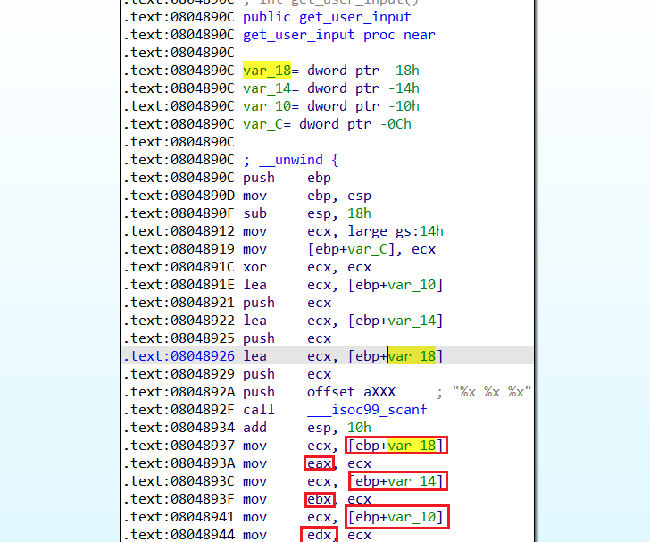

# 00_angr_find
解题
```py
import angr
import sys

def main(argv):
  # Create an Angr project.
  # If you want to be able to point to the binary from the command line, you can
  # use argv[1] as the parameter. Then, you can run the script from the command
  # line as follows:
  # python ./scaffold00.py [binary]
  # (!)
  path_to_binary = ???  # :string  windows下填'F:/CTF工具大集合/revers/angr_ctf-master/dist/00_angr_find'
  project = angr.Project(path_to_binary)

  # Tell Angr where to start executing (should it start from the main()
  # function or somewhere else?) For now, use the entry_state function
  # to instruct Angr to start from the main() function.
  initial_state = project.factory.entry_state()

  # Create a simulation manager initialized with the starting state. It provides
  # a number of useful tools to search and execute the binary.
  simulation = project.factory.simgr(initial_state)

  # Explore the binary to attempt to find the address that prints "Good Job."
  # You will have to find the address you want to find and insert it here. 
  # This function will keep executing until it either finds a solution or it 
  # has explored every possible path through the executable.
  # (!)
  print_good_address = ???  # :integer (probably in hexadecimal) 找到想输出的那个地方的地址
  simulation.explore(find=print_good_address)

  # Check that we have found a solution. The simulation.explore() method will
  # set simulation.found to a list of the states that it could find that reach
  # the instruction we asked it to search for. Remember, in Python, if a list
  # is empty, it will be evaluated as false, otherwise true.
  if simulation.found:
    # The explore method stops after it finds a single state that arrives at the
    # target address.
    solution_state = simulation.found[0]

    # Print the string that Angr wrote to stdin to follow solution_state. This 
    # is our solution.
    print(solution_state.posix.dumps(sys.stdin.fileno()))
  else:
    # If Angr could not find a path that reaches print_good_address, throw an
    # error. Perhaps you mistyped the print_good_address?
    raise Exception('Could not find the solution')

if __name__ == '__main__':
  main(sys.argv)
```
## 01_angr_avoid
```py
import angr
import sys

def main(argv):
  path_to_binary = r'F:\CTF工具大集合\revers\angr_ctf-master\dist\01_angr_avoid'
  project = angr.Project(path_to_binary)
  initial_state = project.factory.entry_state()
  simulation = project.factory.simgr(initial_state)

  # Explore the binary, but this time, instead of only looking for a state that
  # reaches the print_good_address, also find a state that does not reach 
  # will_not_succeed_address. The binary is pretty large, to save you some time,
  # everything you will need to look at is near the beginning of the address 
  # space.
  # (!)
  print_good_address = 0x080485E0
  will_not_succeed_address = 0x080485A8
  simulation.explore(find=print_good_address, avoid=will_not_succeed_address)

  if simulation.found:
    solution_state = simulation.found[0]
    print(solution_state.posix.dumps(sys.stdin.fileno()))
  else:
    raise Exception('Could not find the solution')

if __name__ == '__main__':
  main(sys.argv)
```

##  02_angr_find_condition
```py
# It is very useful to be able to search for a state that reaches a certain
# instruction. However, in some cases, you may not know the address of the
# specific instruction you want to reach (or perhaps there is no single
# instruction goal.) In this challenge, you don't know which instruction
# grants you success. Instead, you just know that you want to find a state where
# the binary prints "Good Job."
#
# Angr is powerful in that it allows you to search for a states that meets an
# arbitrary condition that you specify in Python, using a predicate you define
# as a function that takes a state and returns True if you have found what you
# are looking for, and False otherwise.

import angr
import sys

def main(argv):
  path_to_binary = argv[1]
  project = angr.Project(path_to_binary)
  initial_state = project.factory.entry_state()
  simulation = project.factory.simgr(initial_state)

  # Define a function that checks if you have found the state you are looking
  # for.
  def is_successful(state):
    # Dump whatever has been printed out by the binary so far into a string.
    stdout_output = state.posix.dumps(sys.stdout.fileno())

    # Return whether 'Good Job.' has been printed yet.
    # (!)
    return b'Good Job' in stdout_output  # :boolean

  # Same as above, but this time check if the state should abort. If you return
  # False, Angr will continue to step the state. In this specific challenge, the
  # only time at which you will know you should abort is when the program prints
  # "Try again."
  def should_abort(state):
    stdout_output = state.posix.dumps(sys.stdout.fileno())
    return b'Try again' in stdout_output  # :boolean

  # Tell Angr to explore the binary and find any state that is_successful identfies
  # as a successful state by returning True.
  simulation.explore(find=is_successful, avoid=should_abort)

  if simulation.found:
    solution_state = simulation.found[0]
    print(solution_state.posix.dumps(sys.stdin.fileno()))
  else:
    raise Exception('Could not find the solution')

if __name__ == '__main__':
  main(sys.argv)

```

这个脚本运行的时候需要在cmd中，切换到二进制和这个脚本的文件夹下运行
```cmd
python scaffold02.py 02_angr_find_condition
```
## 03_angr_symbolic_registers
```py
# Angr doesn't currently support reading multiple things with scanf (Ex: 
# scanf("%u %u).) You will have to tell the simulation engine to begin the
# program after scanf is called and manually inject the symbols into registers.

import angr
import claripy
import sys

def main(argv):
  path_to_binary = argv[1]
  project = angr.Project(path_to_binary)

  # Sometimes, you want to specify where the program should start. The variable
  # start_address will specify where the symbolic execution engine should begin.
  # Note that we are using blank_state, not entry_state.
  # (!)
  start_address = 0x08048980  # :integer (probably hexadecimal)
  initial_state = project.factory.blank_state(addr=start_address)

  # Create a symbolic bitvector (the datatype Angr uses to inject symbolic
  # values into the binary.) The first parameter is just a name Angr uses
  # to reference it. 
  # You will have to construct multiple bitvectors. Copy the two lines below
  # and change the variable names. To figure out how many (and of what size)
  # you need, dissassemble the binary and determine the format parameter passed
  # to scanf.
  # (!)
  password0_size_in_bits = 32  # :integer
  password0 = claripy.BVS('password0', password0_size_in_bits)

  password1_size_in_bits = 32  # :integer
  password1 = claripy.BVS('password1', password1_size_in_bits)

  password2_size_in_bits = 32  # :integer
  password2 = claripy.BVS('password2', password2_size_in_bits)

  # Set a register to a symbolic value. This is one way to inject symbols into
  # the program.
  # initial_state.regs stores a number of convenient attributes that reference
  # registers by name. For example, to set eax to password0, use:
  #
  # initial_state.regs.eax = password0
  #
  # You will have to set multiple registers to distinct bitvectors. Copy and
  # paste the line below and change the register. To determine which registers
  # to inject which symbol, dissassemble the binary and look at the instructions
  # immediately following the call to scanf.
  # (!)
  initial_state.regs.eax = password0
  initial_state.regs.ebx = password1
  initial_state.regs.edx = password2

  simulation = project.factory.simgr(initial_state)

  def is_successful(state):
    stdout_output = state.posix.dumps(sys.stdout.fileno())
    return b'Good Job' in stdout_output

  def should_abort(state):
    stdout_output = state.posix.dumps(sys.stdout.fileno())
    return b'Try again' in stdout_output

  simulation.explore(find=is_successful, avoid=should_abort)

  if simulation.found:
    solution_state = simulation.found[0]

    # Solve for the symbolic values. If there are multiple solutions, we only
    # care about one, so we can use eval, which returns any (but only one)
    # solution. Pass eval the bitvector you want to solve for.
    # (!)
    solution0 = solution_state.se.eval(password0)
    solution1 = solution_state.se.eval(password1)
    solution2 = solution_state.se.eval(password2)

    # Aggregate and format the solutions you computed above, and then print
    # the full string. Pay attention to the order of the integers, and the
    # expected base (decimal, octal, hexadecimal, etc).
    solution = "{} {} {}".format(solution0,solution1,solution2)  # :string
    print(solution)
  else:
    raise Exception('Could not find the solution')

if __name__ == '__main__':
  main(sys.argv)

```

从题目看出get_user_input函数输入的三个值，分别存储在eax、ebx、edx寄存器