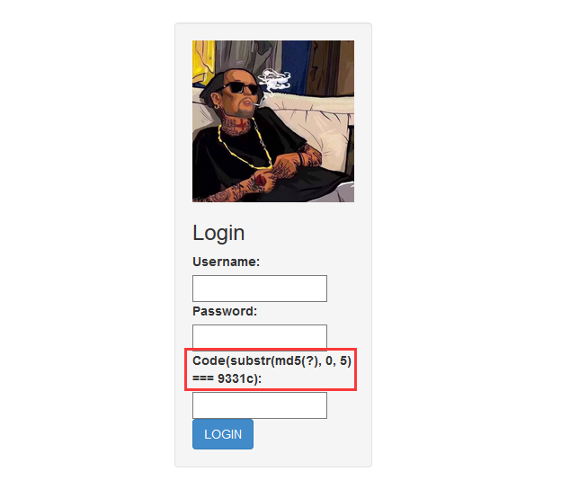

# 1、已知MD5值与前面部分内容爆破值
## 1）确定长度_类型1
```py
import hashlib
dic = 'abcdefghijklmnopqrstuvwxyz1234567890ABCDEFGHIJKLMNOPQRSTUVWXYZ'
for a in dic:
  for b in dic:
    for c in dic:
        t = 'try'+str(a)+'66'+str(b)+str(c)
        md5 = hashlib.md5(t.encode('utf-8')).hexdigest()
    	#print t
        if md5[:32] == 'c905ab50c96685d90c49bb6422aad136':
            print(t)
```
## 2）确定长度_类型2
```py
import string
import hashlib
a='TASC?O3RJMV?WDJKX?ZM'
b='e9032???da???08????911513?0???a2'
dic1=string.digits+string.ascii_lowercase+string.ascii_uppercase #就是'abcdefghijklmnopqrstuvwxyz1234567890ABCDEFGHIJKLMNOPQRSTUVWXYZ'
for i1 in dic1:
	for i2 in dic1:
		for i3 in dic1:
			bb='TASC'+i1+'O3RJMV'+i2+'WDJKX'+i3+'ZM'
			aa=hashlib.md5(bb.encode('utf-8'))
			bbb=aa.hexdigest()
			if bbb[:5]=='e9032':
				print (i1,i2,i3)

a=hashlib.md5('TASCJO3RJMVKWDJKXLZM'.encode('utf-8'))
print (a.hexdigest())
```
## 3）截断验证码
以De1CTF线上赛Web3为例，在De1CTF中，    遇到的MD5截断比较验证是这样的：

这个验证码提示的意思是“将问号（即为Code）进行md5加密之后截取前5位===9331c”

那么在理论上存在的可能性有16^5种，页面每次刷新之后md5都会更新一次，但是在现实中，md5前五位相同是多解

那么我们的思路就可以梳理为：创建一个彩虹表进行比对，暴力猜解Code
```py
from multiprocessing.dummy import Pool as tp
import hashlib

knownMd5 = '9331c'

def md5(text):
    return hashlib.md5(str(text).encode('utf-8')).hexdigest()

def findCode(code):   
    key = code.split(':')
    start = int(key[0])  
    end = int(key[1]) 
    for code in range(start, end):
        if md5(code)[0:5] == knownMd5:            
            print (code)
            break
list=[] 
for i in range(3):    #这里的range(number)指爆破出多少结果停止
    list.append(str(10000000*i) + ':' + str(10000000*(i+1)))
pool = tp()    #使用多线程加快爆破速度
pool.map(findCode, list) 
pool.close()
pool.join()
```
运行结果如下：

以上输出的3个Code都是可以使用的，针对不同情况可以选择爆破出不同数量的结果。

## 4）不确定长度类
题目：
```
ciphertext_s='aaf41389aff8ce58c3d6f9632d4a31a0' #密文
salt = '5678' #加盐 #如果不加盐，为空就是正常的md5解密
maxlenth=int(5) #明文的最大长度
str_letter="abcdefghijklmnopqrstuvwxyz" #明文的字符范围
```
解题脚本：
```py
import itertools as its
import hashlib
from multiprocessing.dummy import Pool as tp

def get_list(maxlenth,str_letter):
    plain_list = []
    for i in range(1, maxlenth+1):
    # 迭代生成明文(例如abc,repeat=2  结果为（a,a)(a,b)(a,c)(b,b)(b,a)(b,c)(c,c)(c,a)(c,b)
        r = its.product(str_letter, repeat=i)
        for j in r:
            plain_list.append(''.join(j))
    # print(plain_list)
    return plain_list
    
def uncipher(plain_part):
    plaintext = "%s%s" % (plain_part, '5678')  #把盐加到明文的后面 每次生成的最终明文
    # 每个明文加密成密文，然后密文与密文做对比
    ciphertext = hashlib.md5(str(plaintext).encode('utf-8')).hexdigest()
    # 对比密文确认明文
    if ciphertext == 'aaf41389aff8ce58c3d6f9632d4a31a0':    #如果密文一致，打印结果
      print ("明文是：%s，密文是%s" % (plaintext, ciphertext)) #打印结果


ciphertext_s='aaf41389aff8ce58c3d6f9632d4a31a0' #密文
salt = '5678' #加盐 #如果不加盐，为空就是正常的md5解密
maxlenth=int(5) #明文的最大长度,一般不会超过6位，否则短时间很难暴力破解
str_letter="abcdefghijklmnopqrstuvwxyz" #明文的字符范围

cip_list = get_list(maxlenth,str_letter)
pool = tp(20)    #使用多线程加快爆破速度
pool.map(uncipher,cip_list) 
pool.close()
pool.join()
```

## 5）与时间戳相结合
没找到具体的题目，主要是理解明文+时间戳再md5加密。
要了解时间戳的形式。
```py
import hashlib
import time
import string
t = str(int(time.time()))#时间戳规范成10位,即消去了float类型状况思路
for i in range(1,100000000000000):
    word = str(t)
    tmp = hashlib.md5(word.encode('utf-8')).hexdigest()#进行md5加密的方法
    x=tmp[0:19]#截断值的作用
    y=x+'admin'
    z=hashlib.md5(y.encode('utf-8')).hexdigest()
    if 'ae8b63d93b14eadd1adb347c9e26595a' == z:
       print (x)
```

## 6）